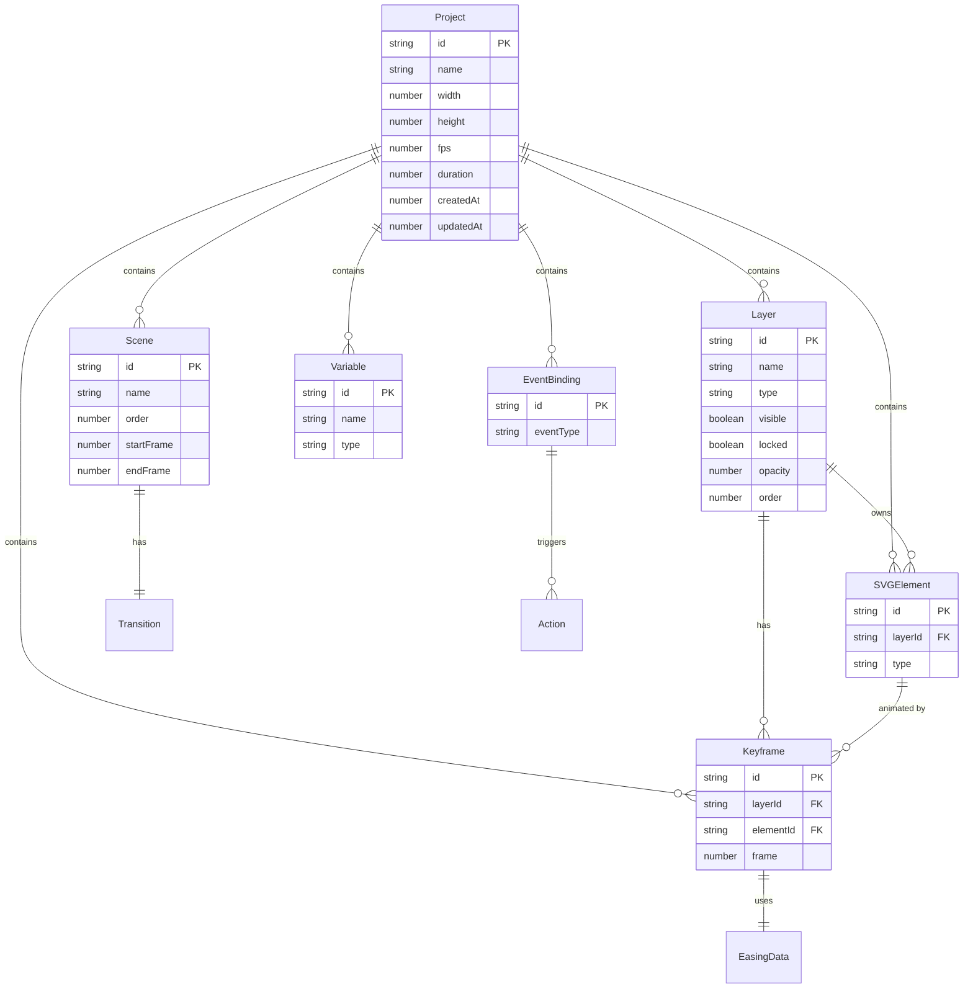

## 1. 架构设计

```mermaid
flowchart TD
    subgraph "前端层 (React + Vite)"
        "UI[页面组件]" --> "Store[Zustand 状态管理]"
        "Store" --> "Engine[动画引擎核心]"
    end
    subgraph "动画引擎层"
        "Engine" --> "SVG[SVG 渲染模块]"
        "Engine" --> "Layer[图层管理模块]"
        "Engine" --> "Timeline[时间线模块]"
        "Engine" --> "Scene[场景管理模块]"
        "Engine" --> "Logic[逻辑画布模块]"
    end
    subgraph "数据层"
        "Store" --> "DB[IndexedDB 存储]"
        "DB" --> "IDB[(IndexedDB)]"
    end
    subgraph "导出层"
        "Engine" --> "Export[导出模块]"
        "Export" --> "SMIL[SVG SMIL]"
        "Export" --> "CSS[CSS Keyframes]"
        "Export" --> "GIF[GIF/PNG]"
    end
```

## 2. 技术说明

- **前端框架**：React@18 + TypeScript + Vite@5
- **样式方案**：TailwindCSS@3 + CSS Variables（主题色管理）
- **状态管理**：Zustand（轻量、支持中间件）
- **SVG 渲染**：原生 SVG DOM 操作 + React 组件化封装
- **动画引擎**：自研关键帧插值引擎（支持缓动、弹簧、弹性等曲线）
- **时间线**：Canvas 2D 绘制时间轴轨道与关键帧（高性能）
- **逻辑画布**：Canvas 2D 绘制节点编辑器
- **数据库**：IndexedDB（通过 idb 库封装，存储项目、场景、关键帧数据）
- **导出方案**：SVG SMIL 动画生成、CSS @keyframes 代码生成、Canvas 逐帧录制 + gif.js 生成 GIF
- **初始化工具**：`npm create vite-init@latest` React + TS 模板
- **后端**：无（纯前端应用，数据全部存浏览器）

## 3. 路由定义

| 路由 | 用途 |
|------|------|
| `/` | 主编辑器（SVG画布 + 图层面板 + 属性面板 + 时间线 + 场景管理，单页工作台） |
| `/preview` | 全屏预览播放页 |

## 4. API 定义

无后端 API。所有数据通过 IndexedDB 本地存取，封装为 `db` 模块：

```typescript
// 项目数据接口
interface Project {
  id: string;
  name: string;
  width: number;           // 画布宽度
  height: number;          // 画布高度
  fps: number;             // 帧率（默认 60）
  duration: number;        // 总时长（秒）
  backgroundColor: string; // 画布背景色
  scenes: Scene[];
  layers: Layer[];
  elements: SVGElement[];
  keyframes: Keyframe[];
  variables: Variable[];
  eventBindings: EventBinding[];
  createdAt: number;
  updatedAt: number;
}

interface Scene {
  id: string;
  name: string;
  order: number;
  startFrame: number;
  endFrame: number;
  transition: Transition;
  thumbnail: string;       // Base64 缩略图
}

interface Layer {
  id: string;
  name: string;
  type: 'shape' | 'group' | 'image' | 'text';
  visible: boolean;
  locked: boolean;
  opacity: number;
  blendMode: string;
  parentId: string | null;
  order: number;
  colorTag: string;        // 图层色标
  elementIds: string[];    // 关联的 SVG 元素 ID
}

interface SVGElement {
  id: string;
  layerId: string;
  type: 'rect' | 'circle' | 'ellipse' | 'line' | 'path' | 'text' | 'g' | 'image';
  attrs: Record<string, any>;  // SVG 属性
  transform: Transform;
  fill: FillStyle;
  stroke: StrokeStyle;
  children?: SVGElement[];     // group 类型子元素
}

interface Transform {
  translateX: number;
  translateY: number;
  rotate: number;
  scaleX: number;
  scaleY: number;
  skewX: number;
  skewY: number;
  originX: number;  // 变换中心
  originY: number;
}

interface FillStyle {
  type: 'none' | 'solid' | 'linear-gradient' | 'radial-gradient';
  color: string;
  opacity: number;
  gradientStops?: GradientStop[];
}

interface StrokeStyle {
  color: string;
  width: number;
  opacity: number;
  linecap: 'butt' | 'round' | 'square';
  linejoin: 'miter' | 'round' | 'bevel';
  dasharray?: string;
}

interface Keyframe {
  id: string;
  layerId: string;
  elementId: string;
  frame: number;
  properties: {
    transform?: Partial<Transform>;
    opacity?: number;
    fill?: Partial<FillStyle>;
    stroke?: Partial<StrokeStyle>;
    [key: string]: any;
  };
  easing: EasingData;
}

interface EasingData {
  type: 'preset' | 'cubic-bezier' | 'spring';
  name?: string;           // preset 名称
  cubicBezier?: [number, number, number, number];
  springConfig?: { stiffness: number; damping: number; mass: number };
}

interface Transition {
  type: 'none' | 'fade' | 'slide-left' | 'slide-right' | 'slide-up' | 'slide-down' | 'zoom-in' | 'zoom-out';
  duration: number;        // 过渡帧数
  easing: EasingData;
}

interface Variable {
  id: string;
  name: string;
  type: 'number' | 'string' | 'boolean' | 'color';
  defaultValue: any;
  currentValue: any;
}

interface EventBinding {
  id: string;
  eventType: 'click' | 'hover' | 'frame-reach' | 'variable-change' | 'scene-end';
  sourceElementId?: string;
  sourceFrame?: number;
  sourceVariableId?: string;
  condition?: {
    operator: 'eq' | 'neq' | 'gt' | 'lt' | 'gte' | 'lte';
    value: any;
  };
  actions: Action[];
}

interface Action {
  type: 'play-scene' | 'set-variable' | 'toggle-visibility' | 'set-property' | 'play-animation';
  targetId?: string;
  params: Record<string, any>;
}
```

## 5. 服务器架构图

无后端服务，跳过。

## 6. 数据模型

### 6.1 数据模型定义



### 6.2 数据定义语言（IndexedDB Schema）

```javascript
db = {
  name: "MotionCanvasDB",
  version: 1,
  stores: {
    projects: {
      keyPath: "id",
      indexes: [
        { name: "by_updatedAt", keyPath: "updatedAt" },
        { name: "by_name", keyPath: "name" }
      ]
    }
  }
}
```

## 7. 项目目录结构

```
motion-canvas/
├── src/
│   ├── components/              # UI 组件层
│   │   ├── Canvas/              # SVG 画布相关
│   │   │   ├── SVGCanvas.tsx         # 主画布（缩放/平移/选择）
│   │   │   ├── SVGElement.tsx        # 可交互 SVG 元素渲染
│   │   │   ├── SelectionBox.tsx      # 选择框/变换手柄
│   │   │   └── GridOverlay.tsx       # 网格/辅助线叠加层
│   │   ├── Toolbar/             # 顶部工具栏
│   │   │   ├── MainToolbar.tsx       # 主工具栏
│   │   │   ├── ToolButton.tsx        # 工具按钮
│   │   │   └── ZoomControl.tsx       # 缩放控制
│   │   ├── Layers/              # 图层面板
│   │   │   ├── LayerPanel.tsx        # 图层面板容器
│   │   │   ├── LayerItem.tsx         # 单个图层行
│   │   │   └── LayerGroup.tsx        # 图层分组
│   │   ├── Properties/          # 属性面板
│   │   │   ├── PropertyPanel.tsx     # 属性面板容器
│   │   │   ├── FillEditor.tsx        # 填充编辑器
│   │   │   ├── StrokeEditor.tsx      # 描边编辑器
│   │   │   ├── TransformEditor.tsx   # 变换编辑器
│   │   │   └── ColorPicker.tsx       # 颜色选择器
│   │   ├── Timeline/            # 时间线
│   │   │   ├── TimelinePanel.tsx     # 时间线面板容器
│   │   │   ├── TimeRuler.tsx         # 时间标尺
│   │   │   ├── TrackRow.tsx          # 图层轨道行
│   │   │   ├── KeyframeMarker.tsx    # 关键帧标记
│   │   │   ├── Playhead.tsx          # 播放头
│   │   │   ├── PlaybackControls.tsx  # 播放控制按钮
│   │   │   └── EasingEditor.tsx      # 缓动曲线编辑器
│   │   ├── Scenes/              # 场景管理
│   │   │   ├── SceneManager.tsx      # 场景管理条
│   │   │   ├── SceneThumbnail.tsx    # 场景缩略图
│   │   │   └── TransitionPicker.tsx  # 过渡效果选择器
│   │   ├── Logic/               # 逻辑画布
│   │   │   ├── LogicCanvas.tsx       # 逻辑节点编辑画布
│   │   │   ├── EventNode.tsx         # 事件节点
│   │   │   ├── ActionNode.tsx        # 动作节点
│   │   │   └── VariableNode.tsx      # 变量节点
│   │   ├── Export/              # 导出
│   │   │   ├── ExportDialog.tsx      # 导出对话框
│   │   │   └── ExportPreview.tsx     # 导出预览
│   │   └── common/              # 通用组件
│   │       ├── Panel.tsx
│   │       ├── IconButton.tsx
│   │       ├── Slider.tsx
│   │       └── Dropdown.tsx
│   ├── engine/                  # 动画引擎核心
│   │   ├── SVGRenderer.ts       # SVG DOM 渲染器
│   │   ├── LayerManager.ts      # 图层管理器
│   │   ├── KeyframeEngine.ts    # 关键帧插值引擎
│   │   ├── EasingFunctions.ts   # 缓动函数库
│   │   ├── SceneManager.ts      # 场景管理器
│   │   ├── LogicEngine.ts       # 逻辑执行引擎
│   │   └── TimelineRenderer.ts  # 时间线 Canvas 渲染
│   ├── store/                   # 状态管理
│   │   ├── useProjectStore.ts   # 项目状态
│   │   ├── useToolStore.ts      # 工具状态
│   │   ├── useTimelineStore.ts  # 时间线状态
│   │   └── useUIStore.ts        # UI 状态
│   ├── db/                      # 数据持久化
│   │   ├── database.ts          # IndexedDB 初始化
│   │   └── projectRepo.ts       # 项目 CRUD
│   ├── export/                  # 导出模块
│   │   ├── svgExport.ts         # SVG SMIL 导出
│   │   ├── cssExport.ts         # CSS 动画代码生成
│   │   └── gifExport.ts         # GIF 逐帧录制
│   ├── types/                   # TypeScript 类型
│   │   └── index.ts
│   ├── utils/                   # 工具函数
│   │   ├── svgUtils.ts          # SVG 工具
│   │   ├── geometry.ts          # 几何计算
│   │   └── colorUtils.ts        # 颜色工具
│   ├── App.tsx
│   ├── main.tsx
│   └── index.css
├── index.html
├── package.json
├── tsconfig.json
├── vite.config.ts
└── tailwind.config.js
```
