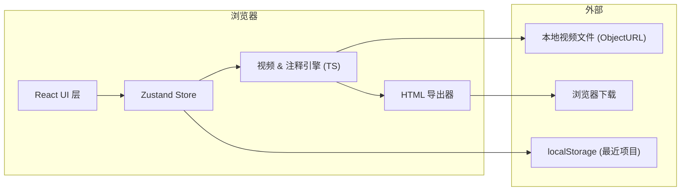

# RigReel 技术架构

## 1. 架构设计



## 2. 技术选型

- **前端**：React@18 + TypeScript + Vite + Tailwind CSS@3
- **状态管理**：Zustand
- **路由**：react-router-dom
- **图标**：lucide-react
- **视频处理**：浏览器原生 `<video>` + Canvas API（截取缩略图与海报帧）
- **导出**：自定义模板字符串 + base64 内联（无后端）

> 暂不引入后端与数据库，所有内容保留在浏览器；最近项目通过 localStorage 持久化。

## 3. 路由定义

| 路由 | 用途 |
|------|------|
| `/` | 工作台（编辑器） |
| `/export` | 导出配置与预览（独立对话框层） |
| `/view` | 预览最终 HTML 效果（开发自检用） |

## 4. 核心数据模型

```ts
type Project = {
  id: string;
  name: string;
  video: { src: string; duration: number; width: number; height: number; fps: number };
  chapters: Chapter[];
  annotations: Annotation[];
  theme: ThemeConfig;
  updatedAt: number;
};

type Chapter = {
  id: string;
  title: string;
  start: number;     // 秒
  end: number;
  color: string;
};

type Annotation =
  | { id: string; kind: "bone"; label: string; x: number; y: number; t: number; tailTo?: { x: number; y: number } }
  | { id: string; kind: "facial"; control: FacialControl; x: number; y: number; t: number };

type FacialControl =
  | "jaw" | "mouth_l" | "mouth_r" | "brow_l" | "brow_r" | "eye_l" | "eye_r"
  | "nose_tip" | "cheek_l" | "cheek_r" | "lip_top" | "lip_bot"; // 共 12+ 预设

type ThemeConfig = {
  primary: string;       // 强调色
  accent: string;        // 面部控制点色
  font: "Inter" | "Space Grotesk" | "JetBrains Mono";
  brand: string;         // 角标文字
  showWatermark: boolean;
};
```

## 5. 关键模块

### 5.1 视频引擎 (`src/engine`)
- `loadVideo(file: File)`：通过 `URL.createObjectURL` 加载，返回元数据。
- `seekTo(t: number)`：高精度跳帧；带帧率计算。
- `grabFrame(t: number)`：用离屏 canvas 抓帧为 `dataURL`（用于缩略图 / 海报）。

### 5.2 注释引擎 (`src/engine/annotations.ts`)
- 内置 12+ 面部控制器预设 (svg 图标库)。
- 提供 `addAnnotation`、`moveAnnotation`、`bindToTime` 接口。
- 渲染层：单层 SVG 叠在 `<video>` 之上，绝对定位，pointer events。

### 5.3 导出器 (`src/exporter`)
- 接收 `Project` 描述，输出**完全自包含** HTML：
  - 视频 → base64 dataURL 内联
  - 注释数据 → JSON 注入 `<script type="application/json">`
  - 样式与脚本 → 内联 CSS / 简版 React-free runtime (原生 JS + template)
- 提供 `exportProject(project, options)` 与 `previewProject(project)` 两个 API。

### 5.4 运行时播放器 (用于导出的 HTML)
- 纯原生 JS，单文件 ~ 12KB。
- 包含：时间轴、注释渲染、章节切换、对比模式开关、主题切换、键盘快捷键。

## 6. 文件结构

```
src/
├── components/
│   ├── TopBar.tsx
│   ├── Sidebar/
│   │   ├── ChapterList.tsx
│   │   └── AnnotationList.tsx
│   ├── Canvas/
│   │   ├── VideoStage.tsx
│   │   └── AnnotationLayer.tsx
│   ├── Timeline/
│   │   ├── Timeline.tsx
│   │   ├── Playhead.tsx
│   │   └── ChapterBar.tsx
│   ├── Inspector/
│   │   ├── BoneInspector.tsx
│   │   └── FacialInspector.tsx
│   └── ExportDialog.tsx
├── engine/
│   ├── video.ts
│   ├── annotations.ts
│   └── facialPresets.ts
├── exporter/
│   ├── template.ts        # 导出 HTML 的字符串模板
│   ├── runtime.ts         # 嵌入到导出 HTML 的播放运行时
│   └── package.ts         # 打包入口
├── store/
│   └── useProjectStore.ts
├── pages/
│   ├── Workspace.tsx
│   └── ExportPage.tsx
├── utils/
│   ├── time.ts
│   └── id.ts
├── App.tsx
├── main.tsx
└── index.css
```

## 7. 性能与兼容性

- 编辑器：仅 200MB 以下的本地视频；超时 / 超大提示降级。
- 导出 HTML 兼容 Chrome / Edge / Safari 14+ / Firefox 100+。
- 视频 > 200MB 时改用 ZIP 打包（视频 + html），由浏览器原生下载。

## 8. 测试 / 自检

- 通过 `pnpm dev` 启动后，使用 `/workspace` 中 `assets/sample.mp4`（若不存在则用 Canvas 生成一段测试视频）。
- 验证：可成功加载、添加注释、调整章节、导出 HTML；导出的 HTML 在新标签页打开能正常播放。
