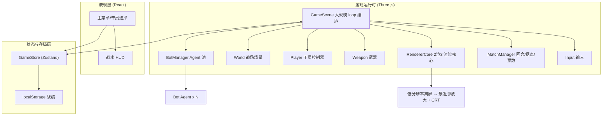
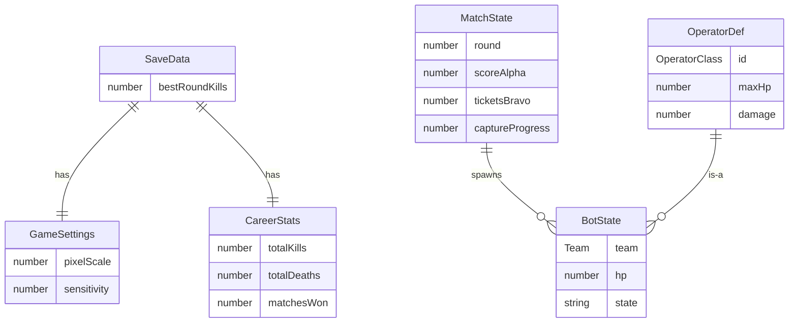

## 1. 架构设计



## 2. 技术说明

- **前端框架**：React@18 + TypeScript + Vite（沿用）
- **3D 引擎**：Three.js（沿用，直接控制低分辨率离屏渲染）
- **2 渲 3 核心方案**（沿用）：WebGL 以低分辨率渲染 → canvas `image-rendering: pixelated` 最近邻放大 → CSS 扫描线/噪点/暗角
- **大规模 Agent loop**：
  - `BotManager` 维护友军/敌军 Agent 池，每帧统一更新（状态机 + 移动 + 射击 + 碰撞）
  - 每个 `Bot` 为面向相机的 billboard `Sprite`（像素士兵），共享材质降低 draw call
  - 射线命中检测：玩家/bot 开火时对存活 Agent 做球-射线检测，O(N) 可承载 10+ Agent
- **队伍系统**：`Team` = `"alpha"(友) | "bravo"(敌)`，Agent/玩家归属队伍，命中同队无伤害（避免 TK 友军伤害可选）
- **回合/对局 loop**：`MatchManager` 驱动 `准备 → 交战 → 回合结算 → 下一回合 → 对局结算`；据点占领按区内人数差累积；重生票耗尽或据点满判回合胜负；先夺 3 回合赢对局
- **重生系统**：死亡 Agent 进重生队列，倒计时后在己方基地重生，重生票 -1，票为 0 则该队该回合无法重生
- **状态管理**：Zustand（沿用）
- **样式**：TailwindCSS@3 + CSS Variables（沿用）
- **路由**：单页状态机 `menu / operator / playing / paused / roundEnd / matchEnd`（沿用，无 react-router）
- **存档**：localStorage 战绩（沿用）
- **后端**：无（纯前端，AI bot 模拟「多人平台」战场）

## 3. 路由定义（状态机）

| gameState | 用途 |
|------|------|
| `menu` | 主菜单 |
| `operator` | 干员选择 |
| `playing` | 回合进行中 |
| `paused` | 暂停 |
| `roundEnd` | 回合结算（短暂展示胜负） |
| `matchEnd` | 对局结算 |

## 4. API 定义（运行时接口）

```typescript
type Team = "alpha" | "bravo";
type OperatorClass = "assault" | "recon" | "support";

interface OperatorDef {
  id: OperatorClass;
  name: string;
  maxHp: number;
  speed: number;
  magSize: number;
  reserveAmmo: number;
  fireDelay: number;
  damage: number;
  desc: string;
}

interface BotState {
  team: Team;
  class: OperatorClass;
  pos: Vector3;
  yaw: number;
  hp: number;
  alive: boolean;
  respawnTimer: number;
  state: "patrol" | "engage" | "seekCover" | "dead";
  target: Bot | Player | null;
  fireCooldown: number;
}

interface MatchState {
  round: number;
  scoreAlpha: number;
  scoreBravo: number;
  ticketsAlpha: number;
  ticketsBravo: number;
  captureProgress: number; // -100~+100，正=友军占领
  captureTarget: number;   // ±100 满
  phase: "prep" | "combat" | "roundOver";
}
```

## 5. 服务器架构图

无后端，跳过。

## 6. 数据模型



localStorage Schema：
```javascript
{
  "delta_settings": { pixelScale, sensitivity, fogDensity, sound },
  "delta_career": { totalKills, totalDeaths, matchesWon, bestRoundKills }
}
```

## 7. 项目目录结构

```
src/
├── game/
│   ├── GameScene.ts        # 大规模 loop 编排
│   ├── RendererCore.ts     # 2渲3（沿用）
│   ├── World.ts            # 战场：地形/建筑/掩体/天空/灯光
│   ├── Player.ts           # 干员 FPS 控制（沿用+扩展血量/护甲）
│   ├── Weapon.ts           # 武器 viewmodel+射击（沿用+扩展装弹/备弹）
│   ├── Input.ts            # 输入（沿用+R 装弹）
│   ├── Bot.ts              # 单个 AI Agent 状态机
│   ├── BotManager.ts       # Agent 池 + 统一更新 + 命中检测
│   ├── MatchManager.ts     # 回合/据点/票数/胜负
│   ├── maps.ts             # 大地图布局数据
│   ├── operators.ts        # 干员职业定义
│   └── textures.ts         # 像素纹理（士兵/建筑/天空）
├── components/
│   ├── MainMenu.tsx        # 主菜单
│   ├── OperatorSelect.tsx  # 干员选择
│   ├── GameCanvas.tsx      # 战场画布
│   ├── HUD.tsx             # 战术 HUD
│   ├── Minimap.tsx         # 小地图
│   ├── SettingsPanel.tsx   # 设置
│   ├── ResultScreen.tsx    # 对局结算
│   └── PixelButton.tsx     # 像素按钮（沿用）
├── store/useGameStore.ts
├── lib/storage.ts
├── App.tsx
├── main.tsx
└── index.css
```

## 8. 大规模 loop 实现要点

1. **统一 Agent 更新**：`BotManager.update(dt)` 遍历所有 bot，状态机驱动（巡逻→发现敌人→交战→寻掩体→死亡→重生），共享临时向量避免 GC
2. **命中检测**：开火时 `raycastAgents(origin, dir, team)` 返回最近异队 Agent；bot 开火同理，对玩家用球距检测
3. **碰撞**：bot 与建筑 AABB 碰撞（沿用 World.collides），分轴滑动
4. **据点占领**：每帧统计据点区内双方存活人数，差值累积 captureProgress，达 ±100 判回合
5. **重生队列**：死亡 bot 入队，倒计时归位后从基地 spawn，重生票 -1
6. **性能**：bot sprite 共享材质、InstancedMesh 建筑、合并几何墙体；目标 60fps / 10+ Agent
7. **回合编排**：MatchManager 状态机 prep(3s) → combat → roundOver(4s) → 下一回合 / matchEnd
