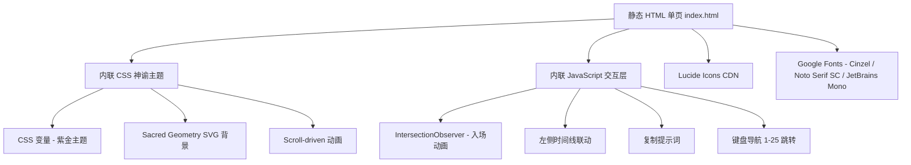

# 《天穹遗子》第一幕分镜展示页 - 技术架构文档

## 1. 架构设计



## 2. 技术描述
- **形态**：单文件 `index.html`（HTML + 内联 CSS + 内联 JS），无构建步骤
- **字体**：Google Fonts（Cinzel、Noto Serif SC、JetBrains Mono、EB Garamond）
- **图标**：Lucide Icons（CDN 引入）
- **动画**：纯 CSS 动画 + IntersectionObserver 触发的入场过渡 + 缓动函数模拟"沉降/置换差"
- **运行方式**：`python3 -m http.server` 提供本地预览
- **数据源**：25 镜分镜数据以 JSON 形式内联在 `<script type="application/json">` 中，由 JS 渲染

## 3. 路由定义
| 路径 | 用途 |
|------|------|
| `/` | 单页分镜展示 |
| `/index.html#shot-1` ~ `#shot-25` | 镜头锚点跳转 |

## 4. API 定义
无后端 API。

## 5. 服务器架构
无后端。

## 6. 数据模型
镜头数据结构（TypeScript-like）：
```ts
interface Shot {
  id: number;            // 1-25
  timecode: string;      // "0:00-0:08"
  duration: string;      // "8s"
  scale: string;         // 景别：极大全景 / 全景 / 中景 / 近景 / 特写
  movement: string;      // 运镜
  visual: string;        // 画面内容
  dialogue: string;      // 对白 / 旁白
  sfx: string;           // 音效
  prompt: string;        // AI 生成提示词
  note?: string;         // 镜头特殊标注（如闪回、倒放）
}
```

## 7. 性能与无障碍
- 仅在 IntersectionObserver 触发时为卡片添加 `in-view` 类
- 字体使用 `font-display: swap`
- 颜色对比度满足 WCAG AA
- 提供 `prefers-reduced-motion` 媒体查询，关闭大规模动画
