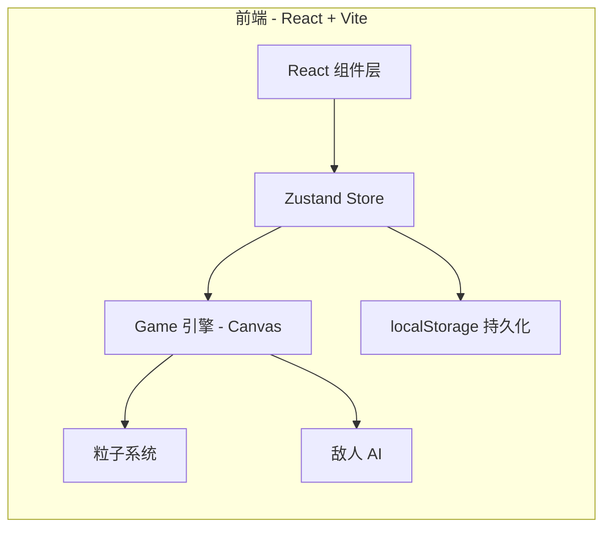
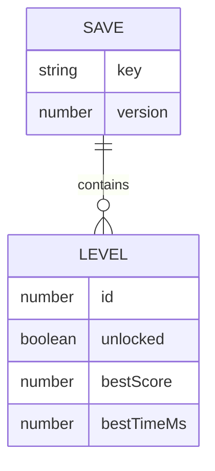

# 球球大冒险 - 技术架构文档

## 1. 架构设计



## 2. 技术选型

- **前端框架**:React@18 + TypeScript@5
- **构建工具**:Vite@5
- **样式方案**:TailwindCSS@3
- **状态管理**:Zustand@4
- **游戏渲染**:HTML5 Canvas 2D (无外部引擎)
- **图标**:lucide-react
- **后端**:无 (纯前端)
- **数据存储**:localStorage

## 3. 路由定义

| 路由 | 用途 |
|------|------|
| `/` | 主菜单:选择关卡、清空存档、查看说明 |
| `/play/:levelId` | 游戏页:进入指定关卡进行游戏 |
| `/result/:levelId` | 结算页:展示本局得分并写入最高分 |

## 4. API 定义

无后端 API。localStorage 读写由 Zustand persist 中间件处理,key 为 `ball-game-save-v1`。

## 5. 数据模型

### 5.1 数据模型定义



### 5.2 类型定义

```ts
type SaveState = {
  version: 1;
  levels: LevelState[];
};

type LevelState = {
  id: number;
  unlocked: boolean;
  bestScore: number;
  bestTimeMs: number;
};
```

## 6. 游戏循环架构

```
主循环 (requestAnimationFrame)
  ├─ 输入采样 (键盘 / 触摸)
  ├─ 玩家位置更新 (WASD)
  ├─ 敌人 AI 更新 (巡逻 / 追击)
  ├─ 碰撞检测 (玩家 vs 墙、玩家 vs 敌人、敌人 vs 墙)
  ├─ 粒子更新 (尾迹 / 爆炸 / 光点)
  ├─ 渲染 (背景网格 → 墙 → 敌人 → 玩家 → 粒子 → HUD)
  └─ 状态判定 (胜负 / 通关)
```

## 7. 关键模块设计

### 7.1 粒子系统 (`src/game/ParticleSystem.ts`)
- 预分配 600 个粒子的对象池
- 每帧 `spawn` + `update` + `draw`
- 粒子类型:`trail`(尾迹)、`burst`(爆炸)、`spark`(光点)
- 颜色取自关卡主题色,使用 `globalCompositeOperation = 'lighter'` 叠加

### 7.2 关卡生成 (`src/game/LevelGenerator.ts`)
- 基于关卡 id 哈希生成种子
- 包含外圈围墙 + 内部随机障碍
- 不同关卡主题色不同 (青 → 紫 → 粉 → 红 → 金)

### 7.3 敌人 AI (`src/game/Enemy.ts`)
- 状态机:`PATROL` ↔ `CHASE`
- 当玩家进入视野范围 (200px) 时切换为 `CHASE`
- 移动速度 = 基础速度 × 关卡难度系数 (1 + 0.1 × id)

### 7.4 持久化 (`src/store/saveStore.ts`)
- 使用 Zustand `persist` 中间件
- 默认值:仅第 1 关解锁,其余 9 关上锁
- 玩家通过任一关后,自动解锁下一关

## 8. 性能预算

- 60 FPS 稳定
- 单帧绘制对象上限:玩家 1、敌人 ≤ 10、墙 ≤ 20、粒子 ≤ 600
- 使用离屏 Canvas 缓存静态背景网格
