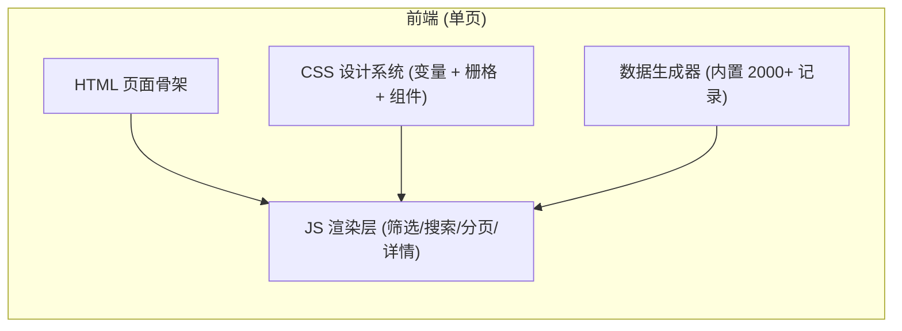
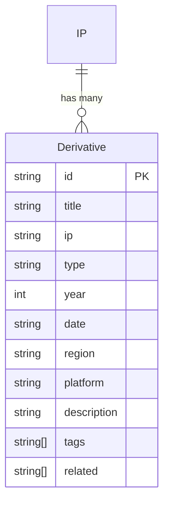

# 游戏IP衍生作品资料库 - 技术架构文档

## 1. 架构设计

说明：本项目为纯前端单页 HTML，**无后端、无数据库、无外部服务**。所有数据由内置数据生成器在页面加载时构造。

## 2. 技术描述

- 形态：单文件 `index.html`（内联 CSS + JS，数据以 ES Module 形式内嵌）
- 字体：Google Fonts（Space Grotesk、Inter Tight、JetBrains Mono、Archivo）
- 图标：Lucide 内联 SVG
- 渲染：原生 DOM + 模板字符串 + IntersectionObserver 滚动入场
- 状态：URL Query 同步（筛选条件可分享）
- 主题：CSS 变量 + `[data-theme]` 切换（默认深色，可切到"档案纸"亮色）
- 部署：直接双击 `index.html` 即可使用；可托管在任何静态服务器

### 不引入的依赖

- 不使用 React/Vue/Svelte（保持单文件、零构建）
- 不使用 Tailwind/UI 库（自定义 CSS 设计系统）
- 不使用任何 CDN 数据接口（避免外网依赖）

## 3. 路由/视图定义

由于是单页应用，视图通过 URL Hash 切换：

| Hash | 视图 |
| --- | --- |
| `#/` | 资料库主页（默认） |
| `#/ip/:slug` | 锚定到某 IP 的筛选视图 |
| `#/type/:type` | 锚定到某类型的筛选视图 |

## 4. 数据模型

### 4.1 实体模型

### 4.2 字段说明

- `id`：自增字符串 ID
- `title`：衍生作品名
- `ip`：原作游戏 IP
- `type`：衍生类型（动画/漫画/电影/剧集/小说/音乐/周边/手办/桌游/手游/设定集/舞台剧/广播剧/展览）
- `year` / `date`：年份与精确日期（≤ 2026-06-08）
- `region`：JP / US / CN / EU / KR / GLOBAL
- `platform`：平台或介质（如 "TV"、"剧场"、"Steam"、"PS5" 等）
- `description`：100 字内简介
- `related`：相关作品 ID 列表

### 4.3 数据生成策略

- 预定义 **≥ 80 个核心 IP 池**（如 Pokémon、最终幻想、生化危机、原神、艾尔登法环、巫师、英雄联盟、刺客信条等）
- 预定义 **14 种衍生类型模板**
- 按"IP 历史 + 行业事实"为每个 IP 在每个类型上构造 N 条作品（典型 IP 30~60 条，长尾 IP 5~15 条）
- 所有日期截止到 2026-06-08
- 总量目标：**≥ 2000 条**

## 5. 关键交互

- **搜索**：debounce 150ms，对 title/ip/description 做不区分大小写的子串匹配
- **筛选**：IP 多选、类型多选、年份范围、地区多选
- **分页/虚拟滚动**：每页 24 条，"加载更多"按钮 + IntersectionObserver 自动加载
- **详情面板**：点击卡片，从右侧滑入，显示完整字段
- **时间线**：渲染按 year 聚合的密度条
- **数据洞察**：3 个并列卡片，展示 Top IP / 类型分布 / 平台分布
- **URL 同步**：筛选条件写入 URL Query，刷新或分享后还原
- **主题切换**：暗/亮主题，CSS 变量驱动

## 6. 性能与无障碍

- 数据懒构造：仅在页面加载时构造一次并缓存到 `window.__DATA__`
- 渲染分片：使用 `requestAnimationFrame` 分批插入卡片
- 关键 ARIA：搜索框、按钮、详情面板均带 `aria-label` / `role`
- 键盘可达：卡片可 Tab 聚焦，Enter 打开详情，Esc 关闭
