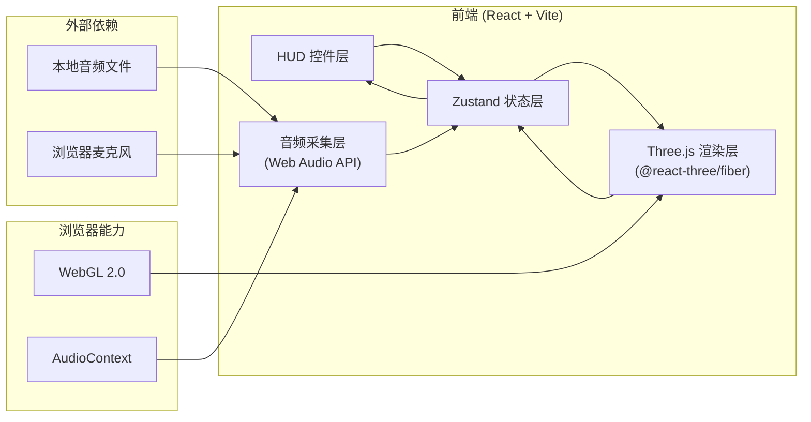
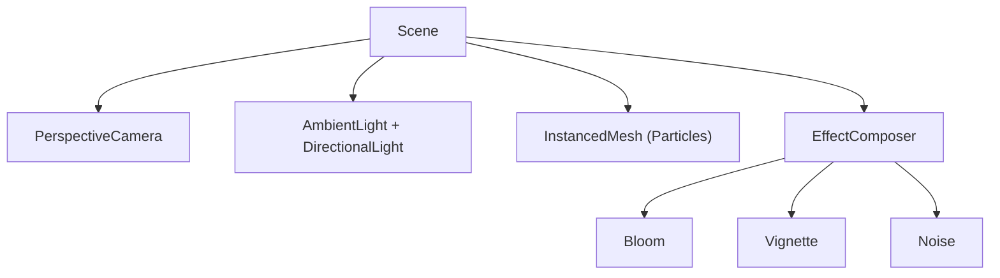

# 技术架构 - 音乐粒子 / 3D 生成式音频可视化

## 1. 架构设计



## 2. 技术栈说明

- **前端框架**：React@18 + TypeScript
- **构建工具**：Vite@5
- **样式方案**：Tailwind CSS@3（玻璃拟态 + 自定义 CSS 变量主题）
- **3D 引擎**：three@0.160 + @react-three/fiber@8 + @react-three/drei@9 + @react-three/postprocessing@2
- **状态管理**：Zustand@4（管理音源、播放状态、预设、配色、参数）
- **图标**：lucide-react
- **后端**：无（纯前端应用）
- **数据库**：无

## 3. 路由定义

| 路由 | 用途 |
|------|------|
| `/` | 主舞台单页面应用（SPA），所有交互通过 HUD 完成 |

> 由于本应用为单页全屏沉浸式产品，采用单一根路由设计，无需 React Router。

## 4. 音频处理与状态结构

### 4.1 音频处理流程

```typescript
// 核心音频管线
audioBufferSourceNode (或 MediaStreamSourceNode)
  ↓ connect
gainNode (音量控制)
  ↓ connect
analyserNode (FFT size: 1024)
  ↓ getByteFrequencyData
Uint8Array (512 频段) → 折叠为 32 段 → 写入 zustand store
```

### 4.2 Zustand Store 结构

```typescript
interface AudioStore {
  // 音源
  source: 'none' | 'file' | 'mic'
  audioBuffer: AudioBuffer | null
  isPlaying: boolean
  volume: number          // 0-1
  currentTime: number     // 秒
  duration: number        // 秒

  // 频谱特征（每帧更新）
  frequencyData: Uint8Array  // 长度 32
  bassLevel: number          // 0-1
  midLevel: number           // 0-1
  trebleLevel: number        // 0-1
  beatDetected: boolean      // 当前帧是否命中节拍

  // 可视化参数
  preset: 'galaxy' | 'vortex' | 'grid' | 'firework' | 'noiseField'
  palette: 'aurora' | 'cyber' | 'twilight' | 'mono' | 'inferno'
  density: number            // 0-1, 实际粒子数 = 5000 + density * 25000
  speed: number              // 0.1-3
  glow: number               // 0-2
  depth: number              // 0-1 景深模糊强度

  // 动作
  loadFile: (file: File) => Promise<void>
  startMic: () => Promise<void>
  togglePlay: () => void
  setPreset: (p: Preset) => void
  setPalette: (p: Palette) => void
  setParam: <K extends keyof Params>(k: K, v: Params[K]) => void
}
```

## 5. Three.js 渲染架构

### 5.1 场景图



### 5.2 关键组件

- `<ParticleField />`：使用 `InstancedMesh` 承载 5000~30000 粒子，每帧根据 preset 函数 + 音频特征更新每个实例的 `position`、`color`、`scale`
- `<CameraRig />`：根据低频 + 鼠标位置微调相机
- `<Postprocessing />`：统一管理后处理效果
- `<HUD />`：覆盖在 Canvas 上方的 UI 控件层

### 5.3 形态预设数学

| Preset | 公式 |
|--------|------|
| galaxy | 螺旋星系：角度 = i * 137.5°，半径 = 平方根分布，Z = 高斯分布 |
| vortex | 漩涡：极坐标 + sin/cos 叠加两层反向旋转 |
| grid | 立方网格：i 取模形成 NxNxN 立方点阵，扰动 = freq * speed |
| firework | 烟花：放射状向量 + 径向脉冲 + 节拍触发扩散 |
| noiseField | 噪声场：3D Perlin/Simplex 噪声，频段驱动偏移 |

## 6. 性能与资源预算

- 目标帧率：桌面 60 FPS，移动端 30 FPS
- 粒子数自适应：`density < 0.3` 时 5000，`> 0.8` 时 30000
- 像素比上限 2，避免 4K 屏幕过载
- 单次 draw call：粒子系统一个，UI 一个，总 < 10 个
- 不使用 HDR 贴图（节省内存）
- 字体使用 Google Fonts CDN（仅 2 个字重）

## 7. 文件结构

```
src/
├── components/
│   ├── ParticleField.tsx     # 3D 粒子系统
│   ├── CameraRig.tsx         # 相机控制器
│   ├── Postprocessing.tsx    # 后处理
│   ├── HUD.tsx               # 顶部/底部 HUD 容器
│   ├── AudioSourcePanel.tsx  # 音源选择
│   ├── PresetBar.tsx         # 形态预设
│   ├── PaletteBar.tsx        # 配色
│   ├── ParamConsole.tsx      # 参数滑块
│   ├── PlayerBar.tsx         # 播放控制
│   └── TitleBar.tsx          # 顶部标题
├── hooks/
│   ├── useAudioAnalyser.ts   # 音频分析
│   ├── useBeatDetector.ts    # 节拍检测
│   └── useFullscreen.ts      # 全屏
├── lib/
│   ├── presets.ts            # 5 种形态函数
│   ├── palettes.ts           # 5 套配色
│   └── beat.ts               # 简单节拍检测算法
├── store/
│   └── useAudioStore.ts      # Zustand store
├── App.tsx
├── main.tsx
└── index.css
```
