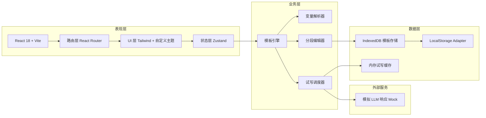

# 幕启 Muse · 技术架构文档

## 1. 架构设计

本期为前端单页应用 + 浏览器本地持久化（localStorage 模拟云端），不引入真实后端，方便演示与部署。所有"云服务"特性以本地状态机 + 模拟数据呈现，后续可平滑接入真实 API。



## 2. 技术选型

- **前端框架**：React@18 + TypeScript
- **构建工具**：Vite@5
- **样式方案**：Tailwind CSS@3 + 自定义设计 token（深色放映厅主题）
- **路由**：React Router@6
- **状态管理**：Zustand@4（轻量、零样板，适合模板/编辑器状态）
- **图标**：lucide-react
- **字体**：Google Fonts（Cormorant Garamond + JetBrains Mono + Noto Serif/Sans SC）
- **持久化**：localStorage（用户、模板、版本快照）+ 内存运行时（试写输出）
- **Mock 数据**：内置 12 个种子模板（覆盖短剧 / 短视频 / 广告 / MV / 动漫 / 游戏）
- **代码质量**：ESLint + Prettier
- **初始化工具**：npm create vite@latest（模板 react-ts）

不引入后端、不引入数据库、不引入 3D / 复杂动效库，保证首屏加载与可演示性。

## 3. 路由定义

| 路由 | 名称 | 用途 |
|------|------|------|
| `/` | 首页 / 仪表盘 | 灵感位 + 我的模板 + 快速试写入口 |
| `/explore` | 模板广场 | 公开模板瀑布 + 筛选 + 克隆 |
| `/editor/:templateId` | 编辑器 | 单模板编辑（新建时 `:templateId = new`） |
| `/stage/:templateId` | 试写舞台 | 参数填表 + 模型生成 + 结果对比 |
| `/team` | 团队空间 | 成员 + 共享库（占位） |
| `/me` | 个人中心 | 账户、主题、用量（占位） |

## 4. 核心数据模型

```ts
// 模板
interface PromptTemplate {
  id: string
  title: string
  cover?: string // 渲染封面（首段）
  category: 'short_drama' | 'short_video' | 'ad' | 'mv' | 'anime' | 'game' | 'custom'
  tags: string[]
  visibility: 'private' | 'team' | 'public'
  author: { id: string; name: string; avatar?: string }
  sections: PromptSection[] // 6 段结构
  variables: PromptVariable[] // 自动抽取
  versions: TemplateVersion[] // 历史快照
  createdAt: number
  updatedAt: number
  cloneCount: number
}

interface PromptSection {
  id: string
  key: 'premise' | 'character' | 'scene' | 'camera' | 'tone' | 'output'
  title: string
  body: string // 含 {{variable}} 占位
  collapsed: boolean
}

interface PromptVariable {
  key: string         // 变量名
  label: string       // 友好名
  description?: string
  defaultValue?: string
  type: 'text' | 'longtext' | 'enum' | 'number'
  options?: string[]  // enum 专用
}

interface TemplateVersion {
  id: string
  label: string
  body: PromptSection[]
  createdAt: number
}

interface StageRun {
  id: string
  templateId: string
  values: Record<string, string>
  outputs: { model: string; text: string; score?: number }[]
  createdAt: number
}
```

## 5. 关键模块

### 5.1 变量解析器 (`utils/variableParser.ts`)
- 正则 `/\{\{\s*([a-zA-Z0-9_]+)\s*\}\}/g` 抽取所有变量
- 去重 + 按出现顺序输出
- 暴露 `fillTemplate(sections, values): string`

### 5.2 模板引擎 (`stores/templateStore.ts`)
- Zustand store
- 字段：`templates`、`currentId`、`dirty`
- 动作：`create`、`updateSection`、`addVersion`、`clone`、`publish`

### 5.3 试写调度器 (`utils/mockLLM.ts`)
- 接收拼接好的 prompt，返回 2-3 个模拟输出
- 200-1500ms 模拟延迟
- 输出内容根据 prompt 关键词动态变化（让对比真实可感）

### 5.4 持久化适配器 (`utils/storage.ts`)
- 统一 localStorage 读写，命名空间 `muse:`
- SSR-safe（虽然本项目不 SSR）

## 6. 目录结构

```
muse/
├─ index.html
├─ package.json
├─ tsconfig.json
├─ vite.config.ts
├─ tailwind.config.js
├─ postcss.config.js
├─ public/
│  └─ favicon.svg
└─ src/
   ├─ main.tsx
   ├─ App.tsx
   ├─ router.tsx
   ├─ styles/
   │  ├─ index.css
   │  └─ theme.css
   ├─ lib/
   │  ├─ variableParser.ts
   │  ├─ mockLLM.ts
   │  ├─ storage.ts
   │  └─ seed.ts
   ├─ stores/
   │  ├─ templateStore.ts
   │  └─ userStore.ts
   ├─ components/
   │  ├─ layout/
   │  │  ├─ AppShell.tsx
   │  │  ├─ TopBar.tsx
   │  │  └─ SideNav.tsx
   │  ├─ ui/
   │  │  ├─ Button.tsx
   │  │  ├─ Card.tsx
   │  │  ├─ Chip.tsx
   │  │  ├─ Field.tsx
   │  │  └─ MarqueeTitle.tsx
   │  └─ editor/
   │     ├─ SectionBlock.tsx
   │     └─ VariablePanel.tsx
   └─ pages/
      ├─ Dashboard.tsx
      ├─ Explore.tsx
      ├─ Editor.tsx
      ├─ Stage.tsx
      ├─ Team.tsx
      └─ Me.tsx
```

## 7. 设计 Token（Tailwind 扩展）

```js
theme.extend.colors = {
  ink: { 950: '#0B0B0E', 900: '#15151A', 800: '#1C1C22', 700: '#26262E' },
  amber: { 500: '#E8A85C', 400: '#F2C281', 600: '#C68A41' },
  curtain: { 500: '#D14B5C', 400: '#E36F7E' },
  bone: { 50: '#F2EEDF', 200: '#D9D6C5', 400: '#8B8A85' },
}
theme.extend.fontFamily = {
  display: ['"Cormorant Garamond"', '"Noto Serif SC"', 'serif'],
  mono: ['"JetBrains Mono"', '"Noto Sans SC"', 'monospace'],
}
```

## 8. 性能与可访问性
- 路由级 `React.lazy` 拆分
- 大列表（广场）使用 `IntersectionObserver` 虚拟化
- 颜色对比度均 ≥ 4.5:1；交互元素均带 focus ring
- 所有按钮 / 表单支持键盘操作

## 9. 后续可扩展点
- 接入真实 LLM（OpenAI / 国产模型）
- 接入 Supabase / 云函数做云端持久化
- 加入模板评论、点赞、AI 评分
- 加入协作光标、版本 diff
