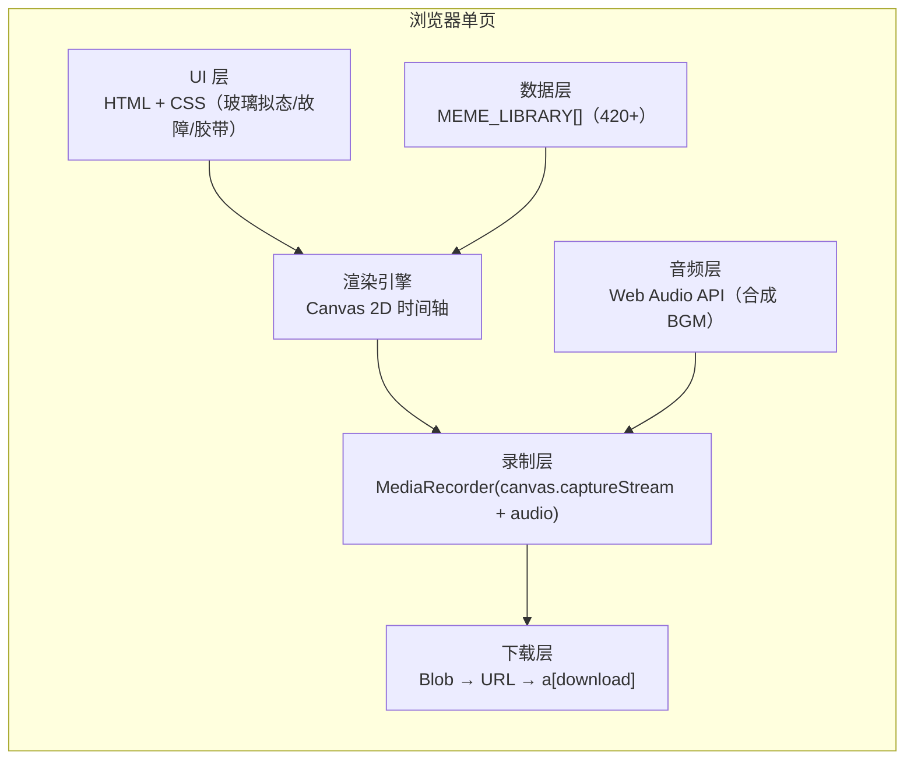
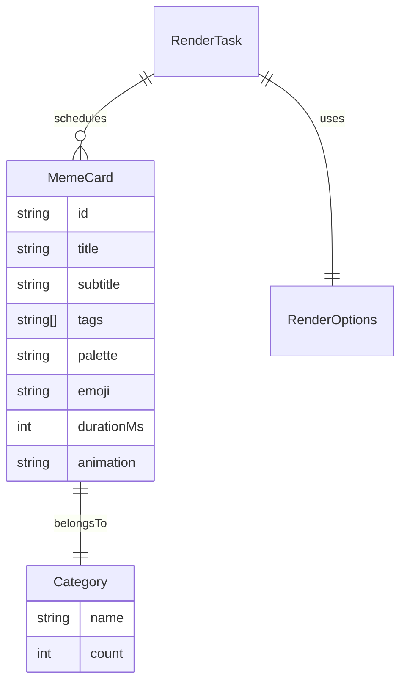

# 技术架构：2025 热梗大爆炸 · 40 分钟自动出片 HTML

## 1. 架构设计
单文件、纯前端、零依赖、零构建。所有逻辑、样式、数据、模板、Canvas 绘制、媒体录制、下载全部位于一个 `index.html` 中。无需后端、无需数据库、无需外部网络请求（仅 Google Fonts CDN + 同源 emoji 资源）。



## 2. 技术描述
- **前端**：原生 HTML + CSS + JavaScript（ES2022），不引入 React/Vue/Tailwind。
- **初始化工具**：无（直接打开 `index.html`）。
- **构建工具**：无（用户明确要求"制作 html"）。
- **后端**：无。
- **数据库**：无（数据全部内联为常量）。
- **字体**：Google Fonts（`Bungee`, `Big Shoulders Display`, `Space Grotesk`, `Noto Sans SC`, `JetBrains Mono`）。
- **图像**：使用 emoji + 纯 CSS 渐变 + SVG 噪点 + Unicode 符号构成视觉层，不依赖外部图片链接，确保离线可生成（首屏除外）。

## 3. 路由定义
无路由（单页单文件）。

| 路径 | 用途 |
|------|------|
| `index.html` | 唯一入口 |

## 4. API 定义
无后端 API；以下为前端内部"接口"。

```ts
type MemeCard = {
  id: string;
  category: '中文热梗' | '国际梗' | 'AI抽象' | '视觉趋势' | '官方榜单' | '情绪标签' | '二次元' | '机器人' | '章节封面' | '标语金句';
  title: string;
  subtitle?: string;
  tags: string[];
  palette: [string, string, string]; // [bg, fg, accent]
  emoji: string;
  durationMs: number;                // 默认 5000ms
  animation: 'stamp' | 'flip' | 'glitch' | 'typewriter' | 'rain' | 'shake' | 'zoom';
  rank?: number;
};

type RenderOptions = {
  totalMinutes: 10 | 20 | 40 | 60 | 120;
  resolution: '720p' | '1080p';
  speed: 0.5 | 1 | 1.5 | 2;
  bgmVolume: 0 | 0.3 | 0.6 | 1;
  watermark: boolean;
};

declare function startRender(opts: RenderOptions): Promise<Blob>;
```

## 5. 服务端架构
无。

## 6. 数据模型

### 6.1 数据模型定义
- 渲染任务 `RenderTask` 持有 `MemeCard[]`、`startTs`、`fps`、`width`、`height`。
- 梗库 `MemeCard` 单一聚合根，下挂 7 大分类列表（共 420+ 条）。
- 进度 `ProgressEvent { frame, totalFrames, currentTitle, remainingMs }`。



### 6.2 数据定义（内联于 JS 常量 `MEME_LIBRARY`）
- 章节封面 10 条（每个分类 1-2 张）
- 中文热梗 ≥ 90 条
- 国际梗 ≥ 70 条
- AI 抽象 ≥ 50 条
- 视觉趋势 ≥ 50 条
- 官方榜单 ≥ 40 条
- 情绪标签 ≥ 40 条
- 二次元 ≥ 30 条
- 机器人 ≥ 20 条
- 标语金句 / 过渡卡 ≥ 20 条
- 重复循环策略：当条目数 × 5s < 2400s 时，引擎自动按分类权重多轮播放并随机洗牌，确保恰好填满目标时长。

## 7. 关键实现要点
1. **Canvas 帧循环**：`requestAnimationFrame` 驱动；每秒 30 帧；每一帧根据 `currentCard` 与 `(now - cardStartTs)` 进度绘制入场动画 / 静止 / 出场动画。
2. **MediaRecorder**：`canvas.captureStream(30)` + `AudioContext.createMediaStreamDestination()` 合并；编码 `video/webm;codecs=vp9,opus`（无 VP9 时回退 vp8）。
3. **时长控制**：总帧数 = `totalMinutes * 60 * 30`；每张卡片 `durationMs` 决定展示时长；引擎自动按分类、节奏切分剩余时间。
4. **BGM 合成**：用 `OscillatorNode` + `GainNode` 合成 lo-fi 鼓点 / glitch 噪声循环，避免引入 mp3 资源。
5. **下载**：录制结束 → `new Blob([...chunks], { type: 'video/webm' })` → `URL.createObjectURL` → 触发 `<a download>`。
6. **错误兜底**：MediaRecorder 不可用时给出"请使用 Chrome / Edge 桌面版"提示并降级为"仅预览"模式。

## 8. 性能与浏览器兼容
- 目标：Chrome 110+ / Edge 110+ 桌面端；
- 单次渲染 2400 秒（72000 帧）将占用较多 CPU/GPU；进度遮罩明确告知用户"录制中请勿切换标签页"；
- 通过 `document.hidden` 监听自动暂停录制并提示。
