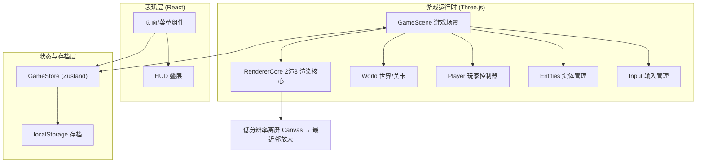
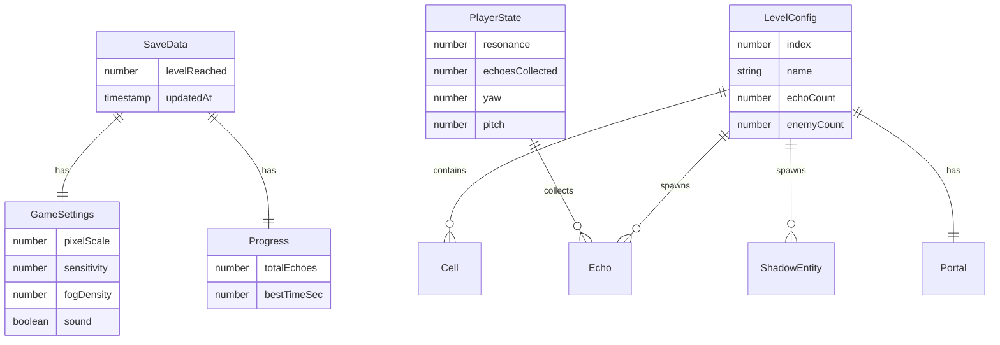

## 1. 架构设计



## 2. 技术说明

- **前端框架**：React@18 + TypeScript + Vite（沿用现有脚手架）
- **3D 引擎**：Three.js（直接使用，不引入 R3F，保证渲染管线的低分辨率离屏渲染可控）
- **2 渲 3 核心方案**：
  - 主 `WebGLRenderer` 以低分辨率 `setSize(W/pixelScale, H/pixelScale)` 渲染，`setPixelRatio(1)`
  - 渲染目标输出到离屏 canvas，再用 CSS `image-rendering: pixelated` 的 `<canvas>` 或 2D context `drawImage` 以 `imageSmoothingEnabled=false` 最近邻放大到全屏，形成粗像素
  - 叠加 CSS 扫描线 / 噪点 / 暗角 overlay 增强 CRT 质感
- **精灵系统**：billboard `Sprite` / `PlaneGeometry` + `MeshBasicMaterial`，纹理由 Canvas 程序化绘制像素图生成（`CanvasTexture`，`magFilter=NearestFilter`）
- **状态管理**：Zustand（沿用，管理游戏状态、设置、存档进度）
- **样式方案**：TailwindCSS@3 + CSS Variables（沿用）
- **路由**：单页游戏，状态机驱动「菜单 / 游戏中 / 结算」而非多路由（无需 react-router，可移除）
- **存档**：localStorage（关卡进度、设置），轻量无需 IndexedDB
- **后端**：无（纯前端）
- **初始化**：在现有 Vite + React 项目基础上重构 src，新增 `three` 依赖

## 3. 路由定义

本项目为单页游戏，使用状态机替代路由：

| 游戏状态 (gameState) | 用途 |
|------|------|
| `menu` | 主菜单界面 |
| `playing` | 游戏进行中（3D 视口 + HUD） |
| `paused` | 暂停 / 设置面板 |
| `victory` | 通关结算 |
| `defeat` | 失败结算 |

## 4. API 定义

无后端 API。所有逻辑为本地运行时。对外暴露的关键运行时接口（TypeScript）：

```typescript
// 游戏设置
interface GameSettings {
  pixelScale: number;      // 像素缩放档：1=高(细), 2=中, 3=低(粗像素)
  sensitivity: number;     // 鼠标灵敏度 0.5~2.0
  fogDensity: number;      // 雾密度 0.06~0.18
  sound: boolean;          // 音效开关
}

// 关卡定义
interface LevelConfig {
  index: number;            // 第几层
  name: string;             // 关卡名「寂静回廊」
  layout: Cell[][];         // 网格地图：0 空 / 1 墙 / 2 回响点 / 3 传送门 / 4 实体出生点 / 5 玩家出生点
  echoCount: number;        // 需收集回响数
  enemyCount: number;       // 暗影实体数
}

// 运行时实体
interface Echo { position: Vector3; collected: boolean; }
interface ShadowEntity { position: Vector3; speed: number; }
interface Portal { position: Vector3; active: boolean; }

// 玩家状态
interface PlayerState {
  position: Vector3;
  yaw: number; pitch: number;
  resonance: number;       // 残响值 0~100
  echoesCollected: number;
}
```

## 5. 服务器架构图

无后端服务，跳过。

## 6. 数据模型

### 6.1 数据模型定义



### 6.2 数据定义语言（localStorage Schema）

```javascript
// localStorage 键值结构
{
  "voidwalker_save": {          // SaveData
    "levelReached": 1,
    "updatedAt": 1782976559000
  },
  "voidwalker_settings": {      // GameSettings
    "pixelScale": 2,
    "sensitivity": 1.0,
    "fogDensity": 0.12,
    "sound": true
  },
  "voidwalker_progress": {      // Progress
    "totalEchoes": 0,
    "bestTimeSec": null
  }
}
```

## 7. 项目目录结构

```
voidwalker/
├── src/
│   ├── game/                       # 游戏运行时核心（Three.js）
│   │   ├── GameScene.ts            # 场景总控：初始化/更新/销毁
│   │   ├── RendererCore.ts         # 2渲3 渲染核心：低分辨率 + 放大 + 后处理
│   │   ├── World.ts                # 关卡世界：墙体/地面/雾/灯光构建
│   │   ├── Player.ts               # 玩家：移动/视角/碰撞
│   │   ├── Input.ts                # 键鼠输入 + 指针锁定
│   │   ├── Entities.ts             # 回响/暗影实体/传送门实体逻辑
│   │   ├── levels.ts               # 关卡布局数据
│   │   └── textures.ts             # Canvas 程序化像素纹理生成
│   ├── components/                 # React UI 层
│   │   ├── MainMenu.tsx            # 主菜单
│   │   ├── GameCanvas.tsx          # 3D 画布容器（挂载 GameScene）
│   │   ├── HUD.tsx                 # 游戏内 HUD
│   │   ├── SettingsPanel.tsx       # 设置面板
│   │   ├── ResultScreen.tsx        # 结算界面
│   │   └── PixelButton.tsx         # 像素风按钮
│   ├── store/
│   │   └── useGameStore.ts         # Zustand 全局状态
│   ├── lib/
│   │   └── storage.ts              # localStorage 封装
│   ├── App.tsx                     # 状态机路由
│   ├── main.tsx
│   └── index.css
├── index.html
├── package.json
├── vite.config.ts
└── tailwind.config.js
```

## 8. 2 渲 3 实现要点

1. **低分辨率渲染**：`renderer.setSize(w / pixelScale, h / pixelScale, false)`，画布 CSS 拉伸到全屏，`image-rendering: pixelated`
2. **像素纹理**：所有材质纹理用 16×16 / 32×32 Canvas 绘制，`magFilter = NearestFilter`，避免线性插值模糊
3. **billboard 精灵**：回响 / 暗影 / 传送门用 `Sprite` 或始终面向相机的 `Plane`，承载像素图，保留 2D 像素感同时存在于 3D 空间
4. **雾效遮距**：`FogExp2` 颜色与背景一致，远墙隐入虚空，强化「像素 + 透视」的纵深感
5. **CRT 后处理**：CSS overlay 叠加 repeating-linear-gradient 扫描线 + 噪点 + radial-gradient 暗角，不占用 WebGL 性能
6. **性能**：墙体合并为单个 `BufferGeometry`；精灵共享材质；目标 60fps
