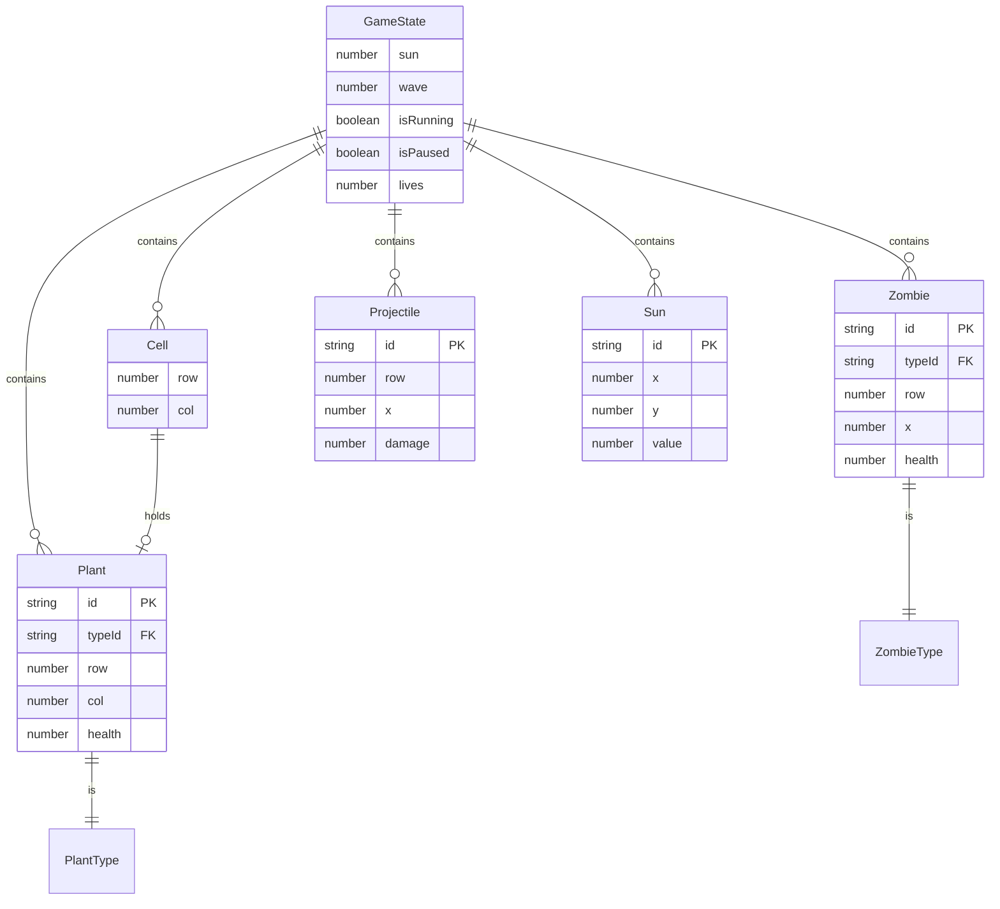

## 1. 架构设计

```mermaid
flowchart TD
    subgraph "前端层 (React + Vite)"
        "UI[页面组件]" --> "Store[Zustand 状态管理]"
        "Store" --> "Engine[游戏引擎核心]"
    end
    subgraph "游戏引擎层"
        "Engine" --> "Grid[棋盘网格系统]"
        "Engine" --> "Plant[植物系统]"
        "Engine" --> "Zombie[僵尸系统]"
        "Engine" --> "Projectile[子弹系统]"
        "Engine" --> "Sun[阳光系统]"
        "Engine" --> "Wave[波次系统]"
    end
    subgraph "渲染层"
        "Engine" --> "SVG[SVG 渲染器]"
    end
```

## 2. 技术说明

- **前端框架**：React@18 + TypeScript + Vite@5
- **样式方案**：TailwindCSS@3 + CSS Variables（主题色管理）
- **状态管理**：Zustand（管理阳光、棋盘、植物、僵尸、子弹、游戏状态）
- **渲染方案**：纯 SVG（所有游戏元素均为 SVG 组件，无 Canvas）
- **动画方案**：CSS animations + React state 驱动的 transform 过渡
- **初始化工具**：`npm create vite@latest` React + TS 模板
- **后端**：无（纯前端应用）

## 3. 路由定义

| 路由 | 用途 |
|------|------|
| `/` | 游戏主界面（默认进入） |
| `/gallery` | SVG 设定图鉴展示 |

## 4. API 定义

无后端 API。所有数据通过本地状态管理。

```typescript
// 核心类型定义
interface PlantType {
  id: string;
  name: string;
  cost: number;
  cooldown: number;
  health: number;
  attackSpeed?: number;
  sunRate?: number;
  svg: React.FC<{ variant?: string }>;
}

interface Plant {
  id: string;
  typeId: string;
  row: number;
  col: number;
  health: number;
  lastAttackAt: number;
  lastSunAt: number;
}

interface ZombieType {
  id: string;
  name: string;
  health: number;
  speed: number;
  damage: number;
  reward: number;
  svg: React.FC<{ frame?: number; hurt?: boolean }>;
}

interface Zombie {
  id: string;
  typeId: string;
  row: number;
  x: number;
  health: number;
  maxHealth: number;
  isEating: boolean;
}

interface Projectile {
  id: string;
  row: number;
  x: number;
  damage: number;
}

interface Sun {
  id: string;
  x: number;
  y: number;
  value: number;
  type: 'sky' | 'plant';
}

interface Cell {
  row: number;
  col: number;
  plant?: Plant;
}
```

## 5. 服务器架构图

无后端服务，跳过。

## 6. 数据模型

### 6.1 数据模型定义



## 7. 项目目录结构（整理框架）

```
pvz-svg-template/
├── src/
│   ├── components/
│   │   ├── Game/                  # 游戏主界面组件
│   │   │   ├── Board.tsx          # 棋盘
│   │   │   ├── Cell.tsx           # 单个格子
│   │   │   ├── Hud.tsx            # 顶部 HUD
│   │   │   ├── SeedPackets.tsx    # 植物卡槽
│   │   │   └── Controls.tsx       # 控制按钮
│   │   ├── Gallery/               # 图鉴组件
│   │   │   ├── GalleryGrid.tsx
│   │   │   └── GalleryCard.tsx
│   │   ├── svg/                   # SVG 设定组件
│   │   │   ├── plants/            # 植物 SVG
│   │   │   │   ├── Sunflower.tsx
│   │   │   │   ├── Peashooter.tsx
│   │   │   │   └── WallNut.tsx
│   │   │   ├── zombies/           # 僵尸 SVG
│   │   │   │   ├── BasicZombie.tsx
│   │   │   │   ├── ConeheadZombie.tsx
│   │   │   │   └── BucketheadZombie.tsx
│   │   │   ├── ui/                # UI 与道具 SVG
│   │   │   │   ├── Sun.tsx
│   │   │   │   ├── Pea.tsx
│   │   │   │   └── Lawn.tsx
│   │   │   └── scenes/            # 场景 SVG
│   │   │       └── Background.tsx
│   │   └── common/                # 通用组件
│   ├── engine/
│   │   ├── gameLoop.ts            # 游戏循环
│   │   ├── collision.ts           # 碰撞检测
│   │   └── constants.ts           # 网格、速度等常量
│   ├── store/
│   │   └── useGameStore.ts        # Zustand 状态
│   ├── types/
│   │   └── index.ts
│   ├── App.tsx
│   ├── main.tsx
│   └── index.css
├── index.html
├── package.json
├── tsconfig.json
├── vite.config.ts
└── tailwind.config.js
```
