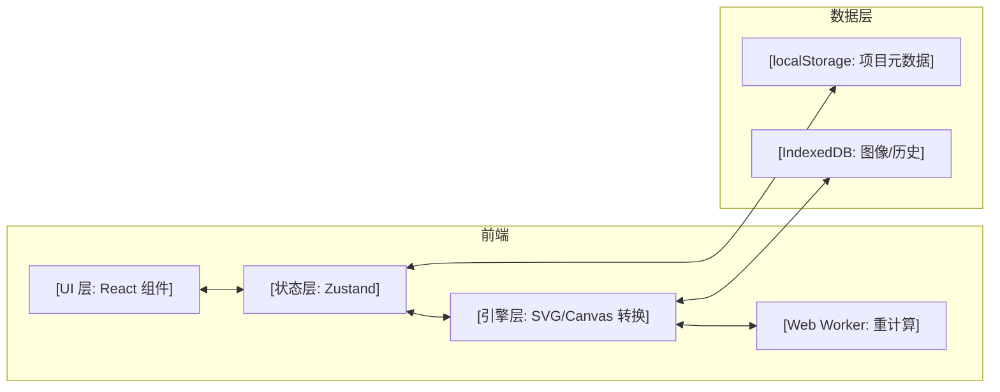
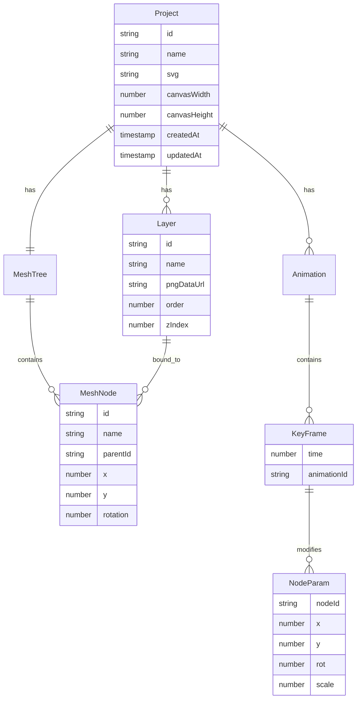

# Live2D 动画模板工具 - 技术架构文档

## 1. 架构设计

本项目为纯前端单页应用，所有计算（SVG 解析、图层切分、骨骼网格生成、动画播放）均在浏览器内完成。无后端依赖，数据持久化采用 localStorage + IndexedDB（图像资源）。



## 2. 技术选型

- **前端框架**：React 18 + TypeScript + Vite
- **样式方案**：Tailwind CSS 3 + CSS Modules（局部细节）
- **状态管理**：Zustand（轻量、跨组件共享画布状态）
- **路由**：React Router v6
- **画布渲染**：原生 SVG（绘制阶段）+ Canvas 2D（动画预览阶段）
- **图像处理**：浏览器原生 `ImageData` + `OffscreenCanvas`（可选 Web Worker 加速）
- **数据持久化**：localStorage（元数据）+ IndexedDB（二进制图像通过 idb-keyval）
- **图标**：lucide-react
- **字体**：Google Fonts（Zen Maru Gothic + Noto Sans SC）
- **导出**：自实现 moc3/JSON 序列化、MediaRecorder API（GIF/WebM）、JSZip（打包）
- **包管理**：pnpm

## 3. 目录结构

```
src/
├── App.tsx
├── main.tsx
├── routes.tsx
├── pages/
│   ├── Home/                  # 首页 / 工作台
│   ├── Draw/                  # SVG 绘制
│   ├── Layers/                # 图层转换
│   ├── Mesh/                  # 骨骼网格
│   ├── Animate/               # 动画模板
│   └── Export/                # 导出
├── components/
│   ├── common/                # 通用 UI（Button、Card、Modal）
│   ├── canvas/                # 画布相关（SvgCanvas、CanvasPreview）
│   ├── panels/                # 面板（LayersPanel、TreePanel、Timeline）
│   └── layout/                # 布局（TopBar、SideBar、StatusBar）
├── engine/                    # 核心引擎
│   ├── svg/                   # SVG 解析、序列化
│   ├── layer/                 # 颜色聚类、边界提取、PNG 切分
│   ├── mesh/                  # 树形骨骼、权重计算
│   ├── animator/              # 关键帧插值、模板应用
│   └── exporter/              # 各种格式导出
├── store/                     # Zustand 切片
│   ├── projectStore.ts
│   ├── drawStore.ts
│   ├── layerStore.ts
│   ├── meshStore.ts
│   └── animStore.ts
├── templates/                 # 模板库（预置 SVG + 网格 + 动画）
├── utils/                     # 工具函数
└── styles/                    # 全局样式
```

## 4. 路由定义

| 路由 | 用途 |
|------|------|
| `/` | 首页（工作台 / 模板库） |
| `/draw` | SVG 绘制工作区 |
| `/layers` | 图层转换工作区 |
| `/mesh` | 骨骼网格工作区 |
| `/animate` | 动画模板工作区 |
| `/export` | 导出工作区 |
| `/preview` | 全屏动画预览 |

工作流采用向导式顶部进度条，用户可前后跳转，状态在 `projectStore` 中跨路由持久。

## 5. 核心引擎设计

### 5.1 SVG 绘制引擎
- 数据结构：`Shape[]`，每个 Shape 包含 `id, type, attrs, transform, parentId`
- 支持：矩形、椭圆、钢笔路径、自由画笔、文本
- 撤销/重做：基于 `JSONPatch` 差分历史栈
- 序列化：标准 SVG 字符串（可被任何 SVG 查看器打开）

### 5.2 图层切分引擎
- 输入：SVG 字符串 + 颜色配置（自动/手动）
- 流程：
  1. 将 SVG 栅格化到 OffscreenCanvas（2048×2731 像素）
  2. 颜色聚类（K-Means，按颜色相似度合并）
  3. 边界吸附（连通域标记 + 八方向 flood fill）
  4. 输出：`Layer[]`，每个 Layer 是独立的 PNG DataURL + 命名
- 命名：按形状 ID 或自动命名（Layer_01, Layer_02…）

### 5.3 骨骼网格引擎
- 树形结构：`MeshNode { id, name, parentId, position, rotation, scale, children[] }`
- 自动生成启发式：
  - 解析 SVG `<g id="head">` 等分组
  - 计算每个分组边界中心作为节点位置
  - 推断父子关系（包含/重叠）
- 绑定：用户拖拽节点到画布，自动关联 Layer
- 权重：自动根据距离计算（高斯衰减）

### 5.4 动画引擎
- 关键帧：`KeyFrame { time, params: { nodeId: { x, y, rot, scale } } }`
- 插值：贝塞尔缓动（cubic-bezier）
- 模板：
  ```ts
  interface AnimTemplate {
    name: string;
    duration: number;
    loop: boolean;
    keyframes: KeyFrame[];
    paramBindings: { nodeId: string; param: string }[];
  }
  ```
- 实时播放：`requestAnimationFrame` 驱动

### 5.5 导出引擎
- **moc3**：简化版 JSON 描述（不完整兼容官方，但保留关键字段）
- **JSON**：项目结构 + 帧数据
- **GIF**：gif.js 编码
- **WebM**：MediaRecorder + Canvas captureStream
- **ZIP**：所有 PNG 图层 + 元数据 + 网格 + 动画

## 6. 数据模型



## 7. 性能与降级

- 大图像栅格化放入 Web Worker，避免阻塞主线程
- 栅格化时增加进度条，必要时降到 1024×1365
- 浏览器不支持 OffscreenCanvas 时回退到普通 Canvas
- 移动端禁用编辑功能，仅展示预览

## 8. 测试与质量

- 单元测试：Vitest（覆盖 engine 各模块纯函数）
- 组件测试：Vitest + Testing Library
- 端到端：手动 Playwright 走查（核心 4 步流程）
- 类型检查：`tsc --noEmit` 与 `npm run check`

## 9. 部署

- 静态站点，可部署到 Vercel / Netlify / GitHub Pages
- 构建产物：`pnpm build` 输出到 `dist/`
- 不需要服务端路由（SPA 模式）
