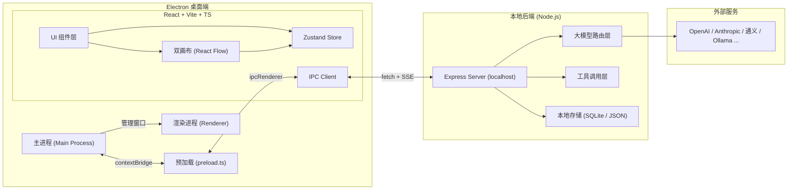
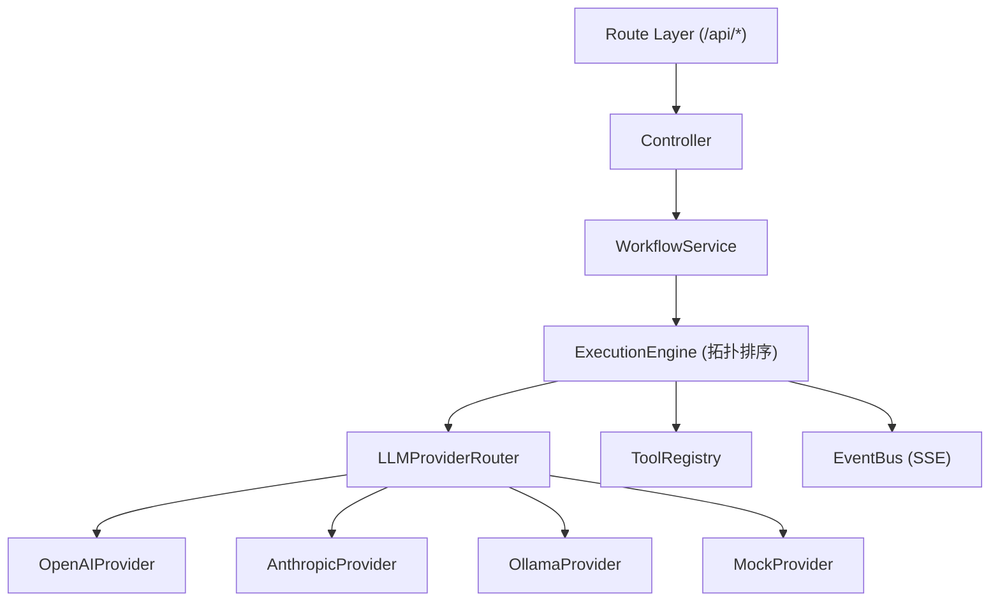
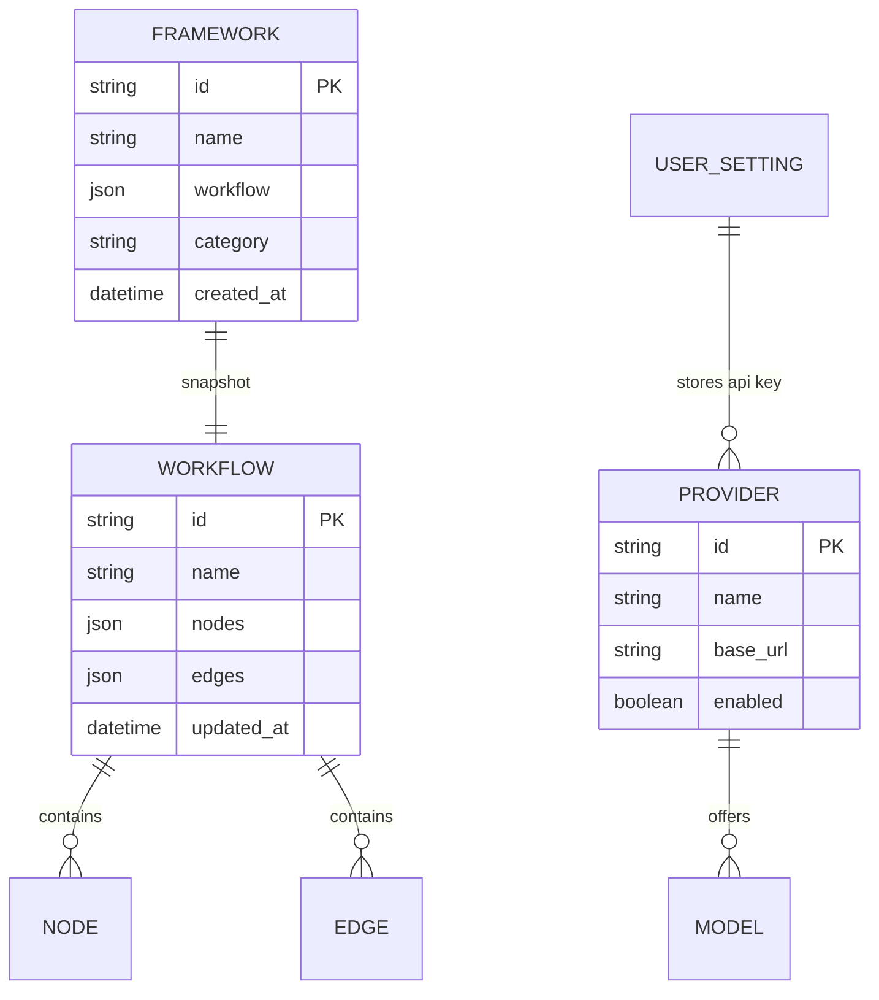

# FlowForge 技术架构

## 1. 架构设计



## 2. 技术栈

- **桌面壳**:Electron@31 + electron-builder
- **前端**:React@18 + Vite@5 + TypeScript@5
- **画布引擎**:@xyflow/react(React Flow v12) —— 节点编辑器的事实标准
- **样式**:Tailwind CSS@3(暗色技术风设计令牌)
- **状态管理**:Zustand@4
- **图标**:lucide-react
- **后端**:Express@4(在主进程或独立 Node 子进程运行,避免阻塞 UI)
- **流式通信**:Server-Sent Events(SSE)
- **大模型接入**:统一抽象 `LLMProvider` 接口,内置 mock provider 以便本地无 key 演示
- **存储**:JSON 文件(`userData/flowforge/`)用于工作流与框架模板
- **通信**:主进程 ↔ 渲染进程 = IPC;后端 ↔ 渲染进程 = 本地 HTTP + SSE
- **包管理**:npm(根据 env,无 pnpm)

## 3. 路由/视图定义(渲染端)

| 视图 | 用途 |
|------|------|
| `/` | 主窗口(双画布 + 节点库 + 属性面板 + 控制台) |
| `/library` | 框架库(我的 / 内置) |
| `/settings` | 设置(API Key、主题、性能) |

> Electron 单窗口内使用 React Router(HashRouter)即可。

## 4. IPC 与后端 API

### 4.1 IPC 接口(主进程)
| 通道 | 方向 | 用途 |
|------|------|------|
| `app:open-file` | renderer → main | 打开 .ff 文件 |
| `app:save-file` | renderer → main | 保存工作流 |
| `app:reveal` | renderer → main | 在系统资源管理器显示文件 |
| `backend:start` | renderer → main | 启动本地后端服务 |
| `backend:status` | renderer → main | 查询后端健康 |

### 4.2 后端 HTTP API
| 路径 | 方法 | 用途 |
|------|------|------|
| `/api/providers` | GET | 列出大模型厂商 |
| `/api/models` | GET | 列出某厂商模型 |
| `/api/ping` | POST | 测延迟 |
| `/api/run` | POST | 启动工作流执行(返回 streamId) |
| `/api/stream/:id` | GET | SSE 流式订阅执行进度 |
| `/api/framework/save` | POST | 保存框架 |
| `/api/framework/list` | GET | 框架列表 |
| `/api/framework/:id` | GET / DELETE | 框架详情 / 删除 |

### 4.3 数据契约(关键类型)
```ts
type NodeKind = 'input' | 'llm' | 'tool' | 'condition' | 'output';
interface WorkflowNode { id: string; kind: NodeKind; position: {x:number;y:number}; data: Record<string, unknown>; }
interface WorkflowEdge { id: string; source: string; target: string; sourceHandle?: string; targetHandle?: string; }
interface Workflow { id: string; name: string; nodes: WorkflowNode[]; edges: WorkflowEdge[]; }
interface RunEvent { type: 'start'|'node-start'|'token'|'node-end'|'error'|'end'; nodeId?: string; payload?: unknown; }
```

## 5. 后端模块图



## 6. 数据模型

### 6.1 ER


### 6.2 本地文件
- `workflows/*.json` — 用户工作流
- `frameworks/*.json` — 框架模板
- `settings.json` — 主题、API Key(本地加密可选)
- `providers.json` — 厂商与模型元数据

## 7. 关键设计决策

1. **双画布的实现**:共用同一份 `Workflow`(节点 + 边),但渲染两种 overlay:
   - 设计画布:常规 React Flow,节点可拖拽
   - 运行时画布:只读 React Flow + 状态层(执行中/成功/失败) + 连线流光
   - 切换通过 Tab 状态,`zustand` 持有同一份 workflow 引用
2. **大模型路由**:抽象 `LLMProvider` 接口,统一返回 `AsyncIterable<token>`,后端通过 SSE 推给前端
3. **流式执行**:使用 EventEmitter + SSE,前端用 `EventSource` 订阅
4. **节点系统**:节点通过 `kind` 区分,组件用工厂 `getNodeComponent(kind)` 注册,后续可扩展
5. **不依赖外部网络**:内置 `MockProvider` 返回伪流式输出,确保 demo 友好
6. **不打包真实大模型 SDK**:仅实现接口与 mock,真实集成作为后续可插拔
