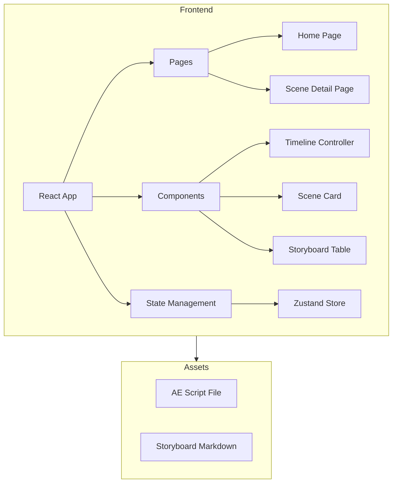

## 1. Architecture Design


## 2. Technology Description
- **Frontend**: React@18 + TypeScript + tailwindcss@3 + vite
- **Initialization Tool**: vite-init
- **Backend**: None（纯前端项目）
- **Database**: None
- **Libraries**: lucide-react, framer-motion（动画）

## 3. Route Definitions
| Route | Purpose |
|-------|---------|
| / | 首页，展示分镜概览 |
| /scene/:id | 场景详情页 |

## 4. API Definitions (if backend exists)
- 不适用

## 5. Server Architecture Diagram (if backend exists)
- 不适用

## 6. Data Model (if applicable)
- 不适用

### 6.1 Data Definition Language
```typescript
// 分镜场景数据结构
interface Scene {
  id: string;
  name: string;
  description: string;
  startTime: number;  // 帧
  endTime: number;    // 帧
  duration: number;   // 秒
  frames: Frame[];
}

// 单帧数据结构
interface Frame {
  frame: number;
  description: string;
  content: string;
  effect: string;
}
```
