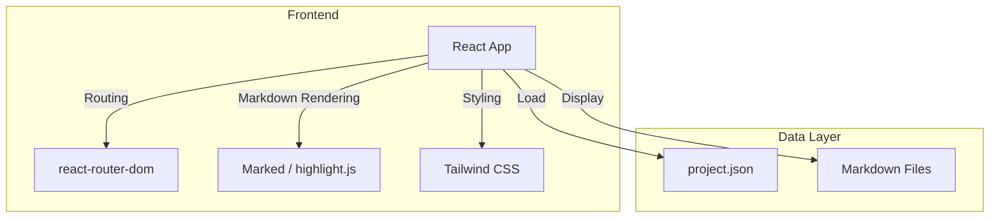

## 1. Architecture Design


## 2. Technology Description
- Frontend: React@18 + TypeScript + Tailwind CSS@3 + Vite
- Initialization Tool: vite-init
- Markdown Rendering: marked + highlight.js
- Routing: react-router-dom
- Build Tool: Vite

## 3. Route Definitions
| Route | Purpose |
|-------|---------|
| / | 项目概览页 |
| /document/:id | 分镜文档阅读页 |

## 4. Data Model
### 4.1 Project Data Structure
```typescript
interface Project {
  project_name: string;
  version: string;
  description: string;
  scenes: Scene[];
  characters: string[];
  visual_style: any;
  camera_style: string[];
  effects: string[];
  total_duration: number;
  total_shots: number;
  created_at: string;
  files: Record<string, string>;
}

interface Scene {
  id: string;
  name: string;
  duration: number;
  shots: number;
}

interface DocumentFile {
  id: string;
  name: string;
  path: string;
  category: 'scenes' | 'characters' | 'effects' | 'camera';
}
```

### 4.2 File Structure
```
/workspace/
├── .trae/documents/
│   ├── prd.md
│   └── arch.md
├── project/
│   ├── camera/
│   │   └── camera.md
│   ├── characters/
│   │   └── characters.md
│   ├── effects/
│   │   └── effects.md
│   ├── scenes/
│   │   ├── scenes.md
│   │   └── storyboard.md
│   └── project.json
└── src/
    ├── pages/
    │   ├── Home.tsx
    │   └── Document.tsx
    ├── components/
    │   ├── Sidebar.tsx
    │   ├── SceneCard.tsx
    │   ├── MarkdownRenderer.tsx
    │   └── ProjectStats.tsx
    ├── data/
    │   └── documents.ts
    └── App.tsx
```
