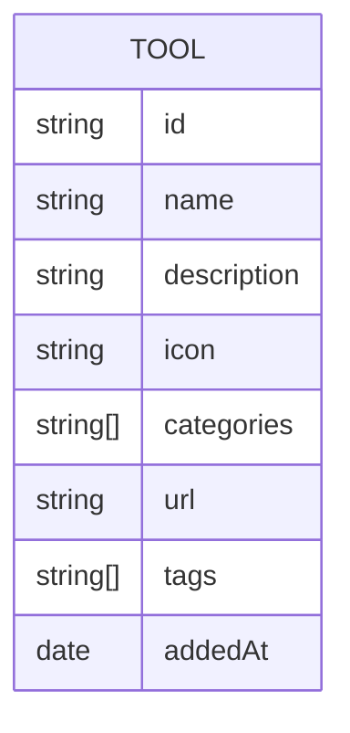

## 1. Architecture Design
```mermaid
graph TB
    subgraph "Frontend (React)"
        A[Home Page]
        B[Tool Detail Page]
        C[Components<br/>ToolCard/SearchBar/Filter]
    end
    
    subgraph "State Management"
        D[Zustand Store]
    end
    
    subgraph "Data"
        E[Mock Data / Static JSON]
    end
    
    A --&gt; C
    B --&gt; C
    C --&gt; D
    D --&gt; E
```

## 2. Technology Description
- **Frontend**: React@18 + TypeScript + tailwindcss@3 + Vite
- **Initialization Tool**: vite-init (react-ts template)
- **State Management**: Zustand
- **Icons**: lucide-react
- **Backend**: None (前端应用，使用静态数据)
- **Database**: None

## 3. Route Definitions
| Route | Purpose |
|-------|---------|
| / | 首页，工具网格展示和搜索 |
| /tool/:id | 工具详情页 |

## 4. API Definitions
不适用，无后端 API

## 5. Server Architecture Diagram
不适用，无后端

## 6. Data Model
### 6.1 Data Model Definition


### 6.2 Data Definition Language
不适用，使用静态数据
