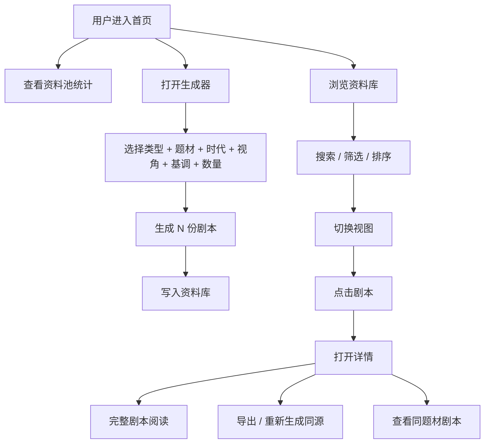

# 剧本工厂 SCRIPT.FORGE - PRD

## 1. 产品概述

构建一个面向编剧、内容创作者、剧本策划、游戏叙事设计师的「剧本智能生成工厂」，基于全局模板与大规模资料源池（题材、时代、角色、幕结构、场景、主题），按用户配置批量生成 2,000+ 份结构化剧本大纲，覆盖动画、游戏、影视、广播剧、漫画脚本、小说大纲等多形态，并提供现代化浏览、检索、详情阅读与导出能力。

- **目标用户**：编剧、剧本策划、内容运营、小说作者、游戏叙事设计师、剧本杀作者
- **核心价值**：将"灵感构思"工业化，从资料池中按模板组合出结构化、可阅读、可二次创作的大纲

## 2. 核心功能

### 2.1 数据规模
- 剧本总量：≥ 2,000 份
- 题材池：≥ 24 类（科幻/奇幻/悬疑/惊悚/爱情/喜剧/历史/战争/冒险/校园/职场/家庭/医疗/法律/犯罪/超自然/末日/赛博朋克/蒸汽朋克/克苏鲁/武侠/仙侠/修真/机甲/怪兽/偶像/竞技/美食/旅行/音乐/神话/黑色幽默…）
- 时代池：≥ 12 个
- 角色原型池：≥ 36 个
- 幕结构模板池：≥ 18 个
- 主题/情节模块池：≥ 200 个
- 场景模板池：≥ 60 个

### 2.2 功能模块
1. **首页（灵感前厅）**：大标题 + 全局模板展示 + 题材分布 + 批量生成器
2. **批量生成器**：用户选择题材 / 类型 / 时代 / 视角 / 基调 / 数量 → 一键生成 N 份
3. **资料库**：网格/列表/剧本格式 三视图浏览
4. **多维筛选**：题材、类型、时代、视角、基调、长度、状态
5. **全文搜索**：标题 / 角色 / logline / 主题 模糊搜索
6. **剧本详情**：完整剧本格式（场景标题、动作、对话、转场、幕）+ 角色卡 + 主题 + 标签
7. **导出**：单条 / 批量 导出为 Markdown / JSON / 纯文本
8. **统计面板**：题材分布、时代分布、视角分布、字数分布

### 2.3 页面详情
| 页面 | 模块 | 描述 |
|------|------|------|
| 首页 | Hero | 巨字标题「剧本工厂 SCRIPT.FORGE」、副标题、生成器入口、资料池统计 |
| 首页 | 全局模板 | 4-6 个核心模块卡片：题材池/角色池/幕结构/场景池/主题池/转折池 |
| 首页 | 生成器 | 选择类型 → 题材 → 时代 → 视角 → 基调 → 数量 → 生成按钮 |
| 首页 | 近期生成 | 最近生成的 12 份剧本 |
| 资料库 | 工具栏 | 搜索、排序、视图、每页数量 |
| 资料库 | 筛选侧栏 | 题材、类型、时代、视角、基调 |
| 资料库 | 网格 | 卡片：标题、logline、题材、类型、时代、字数 |
| 资料库 | 列表 | 紧凑：标题、logline、题材、时代、字数 |
| 资料库 | 剧本视图 | 标准剧本格式：场号、场景标题（INT./EXT.）、动作、对话、幕标题、转场 |
| 详情 | 弹窗 | 完整剧本 + 角色卡 + 主题 + 标签 + 重新生成同源剧本 |
| 趋势 | 多图表 | 题材分布、时代分布、视角分布、字数分布、生成时间线 |

## 3. 核心流程



## 4. 用户界面设计

### 4.1 设计风格
- **整体调性**：编辑 / 编剧室 / 制片厂 —— 致敬好莱坞黄金时代编剧室、好莱坞剧本格式、电影分镜工作台
- **配色**：
  - 背景：暖米色 `#f4ecd8`（旧纸） / 深木色 `#1a1410`（深木板）
  - 文本：深墨黑 `#0a0a0a` / 灰褐 `#5a4a3a`
  - 强调 1：影院红 `#c1121f`（FADE IN 红）
  - 强调 2：褪色金 `#bb8b00`（奥斯卡金）
  - 强调 3：墨水蓝 `#1a3a5c`
  - 副：`#e8d8b8`（半米色）
- **字体**：
  - 显示字体：`Bodoni Moda`（编辑风衬线，致敬电影海报）
  - 主体：`EB Garamond`（经典书籍衬线）
  - 打字机：`Special Elite`（标志性 typewrite 字体）
  - 中文：`Noto Serif SC`（宋体，仿古）
- **质感**：纸张纹理（subtle noise）、印章红、墨水污渍、撕裂边缘
- **元素**：
  - 场号盒：黑色实心框 + 白字
  - 角色名：CENTERED CAPS
  - 对话：缩进 4em
  - 动作：左对齐全宽
  - 转场：右对齐 CAPS
  - FADE IN / FADE OUT：左对齐
  - 幕标题：居中 CAPS 加横线

### 4.2 页面设计
| 页面 | 模块 | UI 元素 |
|------|------|---------|
| 首页 | Hero | 巨字衬线标题、印章红下划线、打字机副标题 |
| 首页 | 生成器 | 选择器组：类型 chip / 题材 chip / 时代下拉 / 视角 radio / 基调 radio / 数量 stepper / 生成按钮 |
| 资料库 | 卡片 | 米色卡片 + 黑色细边 + 标题（衬线粗体）+ logline（斜体小字）+ 题材/类型 chip |
| 剧本视图 | 卡片 | 标准剧本格式布局 |
| 详情 | 弹窗 | 巨幕纸张 + 角色卡 + 主题芯片 + 关联剧本 |
| 顶栏 | Logo | 黑色打字机 + 红印章 |

### 4.3 响应式
- 桌面优先
- 平板 2-3 列
- 移动 1 列 + 抽屉式筛选

### 4.4 视觉特效
- 入场：纸张翻页（CSS 3D rotateY）
- 卡片悬浮：轻微 3D 倾斜 + 阴影加深
- 打字机效果：标题文字 typewriter 逐字出现
- 印章：subtle ink-stamp 效果
- 撕裂边缘：卡片右上角可选缺口

## 5. 剧本结构

```ts
type Script = {
  id: number;
  title: string;          // 剧本名
  type: ScriptType;        // 动画 / 游戏 / 影视 / 广播剧 / 漫画 / 小说
  genre: string;           // 题材
  era: string;             // 时代
  perspective: string;     // 视角
  tone: string;            // 基调
  actCount: number;        // 幕数
  logline: string;         // 一句话梗概
  setting: string;         // 背景设定（200-400 字）
  characters: Character[]; // 角色（3-7）
  themes: string[];        // 主题词
  acts: Act[];             // 幕（3-5）
  wordCount: number;       // 总字数
  tags: string[];          // 标签
  createdAt: string;       // 生成时间
};

type Character = {
  name: string;
  role: 'protagonist' | 'antagonist' | 'mentor' | 'ally' | 'foil' | 'love_interest' | 'trickster';
  archetype: string;       // 原型
  traits: string[];       // 性格特征
  motivation: string;      // 动机
  arc: string;             // 成长弧
};

type Act = {
  number: number;
  title: string;
  scenes: Scene[];
};

type Scene = {
  number: number;
  heading: string;         // INT. 咖啡馆 - 夜
  location: string;
  time: string;
  action: string;          // 动作描述
  dialogue: DialogueLine[];
  transition?: string;     // 转场
};

type DialogueLine = {
  character: string;
  line: string;            // 对话
  parenthetical?: string;  // 表演提示
};
```

## 6. 全局模板

`SCRIPT.FORGE` 的核心是「**全局模板**」，由以下 6 个原子模块池组成，可任意组合：

1. **题材池 (Genre Pool)** — 36+ 题材分类
2. **时代池 (Era Pool)** — 古代/中世纪/近现代/当代/近未来/远未来/末日/平行宇宙
3. **视角池 (Perspective Pool)** — 第一人称/第三人称限制/第三人称全知/多线/POV 群像
4. **基调池 (Tone Pool)** — 黑暗/温暖/冷峻/幽默/史诗/小清新/悬疑/紧张/抒情
5. **幕结构池 (Act Structure Pool)** — 三幕剧 / 四幕剧 / 五幕剧 / 救猫咪 / 节拍表 / 起承转合 / 英雄之旅 12 段
6. **场景库 (Scene Template Pool)** — 开场钩子 / 触发事件 / 中点反转 / 至暗时刻 / 高潮对决 / 收尾余韵

生成算法：`剧本 = 题材 ⊗ 时代 ⊗ 视角 ⊗ 基调 ⊗ 幕结构 ⊗ 角色原型 ⊗ 主题 ⊗ 转折`，每条数据是确定性的可复现组合。
