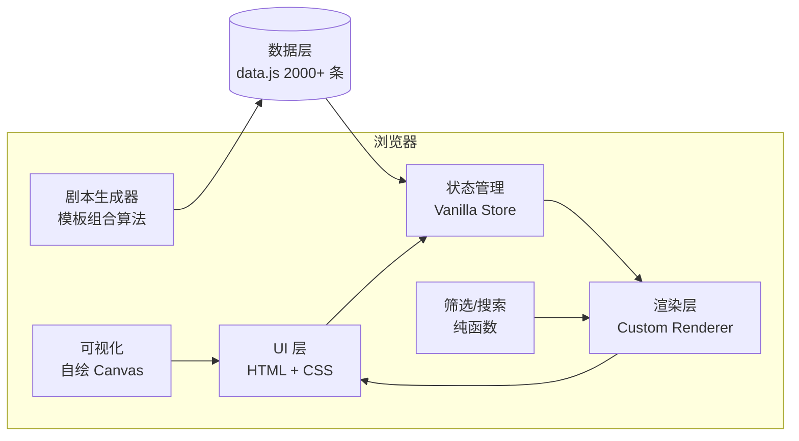

# 剧本工厂 SCRIPT.FORGE - 技术架构

## 1. 架构设计



## 2. 技术选型

- **基础**：纯静态 HTML + 原生 ES6+（无构建依赖）
- **可视化**：自绘 Canvas（同 IP.ARC）
- **字体**：Google Fonts（Special Elite / Bodoni Moda / EB Garamond / Noto Serif SC）
- **状态管理**：自实现轻量 Store
- **样式**：原生 CSS 变量 + BEM 命名
- **图标**：Unicode 字符（不使用 SVG 图标以保持复古质感）

## 3. 路由

| Hash | 视图 |
|------|------|
| `#/` | 首页（默认） |
| `#/library` | 资料库浏览 |
| `#/script/:id` | 剧本详情（弹窗） |
| `#/trends` | 趋势统计 |
| `#/about` | 关于 |

## 4. 数据结构（见 PRD §5）

## 5. 资料池规模

```ts
// 题材池 (Genre Pool)
const GENRES = [
  '科幻', '软科幻', '硬科幻', '奇幻', '高奇幻', '低奇幻', '黑暗奇幻',
  '悬疑', '心理悬疑', '本格推理', '社会派推理', '惊悚', '恐怖', '超自然',
  '爱情', '青春爱情', '古典罗曼史', '悲剧爱情', '喜剧', '黑色幽默', '讽刺',
  '历史', '架空历史', '史诗', '战争', '谍战', '冒险', '公路', '生存',
  '校园', '职场', '家庭', '医疗', '法律', '犯罪', '黑帮',
  '末日', '后末日', '废土', '赛博朋克', '蒸汽朋克', '柴油朋克', '太阳朋克',
  '克苏鲁', '仙侠', '修真', '武侠', '机甲', '怪兽', '偶像', '竞技', '美食',
  '旅行', '音乐', '舞蹈', '神话', '童话', '寓言', '传记', '纪录片',
];

// 时代池 (Era Pool)
const ERAS = [
  '上古神话', '古代王朝', '春秋战国', '秦汉', '三国', '魏晋南北朝',
  '隋唐五代', '宋元明清', '民国', '近现代', '当代', '近未来',
  '远未来', '末日废土', '后启示录', '平行宇宙', '时间穿越', '异世界',
];

// 视角池
const PERSPECTIVES = ['第一人称', '第三人称限制', '第三人称全知', '多线 POV', '群像 POV', '倒叙', '插叙'];

// 基调池
const TONES = ['黑暗', '冷峻', '温暖', '明亮', '幽默', '讽刺', '史诗', '抒情', '紧张', '诡异', '小清新', '悲怆', '浪漫', '荒诞'];

// 角色原型池
const ARCHETYPES = [
  '英雄', '反英雄', '反叛者', '导师', '守门人', '信使', '变形者',
  '阴影', '骗子', '盟友', '爱人', '君王', '贤者', '战士',
  '艺术家', '守护者', '探索者', '创造者', '统治者', '魔术师', '愚者',
  '复仇者', '流浪者', '孤儿', '继承者', '叛徒', '间谍', '审讯者',
  '医生', '工程师', '作家', '音乐家', '画家', '学者', '侦探',
];

// 主题池
const THEMES = [
  '救赎', '复仇', '成长', '牺牲', '身份认同', '自由与枷锁', '爱与失去',
  '权力腐败', '科技异化', '人机关系', '末世求生', '末日', '循环',
  '命运', '选择', '悔恨', '谎言与真相', '信任与背叛', '孤独与连接',
  '记忆', '梦境', '现实与虚拟', '神性与人性', '正义', '道德困境',
  '家庭', '代际', '移民', '阶级', '种族', '性别', '信仰',
  '战争', '和平', '环保', '生态', '疾病', '健康', '生死', '永生',
  '时间', '空间', '存在', '虚无', '意义', '荒诞', '喜剧', '悲剧',
  '侦探', '解谜', '追踪', '逃亡', '追捕', '对决', '复仇', '宽恕',
];
```

## 6. 幕结构模板

每个剧本使用以下幕结构之一：

- **三幕剧**：建置 → 对抗 → 结局
- **四幕剧**：建置 → 上升 → 高潮 → 收尾
- **五幕剧**：建置 → 上升 → 高潮 → 下降 → 灾难/新秩序
- **救猫咪 15 拍**：开场画面 → 主题陈述 → 设置 → 催化剂 → 辩论 → 第二幕入口 → 副线 → 乐趣游戏 → 中点 → 反派逼近 → 失去一切 → 灵魂的黑夜 → 第三幕入口 → 高潮 → 结局
- **英雄之旅 12 段**：平凡世界 → 冒险召唤 → 拒绝召唤 → 遇见导师 → 跨越门槛 → 试炼盟友与敌人 → 接近最深处 → 重大考验 → 获得宝物 → 归途 → 复活 → 携药归来
- **起承转合**：起 → 承 → 转 → 合
- **节拍表 8 拍**：钩子 → 触发 → 第一关 → 中点 → 第二关 → 至暗 → 高潮 → 解决

## 7. 场景模板库

每场戏由以下模板生成：

- 开场钩子（强视觉 / 神秘声音 / 行动开始）
- 触发事件（信使 / 发现 / 来电 / 入侵）
- 推进情节（追逐 / 调查 / 争执 / 谈判）
- 关系转折（告白 / 背叛 / 暴露 / 和解）
- 中点反转（发现真相 / 朋友变敌人 / 计划失败）
- 至暗时刻（失去一切 / 背叛 / 牺牲）
- 高潮对决（最终对决 / 选择 / 牺牲）
- 收尾余韵（新秩序 / 余波 / 钩子）

每场戏的 action / dialogue / transition 来自对应模板的句式库。

## 8. 性能与优化

- 详情按需渲染
- 防抖搜索 250ms
- 分页 24/48
- 完整数据 ~2.5MB（2,000 剧本 × 1.2KB）

## 9. 文件结构

```
/workspace/forge/
├── index.html              # 主页面
├── styles.css              # 主样式（编辑/编剧室风）
├── app.js                  # 主逻辑
├── data.js                 # 2000+ 剧本数据
└── generate-data.js        # 数据生成器脚本
```

## 10. 与 IP.ARC 项目的区别

- **不同主题**：从游戏 IP 衍生作品 → 通用剧本大纲
- **不同美学**：从赛博朋克霓虹 → 编辑/编剧室纸张
- **不同字体**：从 Orbitron/JetBrains Mono → Special Elite/Bodoni Moda
- **不同交互**：从卡片/抽屉 → 剧本格式/打字机效果
- **全局模板概念**：题材/时代/视角/基调/幕结构/场景 6 大原子池自由组合
