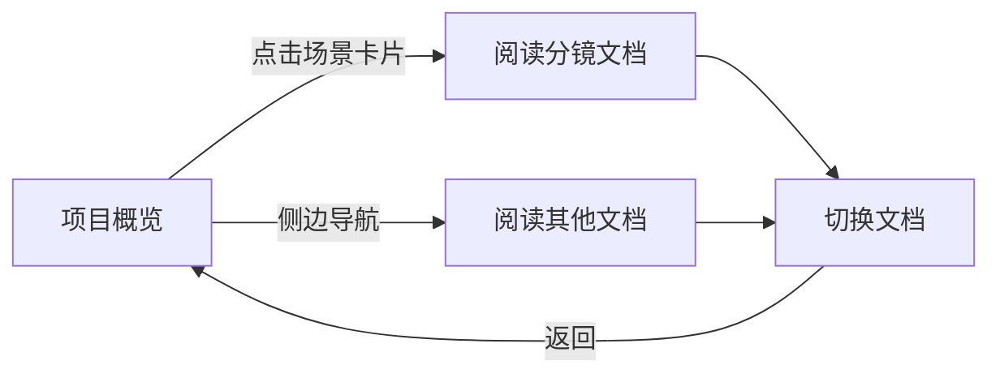

## 1. Product Overview
分镜文档阅读器 - 一款用于展示和导航视频分镜项目的专业阅读器，提供优雅的界面和流畅的用户体验，帮助用户快速浏览分镜脚本、角色设定、特效设计和运镜设计。

## 2. Core Features

### 2.1 Feature Module
1. **项目概览页**: 项目信息展示，场景卡片导航
2. **分镜文档阅读页**: Markdown文档渲染，场景切换
3. **侧边导航**: 目录导航，快速跳转

### 2.3 Page Details
| Page Name | Module Name | Feature description |
|-----------|-------------|---------------------|
| 项目概览页 | 英雄区域 | 展示项目基本信息，包含项目名称、时长、镜头数，卡片式展示三个场景 |
| 项目概览页 | 场景列表 | 每个场景卡片展示场景信息、时长、镜头数 |
| 分镜文档阅读页 | 文档渲染 | Markdown文档美观渲染，支持代码高亮 |
| 分镜文档阅读页 | 场景切换 | 快速切换不同的分镜文档 |
| 侧边导航 | 目录导航 | 文件目录树展示，快速跳转到任意文档 |

## 3. Core Process
用户进入应用 → 查看项目概览 → 点击场景卡片或侧边导航进入对应文档 → 阅读Markdown内容 → 切换不同文档 → 回到项目概览

## 4. User Interface Design
### 4.1 Design Style
- 主色调：深邃暗色主题，深灰蓝背景
- 强调色：金色渐变按钮，金色边框高亮
- 字体：现代无衬线字体，优雅排版
- 布局风格：侧边导航 + 内容区域，卡片式布局
- 按钮风格：圆角矩形，悬停有金色渐变

### 4.2 Page Design Overview
| Page Name | Module Name | UI Elements |
|-----------|-------------|-------------|
| 项目概览页 | 英雄区域 | 大标题展示，项目统计卡片，网格布局 |
| 项目概览页 | 场景卡片 | 场景缩略图，场景信息卡片，悬停效果 |
| 分镜文档阅读页 | Markdown内容 | 阅读区域，文档样式美观，代码高亮 |
| 分镜文档阅读页 | 切换按钮 | 金色渐变按钮，左右箭头 |
| 侧边导航 | 目录树 | 深色侧边栏，高亮选中 |

### 4.3 Responsiveness
桌面端优先，支持响应式布局，移动端适配移动设备。
