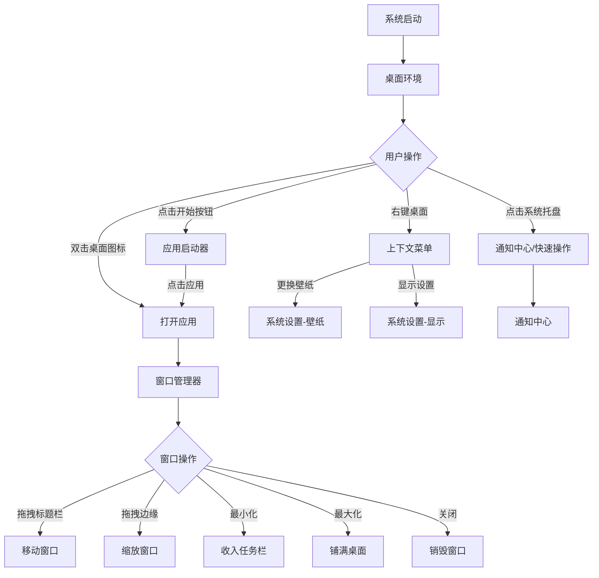

## 1. 产品概述

ConceptOS 是一款基于 Web 技术构建的概念性操作系统界面，采用 Electron + Vite + JSX 技术栈实现标准化桌面环境。它模拟了现代操作系统的核心交互体验，包括窗口管理、任务栏、应用启动器、多任务处理等，为用户提供一个沉浸式的桌面操作系统概念演示。

- 目标用户：开发者、设计师、技术爱好者，用于体验和探索下一代操作系统交互范式
- 核心价值：以 Web 技术还原桌面 OS 体验，展示标准化组件架构与流畅交互设计

## 2. 核心功能

### 2.1 功能模块

1. **桌面环境**：壁纸背景、桌面图标网格、右键上下文菜单
2. **任务栏**：应用启动器（开始菜单）、运行中应用指示器、系统托盘（时钟/音量/网络/电池）、通知中心入口
3. **窗口管理器**：窗口拖拽、缩放、最小化/最大化/关闭、窗口层级管理（Z-Index）、窗口吸附
4. **内置应用**：
   - 文件管理器：目录树浏览、文件列表视图
   - 终端模拟器：命令行界面、命令输入与输出
   - 文本编辑器：代码编辑、语法高亮
   - 系统设置：主题切换、壁纸选择、显示设置
   - 计算器：标准计算功能
5. **应用启动器**：全屏应用网格、搜索过滤、分类标签
6. **通知中心**：系统通知列表、快速操作面板

### 2.2 页面详情

| 页面名称 | 模块名称 | 功能描述 |
|----------|----------|----------|
| 桌面 | 壁纸与图标层 | 动态壁纸背景、桌面图标网格排列、双击打开应用、右键菜单（刷新/壁纸/显示设置） |
| 桌面 | 右键上下文菜单 | 刷新桌面、更换壁纸、显示设置、新建文件夹、排序方式 |
| 任务栏 | 开始按钮 | 点击展开应用启动器，显示用户头像与系统名称 |
| 任务栏 | 运行应用栏 | 显示当前打开的窗口缩略图标，点击切换/最小化窗口 |
| 任务栏 | 系统托盘 | 时钟（实时更新）、音量控制、网络状态、电池指示、通知中心入口 |
| 窗口系统 | 窗口容器 | 可拖拽标题栏、缩放手柄、最小化/最大化/关闭按钮、窗口阴影与圆角 |
| 窗口系统 | 窗口层级管理 | 点击窗口提升至顶层、最小化至任务栏、最大化铺满桌面 |
| 应用启动器 | 搜索栏 | 实时搜索过滤已安装应用 |
| 应用启动器 | 应用网格 | 按分类展示所有内置应用，点击启动 |
| 文件管理器 | 侧边栏 | 快速访问目录（首页/文档/下载/图片） |
| 文件管理器 | 文件列表 | 文件/文件夹图标+名称+大小+修改时间，支持列表/网格视图切换 |
| 终端模拟器 | 命令行界面 | 命令提示符、命令输入、模拟输出（ls/clear/help/date/echo/whoami） |
| 文本编辑器 | 编辑区域 | 行号显示、基础语法高亮、可编辑文本区域 |
| 文本编辑器 | 工具栏 | 新建/保存/字体大小调整 |
| 系统设置 | 主题设置 | 亮色/暗色/自动主题切换 |
| 系统设置 | 壁纸设置 | 预设壁纸缩略图选择 |
| 系统设置 | 显示设置 | 缩放比例调节滑块 |
| 计算器 | 计算器界面 | 数字键盘、运算符、等号、清除、退格、显示当前表达式与结果 |
| 通知中心 | 通知列表 | 系统通知条目（时间+标题+内容），支持清除 |
| 通知中心 | 快速操作 | 亮度/音量滑块、勿扰模式开关 |

## 3. 核心流程

用户启动 ConceptOS 后进入桌面环境，可通过以下方式与应用交互：

1. **启动应用**：点击任务栏开始按钮 → 展开应用启动器 → 搜索或浏览应用 → 点击应用图标启动
2. **窗口操作**：应用以窗口形式打开 → 拖拽标题栏移动 → 拖拽边缘缩放 → 点击按钮最小化/最大化/关闭
3. **多任务管理**：同时打开多个窗口 → 点击任务栏图标切换 → 点击窗口提升层级
4. **系统交互**：右键桌面打开上下文菜单 → 通过系统设置自定义外观 → 通知中心查看系统消息

## 4. 用户界面设计

### 4.1 设计风格

- **整体风格**：现代极简主义 + 毛玻璃质感（Glassmorphism），融合 macOS 的精致感与 Windows 的功能性
- **主色调**：深空蓝 `#0a0e27`（暗色主题）/ 纯净白 `#f8f9fc`（亮色主题）
- **辅助色**：电光蓝 `#3b82f6`（强调色）、薄荷绿 `#10b981`（成功状态）、琥珀橙 `#f59e0b`（警告）
- **按钮风格**：圆角胶囊按钮，hover 时微发光效果，毛玻璃背景
- **字体**：标题使用 `SF Pro Display` / `PingFang SC`，正文使用 `SF Pro Text` / `PingFang SC`，代码使用 `JetBrains Mono`
- **布局风格**：自由窗口布局，任务栏底部固定，应用启动器全屏覆盖
- **图标风格**：线性图标（Lucide Icons），统一 20px 线宽，圆角端点

### 4.2 页面设计概览

| 页面名称 | 模块名称 | UI 元素 |
|----------|----------|---------|
| 桌面 | 壁纸层 | 全屏渐变壁纸、动态粒子效果、模糊叠加层 |
| 桌面 | 图标网格 | 4列网格、48px图标+12px标签、选中高亮边框 |
| 任务栏 | 整体 | 底部固定、64px高度、毛玻璃背景、圆角顶部 |
| 任务栏 | 开始按钮 | 48px圆形、系统Logo、点击缩放动画 |
| 任务栏 | 运行应用 | 40px图标、活跃指示点、hover放大效果 |
| 任务栏 | 系统托盘 | 图标组+数字时钟、hover显示详情浮层 |
| 窗口 | 窗口容器 | 12px圆角、阴影层级3、毛玻璃标题栏 |
| 窗口 | 控制按钮 | 12px圆形、红/黄/绿三色、hover变实心 |
| 应用启动器 | 全屏覆盖 | 毛玻璃背景、居中搜索栏、4x5应用网格 |
| 文件管理器 | 侧边栏 | 240px宽、图标+文字列表、选中高亮 |
| 终端 | 命令行 | 黑色背景、绿色提示符、等宽字体、闪烁光标 |
| 系统设置 | 设置面板 | 左侧分类导航、右侧设置项、开关/滑块控件 |

### 4.3 响应式设计

- 桌面优先设计，最小支持 1024x768 分辨率
- 任务栏在小屏幕下自动收缩图标间距
- 窗口最小尺寸限制（400x300），防止内容不可用
- 应用启动器根据屏幕尺寸自适应网格列数

### 4.4 动效设计

- 窗口打开：从图标位置缩放弹出 + 淡入（200ms ease-out）
- 窗口关闭：缩小回图标位置 + 淡出（150ms ease-in）
- 窗口最小化：缩小至任务栏位置（250ms ease-in-out）
- 应用启动器：从底部滑入 + 背景模糊（300ms spring）
- 通知：从右侧滑入（200ms ease-out）
- 桌面壁纸：缓慢渐变动画（30s 循环）
