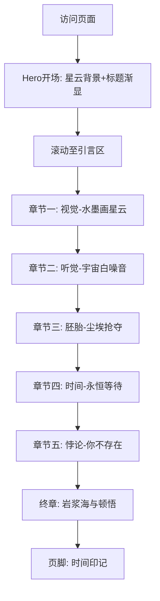

## 1. 产品概述

本项目旨在将一篇关于"时间旅行至地球诞生前"的科学叙事散文，转化为一个沉浸式的单页网页体验。通过宇宙级的视觉氛围、滚动叙事和粒子动效，让读者仿佛亲身漂浮在46亿年前的太阳星云之中，见证地球从尘埃到行星的诞生过程。

- 核心目标：以诗意而科学的方式呈现宇宙起源的壮丽与残酷，让文字内容获得超越平面阅读的感官冲击力
- 目标用户：对宇宙学、科幻、科学传播感兴趣的读者；追求美学体验的网页访客
- 价值：将硬核科学叙事升华为可交互的数字艺术作品

## 2. 核心功能

### 2.2 功能模块
1. **沉浸式叙事页**：单页滚动叙事，包含引言、五大章节、终章

### 2.3 页面详情
| 页面名称 | 模块名称 | 功能描述 |
|-----------|-------------|---------------------|
| 叙事主页 | 开场Hero | 全屏宇宙星云背景，标题"地球诞生前"以打字机/渐显效果出现，滚动提示 |
| 叙事主页 | 引言区 | "这里没有'站在'这个动作..."引言文字，配合星空粒子背景 |
| 叙事主页 | 章节一·视觉 | 宇宙最极致的"水墨画"——暗黑分子云、原恒星红外微光描述 |
| 叙事主页 | 章节二·听觉 | 永恒的"宇宙白噪音"——引力波涟漪、氢分子嘶鸣 |
| 叙事主页 | 章节三·胚胎 | 地球的"胚胎"正在抢夺资源——尘埃环、星子碰撞 |
| 叙事主页 | 章节四·时间 | 时间感的崩溃——5000万年的等待、原太阳点火 |
| 叙事主页 | 章节五·悖论 | 最深层的悖论——你并不存在，身体原材料散落星云 |
| 叙事主页 | 终章 | 最终结局——岩浆海、太阳风、回归现代的顿悟 |
| 叙事主页 | 页脚 | 时间印记、坐标信息、AI生成声明 |

## 3. 核心流程

用户访问页面 → 全屏Hero开场（星云背景+标题渐显）→ 向下滚动触发引言 → 依次滚动揭示五大章节（每章节有独立的视觉氛围与滚动动效）→ 终章收束 → 页脚信息

## 4. 用户界面设计

### 4.1 设计风格
- **主色调**：深空黑（#050510）为底，原恒星红外红（#ff4a2b）、星云橙（#ff8c42）、冷蓝（#3a6ea5）为点缀
- **次色调**：暗紫（#1a0f2e）、深青（#0a1a2f）用于章节区分
- **字体**：标题使用 Cormorant Garamond（优雅衬线，宇宙史诗感），正文使用 Noto Serif SC（中文衬线，文学质感），数据/坐标使用 JetBrains Mono（等宽，科技感）
- **布局**：全屏沉浸式滚动，每章节占满视口，文字居中或偏左，大量留白
- **动效**：Canvas粒子星云背景、滚动视差、文字渐显、原恒星脉动光晕、章节切换时的色彩过渡
- **图标**：极简线条图标，章节序号使用罗马数字

### 4.2 页面设计概览
| 页面名称 | 模块名称 | UI元素 |
|-----------|-------------|-------------|
| 叙事主页 | Hero | 全屏Canvas星云粒子，居中大标题，底部滚动箭头脉动 |
| 叙事主页 | 章节区 | 左侧章节序号（罗马数字），右侧/居中正文，背景色随章节渐变 |
| 叙事主页 | 章节三 | 尘埃粒子碰撞动画，轨道环视觉元素 |
| 叙事主页 | 章节四 | 原恒星从暗红到蓝白的点火动画 |
| 叙事主页 | 终章 | 岩浆海渐变背景，文字逐句浮现 |

### 4.3 响应式
- 桌面优先设计，移动端自适应（字号缩放、布局从双栏转单栏、粒子数量减少以保证性能）
- 触摸优化：滚动流畅，无悬停依赖

### 4.4 视觉氛围指引
- 环境：深空真空感，仅有原恒星微光与星云尘埃
- 光照：原恒星的红外辉光作为唯一暖光源，其余为冷色调
- 焦点：每个章节有一个核心视觉锚点（星云团、粒子流、轨道环、恒星点火、岩浆海）
- 后期效果：颗粒噪点叠加，模拟宇宙微波背景辐射的"颗粒感"
