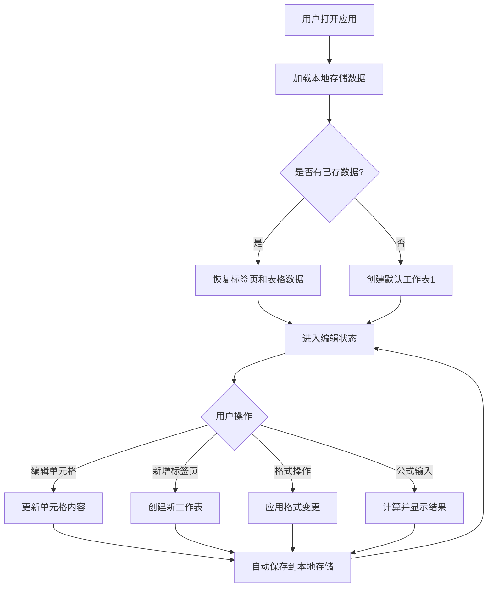

## 1. 产品概述

标签页工作表格是一款轻量级的在线表格编辑工具，支持多标签页管理，让用户可以像使用电子表格一样创建、编辑和组织数据。面向需要快速记录和整理结构化数据的用户群体，提供直觉化的操作体验。

- 解决轻量级数据整理需求，无需打开重型电子表格软件
- 目标用户：项目经理、数据分析师、学生及日常办公人员

## 2. 核心功能

### 2.1 用户角色

本产品为纯前端单用户工具，无需角色区分。

### 2.2 功能模块

1. **工作台页面**：标签页管理、表格编辑区、工具栏、公式栏

### 2.3 页面详情

| 页面名称 | 模块名称 | 功能描述 |
|----------|----------|----------|
| 工作台 | 标签页栏 | 新增/删除/重命名/切换标签页，拖拽排序标签页 |
| 工作台 | 工具栏 | 字体加粗/斜体/对齐方式/背景色/文字颜色 |
| 工作台 | 公式栏 | 显示和编辑当前单元格内容，支持简单公式（SUM/AVERAGE/MIN/MAX） |
| 工作台 | 表格编辑区 | 行列增删、单元格选中/编辑、多选范围、右键菜单（插入/删除行列） |
| 工作台 | 状态栏 | 显示选中区域的统计信息（求和/平均值/计数） |

## 3. 核心流程

用户打开应用后，默认创建一个标签页"工作表1"。用户可以在表格中点击单元格直接输入数据，通过工具栏调整格式，通过标签页栏管理多个工作表。所有数据自动保存到浏览器本地存储。

## 4. 用户界面设计

### 4.1 设计风格

- 主色调：深墨绿 (#1B4332) 搭配薄荷绿 (#52B788) 作为强调色
- 辅助色：暖白 (#FAFAF5) 背景，深灰 (#2D3436) 文字
- 按钮风格：圆角微凸（subtle 3D），hover 时有柔和阴影
- 字体：JetBrains Mono 用于表格数据，Noto Sans SC 用于界面文字
- 布局风格：顶部工具栏 + 公式栏 + 中间表格区 + 底部标签页栏
- 图标风格：线性图标（Lucide），与整体简洁风格一致

### 4.2 页面设计概览

| 页面名称 | 模块名称 | UI元素 |
|----------|----------|--------|
| 工作台 | 标签页栏 | 底部固定，标签页为圆角卡片式，激活态有薄荷绿底色，支持右键菜单 |
| 工作台 | 工具栏 | 顶部固定，图标按钮分组排列，hover 有 tooltip 提示 |
| 工作台 | 公式栏 | 工具栏下方，左侧显示单元格坐标，右侧为可编辑输入框 |
| 工作台 | 表格编辑区 | 网格线淡灰，选中单元格有薄荷绿边框，表头深墨绿底白字 |
| 工作台 | 状态栏 | 底部标签页栏右侧，显示求和/平均值/计数信息 |

### 4.3 响应式设计

- 桌面优先设计，表格区域自适应窗口大小
- 最小支持 1024px 宽度，低于此宽度出现横向滚动条
- 触摸设备支持：单元格点击选中，双击进入编辑

### 4.4 3D 场景指导

不适用
