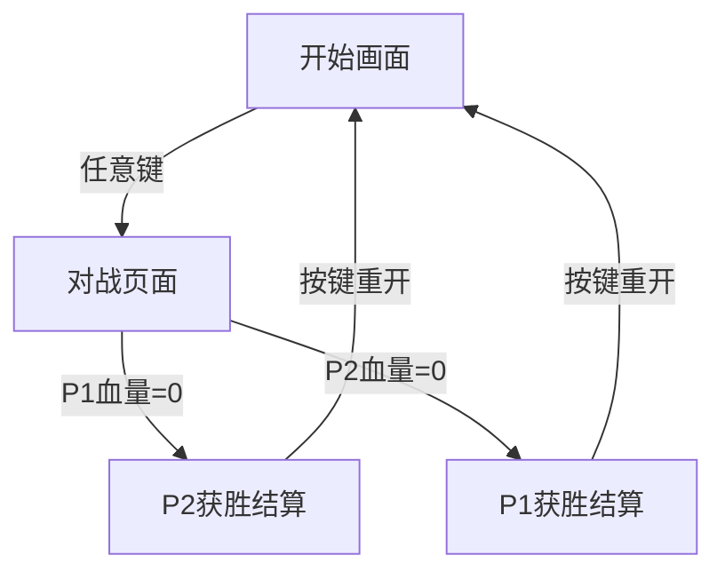

## 1. 产品概述

像素风机甲对战小游戏 —— 一款复古像素风格的本地双人对战游戏。两名玩家各操控一台机甲，在竞技场中进行实时对战，通过移动、攻击、防御等操作削减对方血量，率先将对方血量清零者获胜。

- 目标用户：喜欢复古像素风格、休闲对战的玩家
- 核心价值：简单易上手、节奏紧凑、视觉风格鲜明

## 2. 核心功能

### 2.1 玩家角色

| 角色 | 操控方式 | 特点 |
|------|----------|------|
| 机甲·赤焰（P1） | WASD + J（攻击）+ K（防御） | 红色系，攻击力略高 |
| 机甲·苍雷（P2） | 方向键 + L（攻击）+ ;（防御） | 蓝色系，速度略快 |

### 2.2 功能模块

1. **对战页面**：游戏主场景，包含竞技场背景、两台机甲角色、血量条、操作提示
2. **开始画面**：游戏标题、操作说明、开始按钮
3. **结算画面**：胜负判定、重新开始按钮

### 2.3 页面详情

| 页面名称 | 模块名称 | 功能描述 |
|----------|----------|----------|
| 开始画面 | 标题区 | 显示游戏名称"MECHA ARENA"，像素风格标题动画 |
| 开始画面 | 操作说明 | 显示双方按键操作说明 |
| 开始画面 | 开始按钮 | 按任意键开始游戏 |
| 对战页面 | 竞技场场景 | 像素风格城市废墟背景，地面平台 |
| 对战页面 | 机甲角色 | 两台可操控的像素机甲，支持站立、移动、攻击、防御、受伤动画 |
| 对战页面 | 血量条 | 顶部显示双方血量条，实时更新 |
| 对战页面 | 能量条 | 攻击消耗能量，能量自动恢复 |
| 对战页面 | 特效 | 攻击火花、防御光盾、受伤闪烁 |
| 结算画面 | 胜负宣告 | 显示获胜方名称 |
| 结算画面 | 重新开始 | 按键重新开始对战 |

## 3. 核心流程

1. 玩家进入开始画面，查看操作说明
2. 按任意键开始游戏，双方机甲出现在竞技场两端
3. 双方通过各自按键操控机甲移动、攻击、防御
4. 攻击命中对方时，扣除对方血量；防御可减免伤害
5. 一方血量归零时，游戏结束，进入结算画面
6. 结算画面可按键重新开始

## 4. 用户界面设计

### 4.1 设计风格

- **主色调**：深灰/黑色背景 + 霓虹红（#FF3E3E）与霓虹蓝（#3EA8FF）双色对抗
- **辅助色**：暗紫（#2D1B4E）场景氛围、金黄（#FFD700）能量条
- **像素风格**：所有角色、场景、UI元素均采用像素化渲染，Canvas绘制
- **字体**：像素字体（Press Start 2P），复古8-bit风格
- **布局**：全屏Canvas游戏画面，顶部血量条HUD叠加
- **动画**：8帧/秒角色动画，攻击火花粒子效果，CRT扫描线叠加

### 4.2 页面设计概览

| 页面名称 | 模块名称 | UI元素 |
|----------|----------|--------|
| 开始画面 | 标题区 | 巨大像素字体标题，霓虹发光效果，闪烁动画 |
| 开始画面 | 操作说明 | 像素字体按键图标，左右分栏显示P1/P2操作 |
| 对战页面 | 竞技场 | 深色城市废墟剪影，星空背景，地面平台 |
| 对战页面 | 机甲 | 32x48像素精灵，红/蓝配色，帧动画 |
| 对战页面 | HUD | 顶部血量条（红/蓝渐变），能量条（金色），角色名称 |
| 结算画面 | 胜负文字 | 大号像素字体，胜者颜色高亮，闪烁效果 |

### 4.3 响应式设计

- 桌面端优先，Canvas自适应窗口大小，保持16:9比例
- 键盘操控为主，暂不支持触屏

### 4.4 游戏机制细节

- **移动**：左右移动，速度3px/帧
- **跳跃**：可跳跃，跳跃高度120px，有重力
- **普通攻击**：近身拳击，伤害10点，消耗15能量，攻击持续12帧
- **防御**：举盾防御，减免70%伤害，持续消耗能量5/帧
- **血量**：每方100点
- **能量**：每方100点，自动恢复0.5/帧
- **攻击判定**：攻击动画第4-8帧为判定帧，检测攻击范围与对方碰撞
- **受击硬直**：被击中后硬直10帧，无法操作
- **推挤**：两机甲不可重叠，互相推挤
