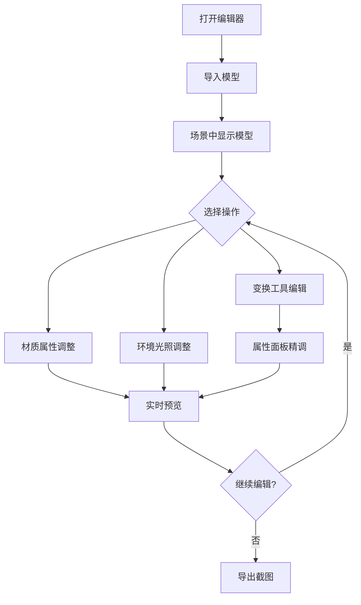

## 1. 产品概述

PlayCanvas 模型编辑器是一款基于浏览器的轻量级 3D 模型查看与编辑工具，使用 PlayCanvas 引擎作为核心渲染器，面向 3D 美术师、游戏开发者和产品设计师，提供模型导入、场景编辑、材质调整和实时预览能力。

- 解决传统 3D 编辑器安装繁琐、学习成本高的问题，提供即开即用的 Web 端编辑体验
- 目标用户：独立游戏开发者、3D 美术师、产品可视化设计师

## 2. 核心功能

### 2.1 用户角色

| 角色 | 注册方式 | 核心权限 |
|------|----------|----------|
| 普通用户 | 无需注册 | 浏览、导入、编辑、导出模型 |

### 2.2 功能模块

1. **编辑器主页面**：3D 视口、场景层级面板、属性面板、工具栏、材质编辑器

### 2.3 页面详情

| 页面名称 | 模块名称 | 功能描述 |
|----------|----------|----------|
| 编辑器主页面 | 3D 视口 | PlayCanvas 渲染的 3D 场景，支持轨道相机控制（旋转、缩放、平移），网格地面，坐标轴辅助线 |
| 编辑器主页面 | 工具栏 | 变换工具切换（移动/旋转/缩放/选择），模型导入按钮，导出按钮，撤销/重做 |
| 编辑器主页面 | 场景层级面板 | 显示场景中所有对象的树形结构，支持选择、可见性切换、重命名、删除 |
| 编辑器主页面 | 属性面板 | 显示选中对象的位置、旋转、缩放数值，支持数值输入修改 |
| 编辑器主页面 | 材质编辑器 | 修改选中对象材质的基础颜色、金属度、粗糙度、发光颜色，实时预览 |
| 编辑器主页面 | 环境光照面板 | 调整环境光强度、方向光方向与颜色、天空盒切换 |
| 编辑器主页面 | 模型导入 | 支持拖拽或点击导入 glTF/GLB 格式模型文件 |
| 编辑器主页面 | 截图导出 | 将当前视口截图导出为 PNG 图片 |

## 3. 核心流程

用户打开编辑器后，通过导入按钮或拖拽方式加载 glTF/GLB 模型文件到 3D 视口中。模型加载完成后，用户可在场景层级面板中选择对象，使用变换工具（移动/旋转/缩放）对模型进行编辑，在属性面板中精确调整变换参数，在材质编辑器中修改材质属性，在环境光照面板中调整场景光照。编辑完成后可导出截图。

## 4. 用户界面设计

### 4.1 设计风格

- 主色调：深色系（#1a1a2e 深蓝黑底色），搭配 #00d4aa 青绿色作为强调色
- 次要色：#16213e 深蓝灰用于面板背景，#0f3460 中蓝用于边框与分隔
- 按钮风格：圆角 6px，半透明背景 + hover 高亮，工具按钮采用图标 + tooltip
- 字体：JetBrains Mono 用于数值输入，Source Sans 3 用于界面文字
- 布局风格：左侧场景层级树，中央 3D 视口，右侧属性/材质/光照面板，顶部工具栏
- 图标风格：线性图标，2px 描边，与深色主题协调

### 4.2 页面设计概览

| 页面名称 | 模块名称 | UI 元素 |
|----------|----------|----------|
| 编辑器主页面 | 3D 视口 | 深色背景，网格地面（淡灰色），坐标轴辅助线（RGB），轨道控制器，选中对象高亮轮廓 |
| 编辑器主页面 | 工具栏 | 顶部水平条，图标按钮组（选择/移动/旋转/缩放），导入/导出按钮，撤销/重做按钮 |
| 编辑器主页面 | 场景层级面板 | 左侧 260px 宽，树形列表，每行含可见性眼睛图标 + 名称，选中行高亮 |
| 编辑器主页面 | 属性面板 | 右侧 300px 宽，折叠式分组，数值输入框带拖拽调节，标签 + 输入框对齐 |
| 编辑器主页面 | 材质编辑器 | 右侧面板内折叠分组，颜色选择器，滑块控件（金属度/粗糙度 0-1） |
| 编辑器主页面 | 环境光照面板 | 右侧面板内折叠分组，光照强度滑块，方向光角度控制，颜色选择器 |
| 编辑器主页面 | 模型导入 | 拖拽区域覆盖视口中央，虚线边框 + 图标提示，或工具栏按钮触发文件选择器 |

### 4.3 响应式设计

- 桌面优先设计，最小支持 1280px 宽度
- 面板可折叠/展开以适应不同屏幕尺寸
- 触控设备支持：轨道控制器适配触摸手势

### 4.4 3D 场景指引

- 环境/HDRI：使用 PlayCanvas 内置天空盒，深色渐变风格
- 灯光设置：一个方向光（主光源）+ 环境光，支持用户调整
- 相机设置：透视相机，FOV 60°，近裁面 0.1，远裁面 1000，轨道控制器
- 构图与焦点：模型居中显示，相机自动适配模型包围盒
- 交互与动画：选中对象高亮，变换 Gizmo 实时跟随，材质修改即时反映
- 后处理效果：可选开启 SSAO 和 Bloom
- 性能预算：目标 60fps，单模型面数上限 500K 三角面
