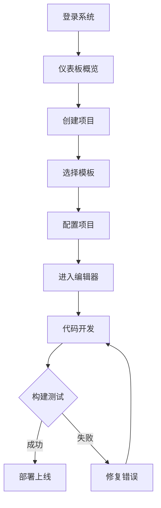

## 1. 产品概述
一个整合的Skill工具链平台，采用Vite构建，旨在帮助开发者持续制作和维护概念验证项目。
- 提供一站式开发工具链，支持快速原型开发和迭代
- 目标用户：前端开发者、全栈开发者、技术团队
- 市场价值：简化开发流程，提高团队协作效率，加速产品迭代

## 2. 核心功能

### 2.1 用户角色
| 角色 | 注册方式 | 核心权限 |
|------|----------|----------|
| 开发者 | 邮箱注册 | 创建项目、使用工具链、协作开发 |
| 管理员 | 后台配置 | 管理用户、监控系统、配置工具 |

### 2.2 功能模块
1. **项目管理**：创建新项目、模板选择、项目列表管理
2. **工具链集成**：代码编辑器、构建工具、测试框架、部署工具
3. **协作功能**：实时协作、版本控制、任务管理
4. **监控面板**：项目状态、构建日志、性能指标

### 2.3 页面详情
| 页面名称 | 模块名称 | 功能描述 |
|----------|----------|----------|
| 仪表板 | 概览卡片 | 显示项目统计、快速操作入口 |
| 项目列表 | 项目卡片 | 项目创建、编辑、删除、搜索 |
| 项目详情 | 编辑器 | 在线代码编辑、实时预览、构建输出 |
| 工具中心 | 工具列表 | 工具安装、配置、管理 |

## 3. 核心流程

**用户创建项目流程：**
1. 用户登录后进入仪表板
2. 点击"创建项目"按钮
3. 选择项目模板（React/Vue/TypeScript等）
4. 配置项目名称和描述
5. 进入项目编辑器开始开发
6. 使用工具链进行构建和测试
7. 一键部署到目标环境

## 4. 用户界面设计

### 4.1 设计风格
- 主色调：深蓝色系(#1e3a5f)配合绿色高亮(#00d4aa)
- 按钮风格：圆角矩形，渐变背景
- 字体：Inter字体，现代简洁风格
- 布局：侧边栏导航 + 主内容区的经典布局
- 图标：使用Lucide图标库，统一风格

### 4.2 页面设计概览
| 页面名称 | 模块名称 | UI元素 |
|----------|----------|--------|
| 仪表板 | 概览卡片 | 统计数字、趋势图表、快速操作按钮 |
| 项目列表 | 项目卡片 | 卡片布局、搜索过滤、分页导航 |
| 项目详情 | 编辑器 | Monaco编辑器、预览面板、终端输出 |
| 工具中心 | 工具列表 | 工具卡片、安装状态、配置按钮 |

### 4.3 响应式设计
- 桌面优先设计
- 支持平板和移动端自适应
- 触控优化的交互元素

### 4.4 动画效果
- 页面切换平滑过渡
- 按钮悬停微动画
- 构建状态加载动画
- 拖拽排序交互反馈