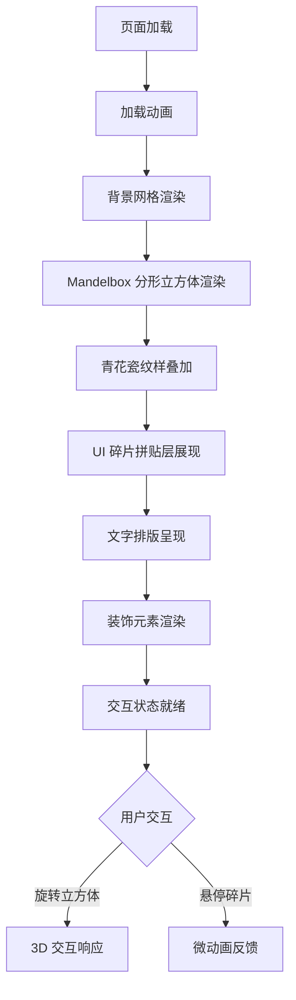

## 1. 产品概述

一款未来主义「离线档案」美学风格的交互式数字海报网页，以 Mandelbox 分形立方体为核心视觉主体，融合青花瓷纹样与 UI 碎片拼贴设计，呈现高品质平面设计、建筑渲染风格的视觉体验。

- 目标：打造一张令人印象深刻的单页交互式数字海报，展现「瓷器设计」与「青花瓷」主题的未来主义美学
- 目标用户：设计师、艺术爱好者、数字艺术展览观众

## 2. 核心功能

### 2.2 功能模块

1. **海报主页面**：Mandelbox 分形立方体、青花瓷纹样、UI 碎片拼贴、文字排版、装饰元素

### 2.3 页面详情

| 页面名称 | 模块名称 | 功能描述 |
|----------|----------|----------|
| 海报主页面 | Mandelbox 分形立方体 | 中央3D分形立方体结构，表面装饰蓝白青花瓷纹样，可交互旋转 |
| 海报主页面 | 青花瓷纹样层 | SVG/CSS 实现的精细蓝白青花瓷图案，覆盖于分形结构表面 |
| 海报主页面 | UI 碎片拼贴层 | 悬浮纸质标签、UI 碎片、图标栏、几何标注，营造分层界面拼贴效果 |
| 海报主页面 | 文字排版 | 粗体黑色文字「瓷器设计」和「青花瓷」醒目融入设计 |
| 海报主页面 | 背景网格 | 浅色技术网格、示意线条、套准标记 |
| 海报主页面 | 信息面板 | 主体两侧竖向信息面板和细长图标工具栏 |
| 海报主页面 | 装饰元素 | 边角支架、圆点、细线边框、纸张纹理、层叠边缘、柔和阴影 |

## 3. 核心流程

用户打开页面 → 加载动画呈现 → 海报各层元素依次展现（背景网格 → 分形立方体 → 青花瓷纹样 → UI碎片 → 文字 → 装饰元素）→ 用户可交互旋转分形立方体 → 悬停UI碎片显示微动画

## 4. 用户界面设计

### 4.1 设计风格

- 主色调：单色灰度（#1a1a1a ~ #f5f5f5），点缀蓝白青花瓷色（#1e3a5f 靛蓝、#e8e4d9 瓷白）
- 按钮风格：无按钮，纯展示型海报
- 字体：衬线展示字体（如 Noto Serif SC）+ 等宽技术字体（如 JetBrains Mono）
- 布局风格：展示板风格，分层拼贴，中央主体 + 两侧面板
- 图标风格：线性技术图标，极简 UI 风格

### 4.2 页面设计概览

| 页面名称 | 模块名称 | UI 元素 |
|----------|----------|---------|
| 海报主页面 | 背景层 | 浅灰技术网格、套准标记、示意线条 |
| 海报主页面 | 主体层 | 3D Mandelbox 分形立方体、青花瓷纹样纹理 |
| 海报主页面 | 拼贴层 | 纸质标签、UI 碎片、图标栏、几何标注 |
| 海报主页面 | 文字层 | 「瓷器设计」「青花瓷」粗体排版 |
| 海报主页面 | 面板层 | 竖向信息面板、图标工具栏 |
| 海报主页面 | 装饰层 | 边角支架、圆点、细线边框、纸张纹理 |

### 4.3 响应式

- 桌面优先设计，海报比例约 3:4 或黄金比例
- 大屏全屏展示，小屏缩放适配

### 4.4 3D 场景指引

- 环境：浅色技术网格背景，无环境贴图
- 灯光：柔和方向光 + 环境光，营造建筑渲染质感
- 相机：正面偏俯视角，微交互旋转
- 构图：中央分形立方体为主体，两侧面板对称
- 交互：鼠标拖拽旋转立方体，滚轮缩放
- 后处理：微妙的灰度滤镜，保持单色美学
