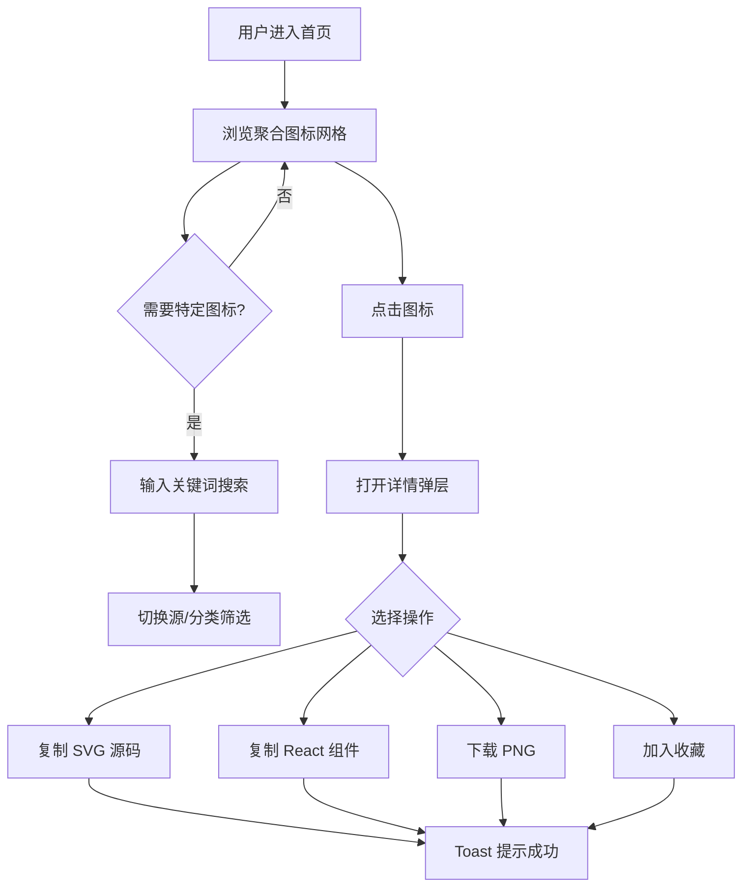

# PRD - 图海 (IconGalaxy) 跨源图标聚合平台

## 1. 产品概述

**图海 (IconGalaxy)** 是一个聚合多源图标的浏览器工具，设计师 / 前端开发者在一个页面内即可检索、预览、复制、下载来自 Iconfont、IconPark、Material Symbols、Lucide、Heroicons、Tabler、Phosphor 等主流图标库的图标资产，无需反复跳转。

- **目标用户**：UI/UX 设计师、前端工程师、产品经理
- **核心价值**：聚合 + 统一预览 + 一键复制（SVG / 组件代码 / PNG），省去切换多个图站的时间成本

## 2. 核心功能

### 2.1 用户角色
本产品为公开浏览工具，**无需注册**即可使用全部核心功能。

### 2.2 功能模块

1. **首页 / 探索页**：聚合图标瀑布、源标签筛选、即时搜索
2. **详情弹层**：单图标多尺寸预览、源码复制（SVG / React / Vue）、下载
3. **收藏夹（本地）**：localStorage 持久化的"我的图标"集合
4. **对比页**：并排对比同关键词在 4 个图源中的视觉差异

### 2.3 页面详情

| 页面名称 | 模块名称 | 功能描述 |
|---------|---------|---------|
| 首页 | 顶部导航栏 | Logo / 全局搜索 / 主题切换 / 收藏夹入口 |
| 首页 | 源切换 Tab | Iconfont / IconPark / Material / Lucide / Heroicons / Tabler / Phosphor 一键切换 |
| 首页 | 搜索栏 | 输入即搜，支持中英文、模糊匹配 |
| 首页 | 分类侧栏 | 通用 / 箭头 / 媒体 / 通讯 / 文件 / 系统 / 商业 等分类索引 |
| 首页 | 图标网格 | 自适应网格，hover 显示复制按钮、来源标签 |
| 详情弹层 | 预览区 | 16/24/32/48px 多尺寸实时预览 + 描边/填充切换 |
| 详情弹层 | 源码面板 | SVG 源码 / React JSX / Vue SFC 三种格式，复制即用 |
| 收藏夹 | 列表视图 | 网格展示已收藏图标，支持移除、批量下载 |

## 3. 核心流程

## 4. 用户界面设计

### 4.1 设计风格
- **整体调性**：**编辑式暗色 (Editorial Dark)** —— 高对比、近似杂志排版的克制美学
- **主色**：
  - 背景 `#0B0B0C`（near-black）
  - 主文 `#F5F1E8`（off-white parchment）
  - 强调色 `#E8453C`（vermillion 朱红，仅用于关键 CTA / 焦点态）
  - 次级灰 `#3A3A3C` / `#6B6B6E`
- **按钮**：矩形硬边 + 1px 描边，hover 时反色翻转（黑底白字 ↔ 白底黑字），无圆角 / 微圆角 2px
- **字体**：
  - 标题 / 展示：**Bricolage Grotesque**（display，600/800）
  - 正文：**JetBrains Mono**（等宽，强化"代码工具"属性）
  - 衬线点缀（Logo 与章节大字）：**Fraunces**（斜体 italic 700）
- **布局**：12 列硬栅格，固定头部 64px，主体内容左侧 240px 侧栏 + 右侧自适应网格
- **图标风格**：统一线性 1.5px stroke、24px 基准框、几何化（与所聚合的 Lucide/Phosphor 风格一致）

### 4.2 页面设计概述

| 页面名称 | 模块名称 | UI 元素 |
|---------|---------|---------|
| 首页 | 顶部导航 | 全宽 64px 高，左侧 Logo（衬线大写 ICON 段 + 无衬线 galaxy），右侧搜索框 / 主题切换 / 收藏夹 |
| 首页 | Hero 区 | 100vh 巨幅标语 "ONE GALLERY. EVERY ICON."，副标题说明聚合源数量 + 在线图标数 |
| 首页 | 源切换 | 横向滚动 chip 列表，选中态下划线 + 朱红色细线 |
| 首页 | 侧栏 | 分类手写体（衬线斜体） + 计数 |
| 首页 | 图标网格 | 5-6 列自适应，hover 出现 2px 朱红描边 + 复制按钮浮起 |
| 详情弹层 | 模态 | 中央 60vw 弹层，左 50% 预览，右 50% 源码 Tab，底部固定"下载"条 |
| 收藏夹 | 网格 | 复用首页图标网格组件，传 favorite=true 过滤 |

### 4.3 响应式
- 桌面优先（≥1280px 完整 6 列网格）
- 平板（768-1279px）→ 4 列
- 移动（<768px）→ 2 列 + 抽屉式分类

### 4.4 动效
- 页面加载：标题字逐字上滑（stagger 30ms）
- 网格进入：图标块 stagger fade-up 8ms
- Hover：边框描线 0.2s ease-out
- 详情弹层：scale 0.96→1 + opacity 0→1，0.25s
- 复制成功：Toast 从右上滑入 + 朱红短横进度条
