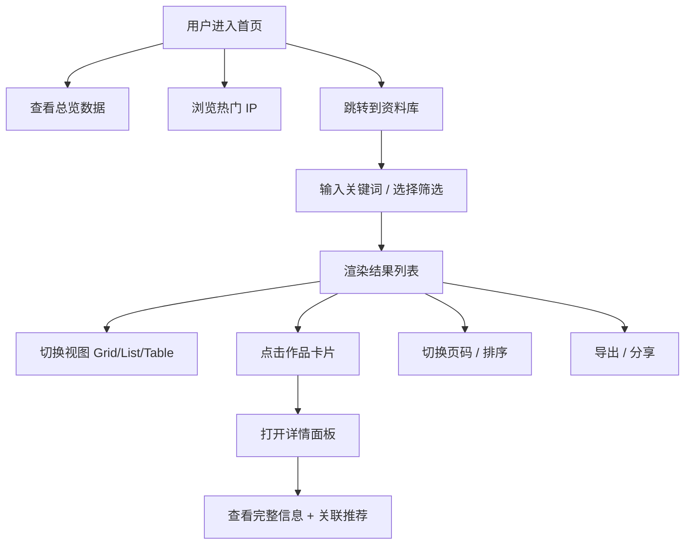

# 游戏 IP 衍生作品资料库 - PRD

## 1. 产品概述

构建一个面向玩家、收藏者、行业研究者的「游戏 IP 衍生作品」综合浏览资料库，聚合至 2026 年 6 月 8 日为止全球范围内基于电子游戏 IP 衍生的动漫、影视、漫画、小说、舞台剧、手办、周边、主题乐园、联动活动、虚拟偶像、商品授权等作品信息，提供搜索、多维筛选、详情查看、数据可视化等现代化浏览体验。

- **目标用户**：游戏玩家、二次元爱好者、ACG 行业从业者、IP 商业化研究者、收藏者
- **核心价值**：解决游戏 IP 衍生作品分散、信息零碎的问题，提供一站式可浏览、可检索、可对比的资料库

## 2. 核心功能

### 2.1 数据规模
- 收录条目：≥ 2000 款
- 覆盖游戏 IP：≥ 100 个全球知名 IP
- 覆盖衍生类型：动画 / 真人影视 / 漫画 / 小说 / 舞台剧 / 音乐剧 / 手办 / 周边 / 主题乐园 / 联动活动 / 虚拟主播 / 商品授权 / 跨媒体企划 等

### 2.2 功能模块
1. **首页概览**：总览数据 + 精选作品 + 热门 IP 排行 + 类型分布
2. **资料库浏览**：网格/列表/表格三视图，支持分页
3. **多维筛选**：按类型、IP、地区、年份、状态、评分、公司筛选
4. **全文搜索**：支持中文/英文模糊搜索
5. **详情查看**：每个作品可查看完整信息（名称、IP、类型、首次公开日期、发行方、状态、热度评分、简介）
6. **数据可视化**：类型分布饼图、年度趋势图、地区分布、IP 衍生数 Top 榜

### 2.3 页面详情
| 页面 | 模块 | 功能描述 |
|------|------|----------|
| 首页 | Hero 区 | 大标题、副标题、关键统计（条目数、IP 数、覆盖国家）、入场按钮 |
| 首页 | 数据面板 | 实时统计：总条目数 / 已发行 / 制作中 / 计划中 / 完结作品数 |
| 首页 | 热门 IP | Top 10 衍生作品数最多的 IP 排行卡片 |
| 首页 | 类型分布 | 各衍生类型作品数饼图 |
| 首页 | 趋势图 | 近 10 年衍生作品年度趋势图 |
| 资料库 | 工具栏 | 搜索框 + 视图切换 + 排序方式 + 高级筛选入口 |
| 资料库 | 筛选侧栏 | 多选筛选：IP、类型、地区、年份、状态、评分 |
| 资料库 | 卡片网格 | 卡片：封面/渐变占位、名称、IP、类型 chip、评分、年份 |
| 资料库 | 列表视图 | 紧凑列表：名称、IP、类型、年份、评分、状态 |
| 资料库 | 表格视图 | 完整字段表：ID、名称、IP、类型、首次日期、地区、状态、评分 |
| 资料库 | 分页器 | 页码 + 每页数量（24/48/96）+ 跳转 |
| 详情 | 弹窗 / 侧抽屉 | 完整信息：名称、所属 IP、类型、状态、首次公开日期、发行方、地区、评分、简介、相关作品 |
| 全局 | 顶栏 | Logo + 搜索 + 主题切换 + 数据导出 |

## 3. 核心流程

## 4. 用户界面设计

### 4.1 设计风格
- **整体调性**：赛博朋克 + 复古游戏机柜（arcade cabinet），致敬 ACG 文化
- **主色**：
  - 背景：`#0a0612`（深紫黑）+ `#14101e`（深石板）
  - 主色：`#ff2e88`（霓虹粉） / `#7c3aed`（电紫）
  - 强调：`#00f0ff`（霓虹青）/ `#facc15`（琥珀金）
  - 文本：`#f5f3ff`（主）/ `#a89cc8`（辅）
- **字体**：
  - 显示字体：`"Orbitron"`（科技感衬线/无衬线几何，致敬未来主义）
  - 中文显示：`"ZCOOL KuaiLe"` 或 `"Noto Sans SC"`
  - 正文：`"JetBrains Mono"` + `"Noto Sans SC"`
- **质感**：CRT 扫描线（subtle 0.04 不透明度）、霓虹辉光（box-shadow）、像素噪点纹理
- **按钮**：圆角 4px + 霓虹边框 + 悬浮时辉光放大
- **卡片**：磨砂玻璃 `backdrop-filter: blur(10px)` + 渐变占位（无图片时按 IP 生成 deterministic 渐变）

### 4.2 页面设计概述
| 页面 | 模块 | UI 元素 |
|------|------|---------|
| 首页 | Hero | 全屏 Hero，巨字标题、滚动指示器、闪烁光标、星尘粒子背景 |
| 首页 | 统计 | 8 个数据卡片，悬浮微动（数字滚动入场） |
| 首页 | 热门 IP | 横向滚动条卡片，封面为 IP 缩写 + 渐变 + 霓虹边 |
| 资料库 | 工具栏 | 固定顶栏，毛玻璃背景 |
| 资料库 | 卡片 | 16:9 占位 + 名称 + 元信息 + 类型 chip + 评分星 |
| 详情 | 抽屉 | 右侧 480px 滑入，封面 + 元信息 + 简介 + 关联作品网格 |
| 全局 | 滚动 | 平滑滚动 + 入场动画 `IntersectionObserver` |

### 4.3 响应式
- 桌面优先（1280px+）：多列网格
- 平板（768-1279）：2-3 列
- 移动（<768）：1 列 + 抽屉式筛选

### 4.4 3D / 视觉特效
- 粒子背景（Canvas，30 fps，0.04 不透明度）
- 标题用渐变描边 + 霓虹辉光
- 卡片悬浮：3D tilt（鼠标移动微旋转）+ 霓虹外发光
- 数字滚动入场动画（CountUp）
- 列表项 staggered fade-in

## 5. 数据样例

| ID | 名称 | 所属 IP | 类型 | 年份 | 地区 | 状态 | 评分 |
|----|------|---------|------|------|------|------|------|
| 1 | 宝可梦 旅途 | 宝可梦 | TV 动画 | 2019 | 日本 | 完结 | 8.6 |
| 2 | 超级马里奥兄弟大电影 | 超级马里奥 | 动画电影 | 2023 | 美国 | 已发行 | 7.1 |
| 3 | 黑神话：悟空 OST Vol.1 | 黑神话：悟空 | OST | 2024 | 中国 | 已发行 | 9.4 |
| 4 | 原神 拾枝杂谈 | 原神 | 官方漫画 | 2022 | 中国 | 连载中 | 8.9 |
| 5 | Arcane 奥术 | 英雄联盟 | 动画剧集 | 2021 | 美国 | 完结 | 9.0 |
| ... | ... | ... | ... | ... | ... | ... | ... |
