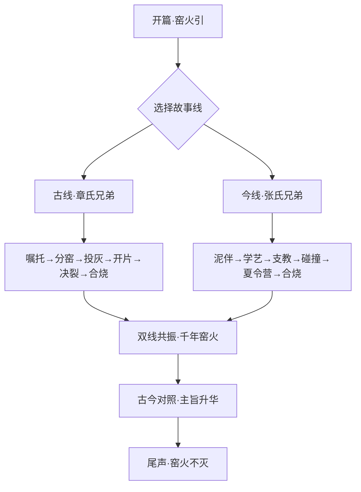

## 1. 产品概述

龙泉青瓷双线故事交互面板——以"裂痕生光，慢火传灯"为主旨，通过双线叙事（古线·章氏兄弟 / 今线·张氏兄弟）呈现千年窑火的传承与裂变。用户在滚动与交互中穿越古今，感受裂痕如何催生美、慢火如何传递人心。

- 目标用户：文化爱好者、青瓷工艺关注者、沉浸式叙事体验用户
- 核心价值：以交互式视觉叙事让非遗故事"活"起来，裂痕与窑火的隐喻贯穿始终

## 2. 核心功能

### 2.1 功能模块

1. **开篇·窑火引**：全屏沉浸式开场，窑火粒子动画 + 主旨题词"裂痕生光，慢火传灯"
2. **古线·章氏兄弟**：南宋章生一、章生二的故事——分窑、投灰、开片、决裂、合烧
3. **今线·张氏兄弟**：当代张寄、张生元的故事——学艺、支教、碰撞、合办夏令营
4. **双线共振·千年窑火**：古今交织对照，裂痕与传承的共振主旨升华
5. **尾声·窑火不灭**：收束全篇，残片犹在的意境

### 2.2 页面详情

| 页面名称 | 模块名称 | 功能描述 |
|----------|----------|----------|
| 开篇·窑火引 | 窑火粒子动画 | Canvas粒子系统模拟窑火升腾，渐显主旨题词 |
| 开篇·窑火引 | 双线入口 | 古线/今线两条故事线入口，以瓷片裂纹为视觉引导 |
| 古线·章氏兄弟 | 时间轴叙事 | 纵向滚动时间轴，6个关键节点：嘱托→分窑→投灰→开片→决裂→合烧 |
| 古线·章氏兄弟 | 开片裂纹动画 | Canvas绘制金丝铁线裂纹效果，随滚动渐次展开 |
| 古线·章氏兄弟 | 瓷器视觉 | 紫口铁足/粉青釉/梅子青/金丝铁线 四种瓷器意象呈现 |
| 今线·张氏兄弟 | 时间轴叙事 | 纵向滚动时间轴，6个关键节点：泥伴→学艺→支教→碰撞→夏令营→合烧 |
| 今线·张氏兄弟 | 残片意象 | Canvas残片碎片拼合动画，象征传承的拼凑与延续 |
| 今线·张氏兄弟 | 窑烟文字 | 窑烟粒子效果中浮现关键对白 |
| 双线共振·千年窑火 | 古今对照 | 左右分屏或交替呈现，古今关键节点一一对应 |
| 双线共振·千年窑火 | 共振主旨 | "裂痕生光，慢火传灯"主旨文字以窑火光晕呈现 |
| 双线共振·千年窑火 | 合烧致敬 | 古今合烧场景交融，窑火粒子汇聚 |
| 尾声·窑火不灭 | 残片留白 | 残片静置画面，渐隐收束 |

## 3. 核心流程

用户进入页面后，经历以下叙事流程：

1. 开篇沉浸：窑火粒子动画吸引注意，主旨题词渐显
2. 选择故事线或自动播放：古线与今线可独立浏览，也可顺序体验
3. 古线叙事：滚动触发章氏兄弟故事节点，开片裂纹动画贯穿
4. 今线叙事：滚动触发张氏兄弟故事节点，残片拼合动画贯穿
5. 双线共振：古今对照呈现，主旨升华
6. 尾声：残片留白，余韵悠长

## 4. 用户界面设计

### 4.1 设计风格

- **主色调**：青瓷色系——粉青(#B0C4B1)、梅子青(#4A7C59)、铁足褐(#5C3A21)、釉白(#F5F0E8)
- **辅助色**：窑火橙(#D4622B)、金丝金(#C9A84C)、铁线黑(#2C2C2C)
- **字体**：标题使用宋体/楷体风格衬线字体（如 Noto Serif SC），正文使用无衬线字体（如 Noto Sans SC）
- **布局**：纵向全屏滚动叙事，每个节点占一屏或半屏，大量留白营造意境
- **动画风格**：水墨晕染、裂纹蔓延、窑火升腾、残片拼合——以Canvas动画为核心视觉语言

### 4.2 页面设计概览

| 页面名称 | 模块名称 | UI元素 |
|----------|----------|--------|
| 开篇·窑火引 | 窑火粒子 | 全屏Canvas，橙红粒子上升，底部窑口光晕，中央题词渐显 |
| 古线·章氏兄弟 | 时间轴 | 左侧竖线时间轴，右侧故事文字，节点处瓷器意象图标 |
| 古线·章氏兄弟 | 开片裂纹 | Canvas覆盖层，裂纹从中心向四周蔓延，金丝铁线双色 |
| 今线·张氏兄弟 | 时间轴 | 右侧竖线时间轴，左侧故事文字，与古线镜像布局 |
| 今线·张氏兄弟 | 残片拼合 | Canvas碎片从散落状态渐聚为完整瓷片 |
| 双线共振 | 古今对照 | 左右分屏，古线左/今线右，同步滚动对照 |
| 双线共振 | 主旨文字 | 窑火光晕中浮现"裂痕生光，慢火传灯" |
| 尾声 | 残片留白 | 静态残片居中，背景渐暗，余韵收束 |

### 4.3 响应式设计

- 桌面优先设计，全屏沉浸式体验
- 移动端适配：时间轴改为单列，双线对照改为上下排列
- 触摸优化：滚动触发动画，支持手势滑动

### 4.4 Canvas场景指引

- **窑火粒子系统**：橙红色粒子从底部升腾，模拟窑口火焰，粒子大小和透明度随高度递减
- **开片裂纹动画**：从中心点向四周蔓延的裂纹线，大纹为深褐色（铁线），细纹为金色（金丝），裂纹路径使用递归分形算法
- **残片拼合动画**：碎片从随机位置和角度渐聚为完整瓷片轮廓，拼合时有微光闪烁
- **窑烟文字**：文字以烟雾粒子形态浮现，逐渐凝聚为清晰文字
- **合烧交融**：两组粒子流（古线暖色/今线冷色）汇聚融合
