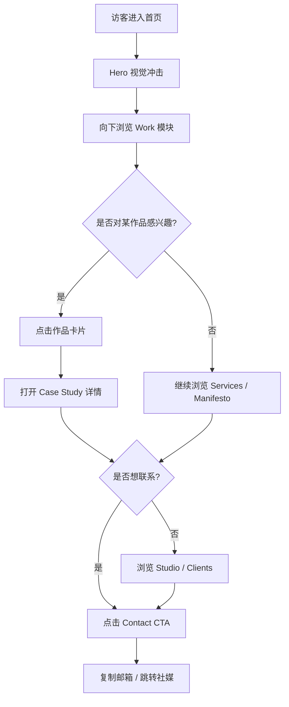

# PRD — AE 创意工作室官网

## 1. 产品概述

**AE** 是一个以"动态视觉 + 编辑式排版"为核心气质的创意工作室展示型 Web 应用。它以单页滚动 + 模块化作品集的形式,呈现工作室的服务、案例、团队与联系入口,目标是用网站本身证明其创意能力。

- **目标用户**:有品牌升级、活动主视觉、动态 KV 需求的品牌方与初创团队主理人
- **核心价值**:用高密度、强风格、强动效的页面语言,让访客在 30 秒内记住工作室的视觉签名
- **交付形态**:纯前端单页应用(SPA),无后端依赖,数据通过 mock 静态数据驱动

## 2. 核心功能

### 2.1 用户角色

本项目为展示型站点,无登录/角色体系,所有访客均为"潜在客户"。

### 2.2 功能模块

1. **首屏 Hero 模块**:超大字号工作室签名、动态标语、滚动提示
2. **作品集 (Work) 模块**:网格化项目卡片,支持悬停预览与点击查看详情
3. **作品详情 (Case Study) 模块**:点击作品卡片后以模态/路由切换显示案例详情
4. **服务 (Services) 模块**:以编辑式编号列表展示工作室提供的服务项
5. **理念 (Manifesto) 模块**:大段排版宣言,体现工作室价值观
6. **团队 (Studio) 模块**:核心成员卡片,含姓名、职位、签名
7. **客户/合作伙伴 (Clients) 模块**:横向滚动的客户 logo 墙
8. **联系 (Contact) 模块**:邮箱、社媒、CTA
9. **全局导航**:固定顶部 / 滚动时缩小的导航条 + 锚点跳转

### 2.3 页面详情

| 页面名称 | 模块名称 | 功能描述 |
|---------|---------|---------|
| Home | Hero | 全屏大标题 + 副标题 + 滚动指示;入场动效:字符逐位揭示 + 背景渐变流动 |
| Home | Work | 12 宫格作品集;卡片悬停时显示项目主色与简短描述;点击进入详情 |
| Home | Case Study | 模态式详情:大图、概述、客户、范围、标签;ESC 与遮罩点击关闭 |
| Home | Services | 4 项服务(品牌、动态、视觉系统、活动主视觉),每项含编号与简介 |
| Home | Manifesto | 大段衬线斜体宣言,逐行渐入 |
| Home | Studio | 4 位团队成员卡片,鼠标悬停切换签名色 |
| Home | Clients | 横向无限滚动 logo 列表(CSS 动画) |
| Home | Contact | 大邮箱地址 + 社媒按钮 + "让我们聊聊" CTA |
| Home | Nav | 固定顶部,滚动后缩小高度、出现当前 section 指示 |

## 3. 核心流程

访客在落地页的典型路径:被 Hero 视觉冲击 → 向下浏览作品集 → 点击感兴趣作品查看详情 → 浏览服务与团队 → 通过联系模块发起合作。

## 4. 用户界面设计

### 4.1 设计风格

- **整体气质**:Editorial Brutalism(编辑式粗野主义),高对比、密集信息、不拘一格的版式
- **主色**:`#0A0A0A`(近黑底)、`#F2EFE9`(米白前景)、`#D7FF3A`(电光荧光绿,主强调)、`#FF4D2E`(警示橙,次强调)
- **字体**:
  - 显示字体:`Fraunces`(可变衬线,粗细/光晕可调)— 用于大标题与宣言
  - 正文字体:`IBM Plex Mono`(等宽)— 用于编号、标签、元信息
  - 不使用 Inter、Roboto、Space Grotesk
- **按钮**:实心方角按钮,无圆角,悬停时填充色翻转 + 微平移
- **布局**:12 列非对称网格,刻意留白与密集块面交替;模块间用 1px 米白细线分隔
- **图标/插画风格**:几何线条 + 极少使用 emoji;以自制 SVG 与排版本身作为视觉语言

### 4.2 页面设计概述

| 页面名称 | 模块名称 | UI 元素 |
|---------|---------|---------|
| Home | Hero | 100vh,Fraunces 200pt 标题、IBM Plex Mono 16pt 副标、电光绿光晕背景渐变、字符 stagger 入场 |
| Home | Work | 不规则网格(部分卡片跨 2 列),悬停时遮罩层滑入 + 标签浮起 |
| Home | Case Study | 全屏模态,深色遮罩,左侧大图右侧元信息,顶部固定返回 |
| Home | Services | 编号 `01–04` 大号显示,标题左对齐,描述右对齐,中线分隔 |
| Home | Manifesto | 居中三段斜体衬线,行高 1.4,逐行 IntersectionObserver 渐入 |
| Home | Studio | 4 张卡片,等宽字体签名 + 显示字体姓名,悬停时签名变荧光绿 |
| Home | Clients | 灰度 logo,横向无限滚动,悬停停止并着色 |
| Home | Contact | 巨号邮箱(160pt 显示字体),下方一行社媒文字链 |
| Home | Nav | 透明背景,滚动 80px 后变 `#0A0A0A` + 1px 底边线,当前 section 下划线指示 |

### 4.3 响应式

- **桌面优先**(默认 ≥ 1280px 设计)
- 平板 (≥ 768px):网格塌缩为 2 列,字号缩放 0.85
- 移动端 (< 768px):单列堆叠,字号缩放 0.7,导航变汉堡菜单(点击展开全屏菜单)
- 触摸优化:所有可点击元素 ≥ 44px,案例详情在移动端用全屏 sheet 而非模态

### 4.4 动效

- **入场**:Hero 字符逐位揭示(stagger 30ms),背景渐变 mesh 缓慢漂移(8s 循环)
- **滚动**:模块进入视口时内容逐元素渐入(translateY 24px → 0,opacity 0 → 1,600ms)
- **悬停**:Work 卡片遮罩 200ms 滑入,签名颜色 150ms 翻转
- **微交互**:Logo / 按钮悬停时 1px 位移 + 颜色翻转
- **Clients logo 墙**:CSS `@keyframes` 横向无限滚动,30s 一周期
- 不使用重型 3D / WebGL,保持 60fps
