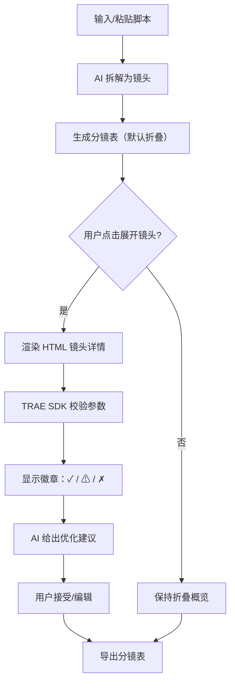

# PRD · 分镜表 AI 镜头设计工作台

## 1. 产品概述

面向短视频创作者、动画师和广告导演的"AI 分镜表"工作台：用户输入脚本，AI 自动拆解为镜头序列，每个镜头支持展开式 HTML 卡片（景别/运镜/构图/配音），并通过 TRAE SDK 验证镜头参数一致性，最终一键导出为可拍摄/可制作的分镜表。

- 核心价值：把"脚本→分镜"的手工工作流压缩到分钟级，并保证镜头节奏、景别与运镜逻辑可校验。
- 目标用户：短视频博主、动画/MG 分镜师、广告创意组、独立导演、AE 后期。

## 2. 核心功能

### 2.1 用户角色
| 角色 | 入口 | 核心权限 |
|------|------|----------|
| 创作者 | 主界面 | 输入脚本、生成/编辑镜头、展开详情、导出 |
| AI 镜头助理 | 内嵌组件 | 自动拆解、建议景别/运镜、补全描述、校验一致性 |

### 2.2 功能模块
1. **脚本舱**：粘贴/输入脚本、分段标记（场景/对白/动作）
2. **分镜表（核心）**：横向/纵向可切换的镜头卡片列表
3. **AI 镜头组件**：可展开的镜头详情（HTML 折叠）
4. **TRAE SDK 验证面板**：实时校验镜头参数（景别、运镜、时长、轴线）
5. **导出舱**：PNG 序列 / JSON / 印刷 PDF 占位

### 2.3 页面与模块
| 页面 | 模块 | 功能描述 |
|------|------|----------|
| 主工作台 | 顶部状态栏 | 项目名、镜头计数、校验状态徽章 |
| 主工作台 | 脚本输入面板 | 多行脚本输入、AI 拆解按钮、解析进度 |
| 主工作台 | 分镜表主区 | 镜头网格/列表，支持展开/收起 |
| 主工作台 | 镜头详情卡片 | 景别、构图、运镜、对白、音效、时长 |
| 主工作台 | AI 建议侧栏 | 镜头优化建议、连续性提示 |
| 主工作台 | TRAE 验证徽章 | SDK 返回的校验结果、错误/警告 |
| 主工作台 | 导出栏 | 复制 JSON、下载 HTML、截图 |

## 3. 核心流程

## 4. 用户界面设计

### 4.1 设计风格
- **主色调**：深色胶片灰 `#0E0F12` + 暖橙高光 `#FF7A1A`（导演监视器配色）
- **辅色**：冷青 `#5BC0EB`（AI 模块）、警示黄 `#F2C14E`、成功绿 `#3DDC97`
- **按钮**：直角 2px 圆角，1px 描边，按下内陷；按钮主操作使用实心橙
- **字体**：标题 `Space Grotesk`（监视器/工程感），正文 `IBM Plex Sans`，等宽 `JetBrains Mono`（时间码/参数）
- **布局**：左脚本舱 + 中分镜表 + 右 AI/TRAE 侧栏，三栏响应式
- **图标**：极简线性 SVG，胶片孔/快门/光圈造型
- **氛围**：胶片颗粒噪点叠加 + 扫描线 0.5% 透明，传递"监视器/DaVinci 调色台"质感

### 4.2 页面设计
| 页面 | 模块 | UI 元素 |
|------|------|---------|
| 主工作台 | 顶部状态栏 | 等宽字项目名、镜头数胶囊、校验徽章 |
| 主工作台 | 脚本舱 | 多行编辑、胶片孔左边框、行动按钮 |
| 主工作台 | 分镜表 | 镜头卡：缩略图/景别/对白/时间码，hover 抬升 |
| 主工作台 | 镜头详情（展开） | 网格：景别/运镜/构图/对白/音效/时长/AI 注释 |
| 主工作台 | 侧栏 | 滚动 AI 建议、TRAE 校验日志 |
| 主工作台 | 导出栏 | 三按钮：JSON / HTML / Print |

### 4.3 响应式
- 桌面优先：≥1280px 三栏
- 平板 768–1279：左右栏折叠为抽屉
- 移动 <768：单列纵向，详情进入二级页

### 4.4 3D 场景（如有）
不涉及 3D 场景，本产品为信息工具型界面。

## 5. 镜头数据模型（AI 组件输入/输出）
- 镜头 = { id, seq, scene, shotSize(景别), movement(运镜), composition(构图), dialogue(对白), sfx(音效), duration(秒), cameraAngle, aiNote }
- 校验维度：轴线一致性、跳切、节奏、景别多样性
