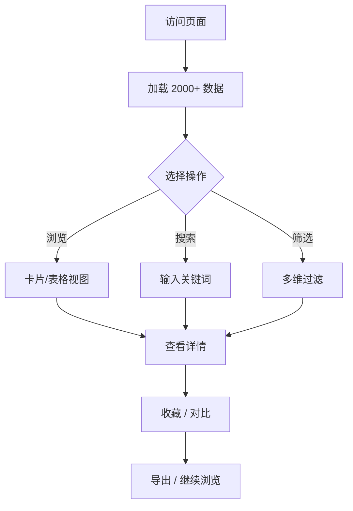

# 游戏IP衍生作品数据库浏览器 PRD

## 1. 产品概述

一个面向玩家、IP研究者和内容创作者的"游戏IP衍生作品宇宙数据库"，截至 2026 年 6 月 8 日收录 2000+ 条覆盖动画、真人影视、漫画、小说、舞台剧、衍生游戏、主题乐园、官方周边、音乐演出等全品类衍生条目，提供一站式浏览、筛选、对比与统计。

- 解决"游戏IP衍生作品分散于百科、流媒体、电商、新闻中难以快速纵览"的痛点
- 目标用户：游戏玩家、二次元爱好者、IP授权从业者、影视/出版行业从业者、研究者
- 价值：唯一一个"游戏→全媒介"映射的可视化窗口

## 2. 核心功能

### 2.1 用户角色
无登录体系，纯前端单页应用

### 2.2 功能模块

1. **首页 Dashboard**：统计看板、热门IP Top 10、年度发布密度、衍生类型分布
2. **浏览页 Browse**：卡片网格 + 表格双视图，支持分页/虚拟滚动
3. **筛选 & 搜索**：多维度过滤（IP、衍生类型、年代、地区、平台）
4. **详情侧边栏 Drawer**：点击任一条目显示完整元数据
5. **统计可视化**：衍生类型饼图、年度趋势柱状图、IP关联热力图
6. **收藏 & 对比**：本地 LocalStorage 收藏夹，多选对比
7. **暗色 / 亮色主题切换**

### 2.3 页面详情
| 页面 | 模块 | 功能描述 |
|------|------|----------|
| 首页 | Hero 数据屏 | 大字号 KPI 数字 + 滚动条装饰 |
| 首页 | 类型分布图 | 甜甜圈 / 柱状 / 词云 三种切换 |
| 浏览 | 工具栏 | 搜索框、筛选 Chip、视图切换、排序 |
| 浏览 | 卡片视图 | 3-4 列响应式卡片，悬停 3D 倾斜 |
| 浏览 | 表格视图 | 紧凑表格，支持列排序 |
| 浏览 | 详情 Drawer | 右侧滑出，展示完整元数据 |
| 收藏 | 收藏夹 | LocalStorage 持久化，导出 JSON |

## 3. 核心流程

用户访问 → 加载嵌入数据 → 浏览 / 搜索 / 筛选 → 打开详情 / 加入收藏 / 加入对比 → 切换视图 / 主题 → 导出或清空

## 4. 用户界面设计

### 4.1 设计风格

- **主色调**：深夜蓝紫 `#0A0A1F` 主背景，电光青 `#7DF9FF` 强调色，霓虹粉 `#FF3CAC` 辅助色
- **字体**：Display 使用 `Space Grotesk` / `Geist Mono`，正文使用 `Inter Tight`
- **按钮**：3D 凸起 + 霓虹外发光，悬浮时位移
- **布局**：顶部固定栏 + 左侧筛选侧边栏 + 主内容区 + 右侧详情 Drawer
- **图标**：Lucide 风格线性图标，统一 1.5px 描边

### 4.2 页面设计概览
| 页面 | 模块 | UI 元素 |
|------|------|----------|
| 首页 | Hero | 全屏数字背景 + 巨型统计数字 + 流光分隔线 |
| 浏览 | 工具栏 | 玻璃磨砂 + 霓虹聚焦边框 |
| 浏览 | 卡片 | 渐变封面 + IP 徽章 + 类型 Chip |
| 浏览 | 详情 | 滑出 Drawer + 元数据网格 + 关联 IP |

### 4.3 响应式
- 桌面优先（≥1280px），平板 (≥768px) 3 列，手机 (≥375px) 1 列
- 移动端折叠侧边栏为底部抽屉

### 4.4 3D 场景
- 不涉及（保持单页性能与首屏速度）
