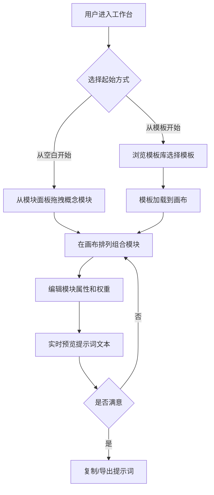

## 1. 产品概述

AI提词器是一款面向创意工作者和AI使用者的概念化提示词构建工具。通过可视化拖拽概念模块、结构化组装提示词，帮助用户高效创建高质量的AI提示词。
- 解决用户编写AI提示词时缺乏结构、难以迭代优化的问题，目标用户为设计师、内容创作者、AI爱好者
- 降低AI提示词的创作门槛，提升提示词质量和复用效率

## 2. 核心功能

### 2.1 用户角色
| 角色 | 注册方式 | 核心权限 |
|------|----------|----------|
| 普通用户 | 无需注册 | 浏览模板、创建和编辑提示词、导出提示词 |

### 2.2 功能模块
1. **工作台页面**: 概念画布、模块面板、属性编辑器、实时预览
2. **模板库页面**: 分类浏览、搜索筛选、模板预览、一键使用

### 2.3 页面详情
| 页面名称 | 模块名称 | 功能描述 |
|----------|----------|----------|
| 工作台页面 | 概念画布 | 拖拽排列概念模块，自由组合提示词结构，支持连线表示逻辑关系 |
| 工作台页面 | 模块面板 | 提供预设概念模块（主体、风格、场景、情绪、技术参数等），支持自定义模块 |
| 工作台页面 | 属性编辑器 | 选中模块后编辑详细属性，如权重、描述文本、变体选项 |
| 工作台页面 | 实时预览 | 实时将画布上的概念模块组装为完整提示词文本，支持一键复制 |
| 工作台页面 | 提示词历史 | 记录当前会话的提示词生成历史，支持回溯和对比 |
| 模板库页面 | 分类浏览 | 按类别（绘画、写作、编程、音乐等）浏览提示词模板 |
| 模板库页面 | 搜索筛选 | 关键词搜索、标签筛选、热度排序 |
| 模板库页面 | 模板预览 | 查看模板详情、概念模块组成、效果示例 |
| 模板库页面 | 一键使用 | 将模板加载到工作台进行编辑 |

## 3. 核心流程

用户打开工具后进入工作台，从左侧模块面板选择概念模块拖入画布，在画布中排列组合模块，点击模块在右侧编辑属性，底部实时预览生成的提示词文本。用户也可以从模板库选择模板一键加载到工作台。

## 4. 用户界面设计

### 4.1 设计风格
- 主色调：深色背景（#0a0a0f）搭配霓虹青色（#00ffd5）和暖橙色（#ff6b35）作为强调色
- 按钮风格：圆角微光按钮，hover时发光效果
- 字体：标题使用 Orbitron（科技感），正文使用 Noto Sans SC（中文友好）
- 布局风格：深色主题三栏布局，左侧模块面板、中间画布、右侧属性面板
- 图标风格：线性图标搭配霓虹发光效果

### 4.2 页面设计概览
| 页面名称 | 模块名称 | UI元素 |
|----------|----------|--------|
| 工作台页面 | 概念画布 | 深色网格背景，模块卡片带发光边框，拖拽时半透明效果，连线为渐变曲线 |
| 工作台页面 | 模块面板 | 左侧固定面板，分类折叠列表，模块卡片带图标和颜色标识 |
| 工作台页面 | 属性编辑器 | 右侧滑出面板，表单输入带发光聚焦效果，权重滑块 |
| 工作台页面 | 实时预览 | 底部固定面板，等宽字体显示提示词，语法高亮，一键复制按钮 |
| 模板库页面 | 分类浏览 | 顶部标签栏切换分类，卡片网格布局，卡片带悬浮动画 |
| 模板库页面 | 搜索筛选 | 顶部搜索栏带霓虹边框，筛选标签组 |

### 4.3 响应式设计
- 桌面优先设计，三栏布局在1440px以上完整展示
- 1024px-1440px：属性面板改为覆盖式滑出
- 768px以下：模块面板改为底部抽屉，画布全屏

### 4.4 3D场景指引
- 不适用
