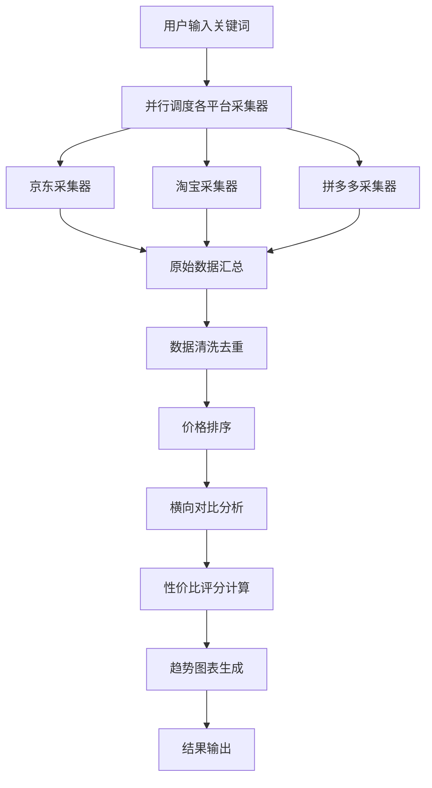

## 1. 产品概述

电商商品价格自动化采集与对比工具，帮助用户从京东、淘宝、拼多多等主流电商平台批量抓取指定商品的名称、价格、销量、店铺评分、网址链接等关键信息，自动完成数据清洗去重、价格排序、横向对比、趋势图表生成和性价比推荐标注。

- 目标用户：电商运营人员、价格监控从业者、个人消费者
- 核心价值：一站式跨平台比价，降低信息差，辅助购买决策

## 2. 核心功能

### 2.1 功能模块

1. **命令行工具页**：关键词搜索采集、数据清洗排序、结果输出（JSON/CSV/终端表格）
2. **演示网页**：关键词输入触发采集、商品对比表格、价格趋势图表、性价比推荐标注、初始化示例数据展示

### 2.2 页面详情

| 页面名称 | 模块名称 | 功能描述 |
|---------|---------|---------|
| 演示网页 | 搜索栏 | 输入关键词，选择平台，点击搜索触发采集 |
| 演示网页 | 商品对比表格 | 展示采集结果，按价格排序，支持平台筛选 |
| 演示网页 | 价格趋势图表 | 展示各平台价格分布柱状图和趋势折线图 |
| 演示网页 | 性价比推荐 | 基于价格/评分/销量综合评分，标注推荐商品 |
| 演示网页 | 示例数据展示 | 初始化时展示预设关键词的采集结果和对比分析 |
| 命令行工具 | 采集命令 | `python price_hunter.py search "关键词" --platforms jd,tb,pdd` |
| 命令行工具 | 导出命令 | 支持 `--format json/csv/table` 输出格式 |
| 命令行工具 | 对比命令 | `python price_hunter.py compare "关键词"` 生成对比报告 |

## 3. 核心流程

用户在命令行或网页输入关键词 → 系统并行调用各平台采集器 → 原始数据汇总 → 数据清洗（去重、格式统一、异常值过滤）→ 按价格排序 → 生成横向对比表 → 计算性价比评分 → 生成趋势图表 → 输出结果

## 4. 用户界面设计

### 4.1 设计风格

- 主色调：深色科技风（#0F172A 深蓝黑底 + #22D3EE 青色高亮 + #F59E0B 琥珀色点缀）
- 辅助色：各平台品牌色（京东红 #E4393C、淘宝橙 #FF5000、拼多多红 #E02E24）
- 字体：JetBrains Mono（数据展示）+ Noto Sans SC（中文正文）
- 布局：卡片式布局，顶部搜索栏，下方分区展示
- 图标：lucide-react 图标库
- 动效：数据加载骨架屏、卡片入场动画、图表渐入

### 4.2 页面设计概览

| 页面名称 | 模块名称 | UI元素 |
|---------|---------|--------|
| 演示网页 | 搜索栏 | 居中大搜索框，平台多选标签，搜索按钮带动画 |
| 演示网页 | 商品对比表格 | 深色表格，平台色标签，价格高亮，排序指示 |
| 演示网页 | 价格趋势图表 | 柱状图+折线图，平台色区分，hover交互 |
| 演示网页 | 性价比推荐 | 推荐徽章，评分雷达图，TOP3高亮卡片 |
| 演示网页 | 示例数据展示 | 初始化加载动画，预设"iPhone 16"搜索结果 |

### 4.3 响应式设计

- 桌面优先设计，表格和图表在大屏展示完整信息
- 平板端表格支持横向滚动
- 移动端卡片式布局替代表格
