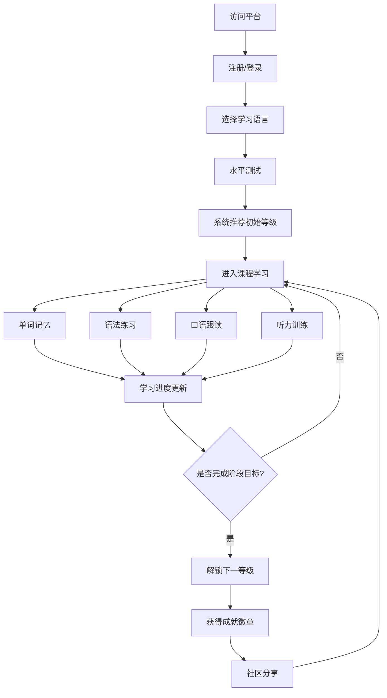

## 1. 产品概述

LinguaVerse 是一款沉浸式多语种在线学习平台，支持英语、日语、韩语等主流语言学习。平台通过分级课程体系、互动式学习模块和个性化推荐，为语言学习者打造从入门到精通的完整学习路径，同时借助社区交流和成就激励系统保持学习动力。

- 目标用户：有语言学习需求的青少年及成人学习者
- 核心价值：沉浸式学习体验 + 个性化路径 + 社区激励驱动

## 2. 核心功能

### 2.1 用户角色

| 角色 | 注册方式 | 核心权限 |
|------|----------|----------|
| 学习者 | 邮箱注册 | 浏览课程、参与学习、社区互动、查看个人进度 |
| 管理员 | 后台分配 | 课程管理、用户管理、内容审核 |

### 2.2 功能模块

1. **首页**：品牌展示、语言选择入口、学习数据概览、热门课程推荐
2. **登录/注册页**：用户认证、社交登录入口
3. **课程中心页**：分级课程浏览、语言筛选、课程详情
4. **学习互动页**：单词记忆、语法练习、口语跟读、听力训练四大模块
5. **学习进度页**：学习数据可视化、每日打卡、连续学习天数
6. **社区页**：学习圈讨论、学习伙伴匹配、话题交流
7. **成就中心页**：徽章收集、排行榜、学习里程碑

### 2.3 页面详情

| 页面名称 | 模块名称 | 功能描述 |
|----------|----------|----------|
| 首页 | Hero区域 | 品牌标语、多语种动态切换展示、开始学习CTA按钮 |
| 首页 | 语言选择卡片 | 英语/日语/韩语三大语言入口卡片，展示学习人数和课程数 |
| 首页 | 学习概览面板 | 已登录用户展示今日学习目标、连续打卡天数、本周学习时长 |
| 首页 | 热门课程推荐 | 基于用户选择语言的个性化课程推荐轮播 |
| 登录/注册页 | 认证表单 | 邮箱+密码注册登录，表单校验，登录/注册模式切换 |
| 课程中心页 | 语言筛选栏 | 按语言类型筛选课程 |
| 课程中心页 | 等级筛选 | 按CEFR等级（A1-C2）筛选课程 |
| 课程中心页 | 课程卡片列表 | 课程封面、名称、等级标签、课时数、完成进度 |
| 课程中心页 | 课程详情弹窗 | 课程大纲、学习目标、适用人群、开始学习按钮 |
| 学习互动页 | 模块切换标签 | 单词记忆/语法练习/口语跟读/听力训练四个标签页 |
| 学习互动页 | 单词记忆模块 | 闪卡翻转、发音播放、例句展示、掌握度标记 |
| 学习互动页 | 语法练习模块 | 填空题、选择题、句子重组、即时反馈与解析 |
| 学习互动页 | 口语跟读模块 | 文本展示、录音按钮、发音评分反馈 |
| 学习互动页 | 听力训练模块 | 音频播放、听力理解题、逐句精听 |
| 学习进度页 | 学习日历 | 每日打卡记录热力图 |
| 学习进度页 | 数据统计 | 学习时长、单词量、完成课程数等核心指标图表 |
| 学习进度页 | 学习路径 | 当前等级进度条、下一等级解锁条件 |
| 社区页 | 话题列表 | 按语言分类的学习话题、热门讨论 |
| 社区页 | 帖子详情 | 帖子内容、评论互动、点赞收藏 |
| 社区页 | 发帖功能 | 发布学习心得、提问、分享资源 |
| 成就中心页 | 徽章展示 | 已获得/未获得徽章网格，解锁条件说明 |
| 成就中心页 | 排行榜 | 周榜/月榜/总榜，学习时长和完成课程数排名 |
| 成就中心页 | 里程碑时间线 | 学习历程关键节点展示 |

## 3. 核心流程

用户注册登录后，选择目标学习语言，系统根据水平测试结果推荐初始等级课程。用户进入课程后，通过四大互动模块（单词记忆、语法练习、口语跟读、听力训练）进行学习，系统实时追踪学习进度并更新数据。完成阶段性学习后解锁下一等级课程，同时在社区分享学习成果、获取成就徽章，形成学习-反馈-激励的闭环。

## 4. 用户界面设计

### 4.1 设计风格

- 主色调：深墨绿（#1A3A2A）+ 暖金（#D4A853）点缀，营造沉稳而温暖的学习氛围
- 辅助色：柔白（#FAFAF7）、浅灰绿（#E8F0EC）、珊瑚橙（#E8734A）用于强调
- 按钮风格：圆角胶囊按钮，主按钮带微妙渐变和悬浮阴影
- 字体：标题使用 Playfair Display（衬线体，优雅知性），正文使用 DM Sans（无衬线，清晰易读）
- 布局风格：左侧固定导航栏 + 右侧内容区，卡片式内容组织
- 图标风格：线性图标，搭配语言特色装饰元素（如日语课程卡片配樱花纹样）

### 4.2 页面设计概览

| 页面名称 | 模块名称 | UI元素 |
|----------|----------|--------|
| 首页 | Hero区域 | 全宽背景渐变、大标题Playfair Display、多语种文字动画切换、CTA胶囊按钮带悬浮效果 |
| 首页 | 语言选择卡片 | 三列卡片布局，每张卡片含语言图标、装饰纹样、学习人数统计、hover时卡片上浮+阴影加深 |
| 首页 | 学习概览面板 | 圆环进度图、连续打卡火焰图标、本周时长柱状图 |
| 登录/注册页 | 认证表单 | 居中卡片式表单、输入框带聚焦动效、模式切换滑块 |
| 课程中心页 | 课程卡片 | 网格布局、封面图+等级标签（彩色胶囊）、进度条、hover缩放效果 |
| 学习互动页 | 单词记忆 | 居中大卡片、点击翻转动画、发音按钮带波纹效果 |
| 学习互动页 | 语法练习 | 卡片式题目、选项按钮带选中动效、正确/错误颜色反馈 |
| 学习互动页 | 口语跟读 | 麦克风按钮带脉冲动画、波形可视化、评分圆环 |
| 学习互动页 | 听力训练 | 播放器控件、进度条、逐句高亮文本 |
| 学习进度页 | 学习日历 | GitHub风格热力图、hover显示详情 |
| 学习进度页 | 数据统计 | 圆环图+柱状图组合、数字计数动画 |
| 社区页 | 话题列表 | 卡片流式布局、语言标签过滤、头像+用户名 |
| 成就中心页 | 徽章展示 | 六边形徽章网格、未解锁灰色、解锁时发光动画 |

### 4.3 响应式设计

- 桌面优先设计，最小宽度1024px完整体验
- 平板端（768-1024px）：侧边导航折叠为顶部导航，卡片从三列变两列
- 移动端（<768px）：单列布局，底部Tab导航，学习模块全屏沉浸式体验

### 4.4 3D场景指引

不适用
