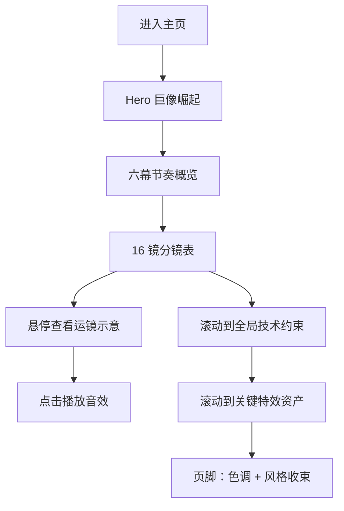

# 产品需求文档（PRD）—《对决》影视 PV 分镜展示页

## 1. 产品概述

将 [storyboard.md](../storyboard.md) 中已规划好的 16 镜 IMAX 巨像开场分镜脚本，呈现为一张可滚动、可交互的 16:9 满画幅视觉分镜站点，作为导演 / 美术 / 投资人快速对齐视觉与节奏的工具。
- 主要用途：分镜浏览、节奏预览、画面与音效同步示意、对外提案演示
- 目标用户：导演组、视效团队、制片人、对外提案客户
- 价值：用「画面 / 运镜 / 音效 / 视觉母题」四列同屏呈现，强化「镜头直接服务于力」这一核心判断

## 2. 核心功能

### 2.1 角色
无登录、无后台，单页静态站点。

### 2.2 功能模块
1. **Hero 开场区**：巨像崛起 / 项目元数据（画幅、时长、渲染基线、色调基线）
2. **节奏概览区**：六幕情绪曲线 + 镜头语言主线
3. **16 镜分镜表**：每镜一张 16:9 画框 + 镜号 / 景别 / 运镜 / 画面 / 特效 / 音效 六列
4. **全局技术约束区**：6 条技术约束的可视化卡片
5. **关键特效资产清单**：6 项 3D / 2D 资产的缩略图位

### 2.3 页面详情

| 页面名称 | 模块名称 | 功能描述 |
| --- | --- | --- |
| 主页 | Hero 开场区 | 16:9 满画幅视频 / 动效背景，叠加项目元数据，金色调低饱和 |
| 主页 | 节奏概览区 | 6 列卡片展示六幕情绪 / 镜头语言 |
| 主页 | 16 镜分镜表 | 16 个分镜卡，每卡含 16:9 画面占位 + 6 列元数据 |
| 主页 | 全局技术约束 | 6 条约束的网格卡片 |
| 主页 | 关键特效资产 | 6 项资产卡片 |

## 3. 核心流程

用户进入主页 → 视差滚动经过 Hero → 鼠标悬停分镜卡查看细节 → 点击分镜卡播放该镜音效 / 切换为「关键帧示意」 → 滚动至底部查看技术约束与资产。

## 4. 用户界面设计

### 4.1 设计风格
- **主色**：苍黄 / 沙金色（#C9A961），低饱和
- **辅色**：墨黑（#0B0B0F）、沙白（#E8E2D0）、中国红（#8B1A1A）作点缀
- **按钮样式**：细线 1px 描边 + 微微发光，hover 时填色翻转
- **字体**：
  - 标题 / 显示字体：`Noto Serif SC`（中文明朝体风格，庄严史诗）
  - 正文 / 数据：`JetBrains Mono`（等宽，给出镜头参数感）
  - 英文点缀：`Cormorant Garamond`（编辑风）
- **布局**：单列瀑布 + 16:9 满画幅分镜卡，弱网格、强对比
- **图标**：lucide 极细线图标（不喧宾夺主）

### 4.2 页面设计概述

| 页面 | 模块 | UI 元素 |
| --- | --- | --- |
| 主页 | Hero 开场区 | 16:9 视频背景 / 颗粒噪点 / 项目元数据左对齐、电影银幕宽比例 / 沙金色 + 墨黑 |
| 主页 | 节奏概览区 | 6 列等宽卡片 / 情绪曲线 SVG 缩略图 / 镜头语言副标题 |
| 主页 | 16 镜分镜表 | 16 个分镜卡 / 顶部 16:9 占位 / 6 列元数据表 / 镜号 03d 风格数字 / hover 提升 |
| 主页 | 全局技术约束 | 6 张玻璃拟物卡 / 编号 01-06 / 描述使用衬线斜体 |
| 主页 | 关键特效资产 | 6 张资产卡 / 缩略图 + 名称 + 简短描述 |

### 4.3 响应式
- 桌面优先（≥1280px 最佳）
- 平板（768–1279px）单列变两列
- 移动端（<768px）分镜卡堆叠为单列，元数据折叠

### 4.4 视觉场景指引
- 背景：暗调（#0B0B0F），叠加细微颗粒噪点
- 灯光：左上 45° 暖光模拟 IMAX 银幕反光
- 动效：进入视口时元素由下淡入 + 模糊收敛，stagger 80ms
- 后处理：CSS backdrop-filter blur 营造玻璃质感
