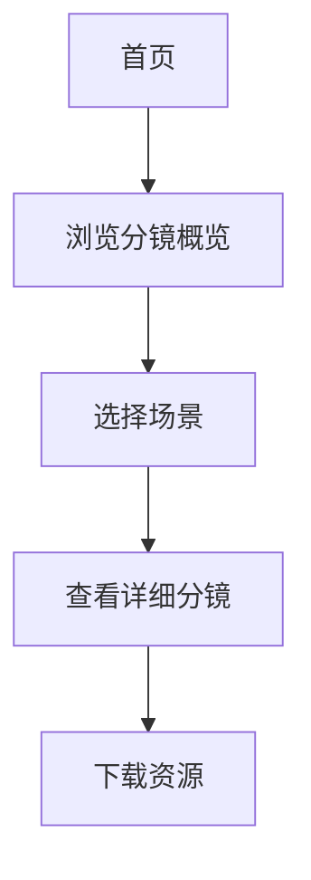

## 1. Product Overview
这是一个视频分镜项目的前端演示界面，用于展示创意视频的分镜脚本、时间线和镜头规划。
- 主要功能是可视化展示分镜剧本、场景切换和特效说明
- 目标用户是视频创作者、动画师和影视后期制作人员

## 2. Core Features

### 2.1 User Roles (if applicable)
| Role | Registration Method | Core Permissions |
|------|---------------------|------------------|
| 普通用户 | 无需注册 | 浏览分镜演示、交互查看场景 |

### 2.2 Feature Module
1. **首页**: 英雄区域、分镜项目概述、场景快速导航
2. **场景详情页**: 单个场景的详细分镜、时间线、特效说明
3. **时间线控制器**: 可交互的时间线、帧导航、播放控制

### 2.3 Page Details
| Page Name | Module Name | Feature description |
|-----------|-------------|---------------------|
| 首页 | 英雄区域 | 项目标题、预览动画、快速开始按钮 |
| 首页 | 分镜概览 | 三个场景卡片列表，包含基本信息 |
| 首页 | 时间线展示 | 可视化时间线，显示各场景时长 |
| 场景详情页 | 分镜表格 | 逐帧展示的镜头描述、画面内容、特效 |
| 场景详情页 | 时间线控制器 | 可拖动的时间轴、帧导航按钮 |
| 场景详情页 | 资源预览 | AE脚本下载、分镜脚本预览 |

## 3. Core Process
用户访问首页 → 浏览分镜概览 → 选择感兴趣的场景 → 查看详细分镜和时间线 → 下载相关资源

## 4. User Interface Design

### 4.1 Design Style
- **主色**: 深邃黑紫渐变 (#0f0c29 → #302b63 → #24243e)
- **强调色**: 霓虹蓝 (#00d4ff)、霓虹红 (#ff0080)
- **按钮风格**: 圆角矩形，带有霓虹发光效果
- **字体**: Space Grotesk (标题) + JetBrains Mono (代码/时间码)
- **布局风格**: 卡片式 + 深色背景，赛博朋克风格
- **图标风格**: Lucide图标，霓虹发光效果

### 4.2 Page Design Overview
| Page Name | Module Name | UI Elements |
|-----------|-------------|-------------|
| 首页 | 英雄区域 | 渐变色背景、闪烁霓虹标题、卡片式场景预览 |
| 首页 | 分镜概览 | 悬浮卡片、渐变色边框、悬停动画 |
| 场景详情页 | 分镜表格 | 深色表格、高亮当前帧、滚动视差 |
| 场景详情页 | 时间线控制器 | 拖动滑块、帧号显示、播放/暂停 |

### 4.3 Responsiveness
- 桌面端优先设计
- 移动端自适应布局
- 触摸优化的交互元素

### 4.4 3D Scene Guidance (if applicable)
- 不适用
