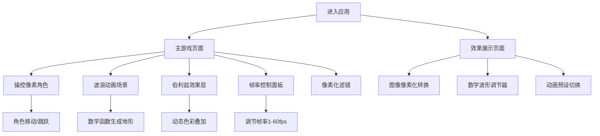

## 1. 产品概述

一款像素风格的互动网页游戏，融合图像像素化处理、波浪/伯利兹数学动画效果和帧率可控的动画系统。玩家操控像素角色在充满数学美学的动态场景中探索，体验像素艺术与数学动画的视觉碰撞。

- 面向喜爱像素艺术、数学可视化和创意互动体验的用户
- 核心价值：将数学函数之美与像素游戏美学融合，创造独特的视觉互动体验

## 2. 核心功能

### 2.1 功能模块

1. **主游戏页面**: 像素角色控制、波浪/伯利兹动画场景、帧率控制面板
2. **效果展示页面**: 图像像素化转换演示、数学波形参数调节器

### 2.2 页面详情

| 页面名称 | 模块名称 | 功能描述 |
|----------|----------|----------|
| 主游戏页面 | 像素角色系统 | 可操控的像素角色，支持移动、跳跃、待机动画 |
| 主游戏页面 | 波浪动画场景 | 基于正弦/余弦函数的波浪地形，角色可在波浪上移动 |
| 主游戏页面 | 伯利兹效果层 | 伯利兹旗图案风格的数学动画叠加层，随时间动态变化 |
| 主游戏页面 | 帧率控制面板 | 可调节动画帧率（1-60fps），实时预览不同帧率下的动画效果 |
| 主游戏页面 | 像素化滤镜 | 场景实时像素化渲染，可调节像素块大小 |
| 效果展示页面 | 图像像素化转换 | 上传图片并实时转换为像素风格，可调节像素粒度 |
| 效果展示页面 | 数学波形调节器 | 调节波浪振幅、频率、相位等参数，实时预览效果 |
| 效果展示页面 | 动画预设 | 多种预设动画效果（海浪、脉冲、漩涡等）一键切换 |

## 3. 核心流程

用户进入主游戏页面，操控像素角色在动态波浪场景中移动。波浪地形由数学函数实时生成，伯利兹风格的色彩动画作为背景层。用户可通过帧率控制面板调整动画流畅度，体验不同帧率下的视觉效果差异。在效果展示页面，用户可上传图片进行像素化转换，并自由调节数学波形参数。

## 4. 用户界面设计

### 4.1 设计风格

- 主色调：深蓝绿（#0A1628）+ 伯利兹蓝（#003F87）+ 热带黄（#FFD100）
- 辅助色：珊瑚红（#FF6B6B）、翡翠绿（#00D4AA）、像素白（#E8E8E8）
- 按钮风格：像素风3D凸起按钮，8bit风格边框
- 字体：Press Start 2P（像素风标题）+ VT323（像素风正文）
- 布局风格：全屏Canvas游戏区域 + 浮动控制面板
- 图标风格：8x8/16x16像素图标

### 4.2 页面设计概览

| 页面名称 | 模块名称 | UI元素 |
|----------|----------|--------|
| 主游戏页面 | 游戏画布 | 全屏Canvas，像素化渲染，波浪地形，角色精灵 |
| 主游戏页面 | 帧率面板 | 右侧浮动面板，滑块+数值显示，帧率图表 |
| 主游戏页面 | 控制提示 | 底部像素风提示条，方向键/WASD操作说明 |
| 效果展示页面 | 图片上传区 | 拖拽上传区域，像素化预览对比 |
| 效果展示页面 | 参数面板 | 左侧参数滑块组，实时预览窗口 |

### 4.3 响应式设计

- 桌面优先设计，Canvas自适应窗口大小
- 移动端支持触摸控制（虚拟方向键）
- 控制面板在小屏幕上可折叠

### 4.4 像素化渲染指导

- 所有图形通过Canvas 2D API以低分辨率绘制后放大
- 使用 `imageSmoothingEnabled = false` 保持像素锐利
- 角色精灵使用16x16或32x32像素画
- 波浪地形使用数学函数逐像素计算高度
- 伯利兹效果使用色彩渐变+波浪函数叠加
