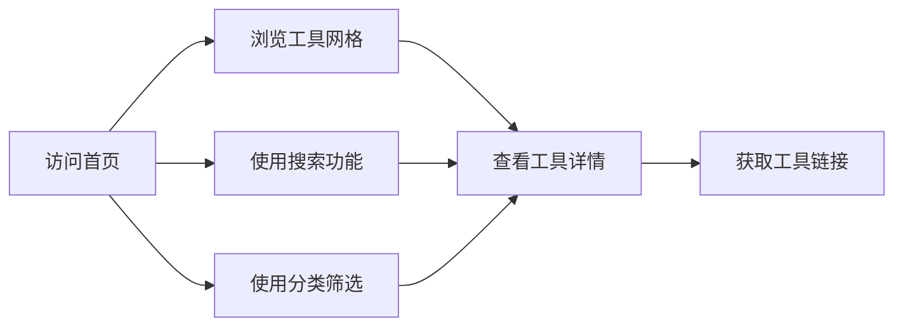

## 1. Product Overview
AI 平台工具链检索工具是一个用于收集、展示和搜索 AI 平台工具的 Web 应用。
- 主要目的：帮助用户快速找到合适的 AI 工具，从各种 AI Bot 中收集工具信息
- 目标用户：AI 开发者、研究人员、产品经理以及对 AI 工具感兴趣的用户

## 2. Core Features

### 2.1 User Roles
无角色区分，所有用户均可浏览和搜索工具

### 2.2 Feature Module
1. **首页**：工具网格展示、搜索功能、分类筛选
2. **工具详情页**：工具详细信息、功能描述、使用链接

### 2.3 Page Details
| Page Name | Module Name | Feature description |
|-----------|-------------|---------------------|
| 首页 | 工具网格 | 以方形卡片形式展示 AI 工具，支持分类筛选 |
| 首页 | 搜索栏 | 支持关键词搜索工具名称和描述 |
| 首页 | 分类筛选 | 按工具类型、平台等维度筛选 |
| 工具详情页 | 详情展示 | 完整的工具信息，包括图标、名称、描述、链接等 |

## 3. Core Process
用户访问首页 → 浏览工具网格或使用搜索/筛选功能 → 点击工具卡片查看详情 → 获取工具使用链接

## 4. User Interface Design
### 4.1 Design Style
- **主色调**：深蓝色 (#1e3a8a) 和青色 (#06b6d4)，营造科技感
- **按钮风格**：方形，轻微圆角，悬停时有渐变效果
- **字体**：使用 Space Grotesk 作为标题字体，Inter 作为正文字体
- **布局风格**：基于网格的卡片式布局
- **图标风格**：使用 lucide-react 图标库，线性风格

### 4.2 Page Design Overview
| Page Name | Module Name | UI Elements |
|-----------|-------------|-------------|
| 首页 | Hero 区域 | 简洁的标题和描述，深色背景，渐变文字 |
| 首页 | 搜索栏 | 居中的搜索框，带有搜索图标，支持实时搜索 |
| 首页 | 工具网格 | 响应式网格布局，方形卡片，卡片悬停有放大和阴影效果 |
| 工具详情页 | 详情区域 | 大尺寸图标，详细描述，清晰的操作按钮 |

### 4.3 Responsiveness
- 桌面端优先设计，自适应不同屏幕尺寸
- 移动端优化网格布局，确保良好的触控体验

### 4.4 3D Scene Guidance
不适用
