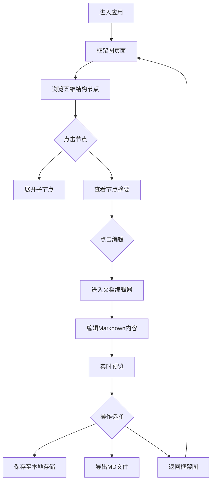

## 1. 产品概述

未央宫文档工作台——一款以西汉未央宫历史散文为内容核心的交互式文档可视化与编辑工具。将散文的五维解析结构（编年空间叙事、意象系统、感官考古、时间意识、语言风格）以可视化框架图呈现，并提供单项文档编辑器，让用户可以逐节浏览、编辑与导出文档内容。

- 目标用户：文学研究者、历史爱好者、散文写作者
- 核心价值：将复杂的文学分析结构可视化，降低认知负荷；提供沉浸式的古风编辑体验

## 2. 核心功能

### 2.1 用户角色

| 角色 | 使用方式 | 核心权限 |
|------|----------|----------|
| 访客 | 无需注册 | 浏览框架图、查看文档内容 |
| 编辑者 | 本地模式 | 浏览、编辑、导出文档内容 |

### 2.2 功能模块

1. **框架图页面**：以交互式树状/网络图展示未央宫散文五维解析结构，支持节点展开/折叠、点击跳转编辑
2. **文档编辑器页面**：单项文档富文本/Markdown编辑器，支持实时预览、古风主题、自动保存

### 2.3 页面详情

| 页面名称 | 模块名称 | 功能描述 |
|----------|----------|----------|
| 框架图页面 | 顶部导航栏 | 品牌标识、页面切换、主题切换 |
| 框架图页面 | 中心框架图 | 交互式节点图，展示五维结构，节点可点击展开子项 |
| 框架图页面 | 节点详情面板 | 点击节点后侧边滑出，显示该节点摘要与"编辑"入口 |
| 框架图页面 | 时间轴浮层 | 底部横向时间轴，对应编年体空间叙事的七个时间节点 |
| 编辑器页面 | 编辑区域 | Markdown编辑器，支持实时预览、语法高亮 |
| 编辑器页面 | 预览区域 | 右侧实时渲染预览，古风排版 |
| 编辑器页面 | 工具栏 | 保存、导出MD、返回框架图、字体/主题设置 |
| 编辑器页面 | 元数据面板 | 显示当前编辑节点的标题、所属维度、关联意象 |

## 3. 核心流程

用户打开应用后，首先看到未央宫散文五维解析的交互式框架图。框架图以"未央宫"为中心节点，五个维度为一级子节点，各维度下的子项为二级节点。用户可点击任意节点查看摘要，点击"编辑"进入单项文档编辑器。编辑器中可修改Markdown内容、实时预览、保存至本地存储、导出为MD文件。

## 4. 用户界面设计

### 4.1 设计风格

- **主色调**：以"丹漆红"（#8B2500）与"夯土黄"（#C4A265）为核心色，呼应未央宫的丹漆夯土意象
- **辅助色**：墨黑（#1A1A2E）、竹青（#2D5A27）、铜绿（#5B7553）
- **背景**：深色宣纸质感，微弱纹理噪点
- **字体**：标题使用"思源宋体"风格衬线字体，正文使用优雅的无衬线体
- **布局**：左右分栏（框架图居中展开 / 编辑器左编辑右预览）
- **动效**：节点展开时墨迹晕染效果，页面切换时卷轴式过渡

### 4.2 页面设计概览

| 页面名称 | 模块名称 | UI元素 |
|----------|----------|--------|
| 框架图页面 | 中心框架图 | 深色背景、金色连线、朱红节点、悬浮光晕、墨迹动效 |
| 框架图页面 | 节点详情面板 | 右侧滑出面板、宣纸底纹、竖排标题、古风边框 |
| 框架图页面 | 时间轴浮层 | 底部横向轴、铜色刻度、节点悬浮显示详情 |
| 编辑器页面 | 编辑区域 | 左侧、深色背景、等宽字体、行号、语法高亮 |
| 编辑器页面 | 预览区域 | 右侧、宣纸底色、宋体排版、朱色批注标记 |
| 编辑器页面 | 工具栏 | 顶部、铜色图标按钮、古风分隔线 |

### 4.3 响应式

- 桌面优先设计（1920×1080基准）
- 平板适配：编辑器切换为上下分栏（编辑在上，预览在下）
- 移动端：框架图缩放适配，编辑器全屏编辑模式

### 4.4 3D场景指导

不适用
