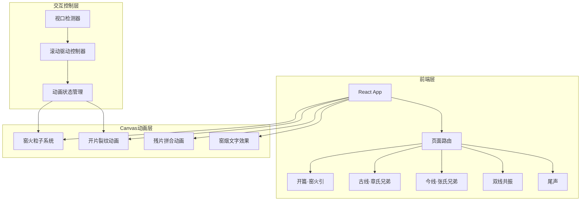

## 1. 架构设计



## 2. 技术说明

- **前端框架**：React@18 + TypeScript + Vite
- **样式方案**：Tailwind CSS@3
- **Canvas动画**：HTML5 Canvas API + 自定义粒子系统
- **滚动驱动**：Intersection Observer API + 自定义滚动进度追踪
- **状态管理**：Zustand
- **路由**：React Router DOM（单页应用内区段导航）
- **字体**：Google Fonts - Noto Serif SC + Noto Sans SC
- **图标**：Lucide React

## 3. 路由定义

| 路由 | 用途 |
|------|------|
| / | 主页面，包含所有故事线区段，纵向滚动浏览 |
| /ancient | 古线故事线独立视图（可选） |
| /modern | 今线故事线独立视图（可选） |

## 4. 组件架构

### 4.1 核心组件

| 组件名 | 职责 |
|--------|------|
| `App` | 根组件，路由与全局状态 |
| `StoryPanel` | 故事面板容器，管理滚动与动画触发 |
| `KilnFireCanvas` | 窑火粒子Canvas动画 |
| `CrackCanvas` | 开片裂纹Canvas动画 |
| `ShardCanvas` | 残片拼合Canvas动画 |
| `SmokeTextCanvas` | 窑烟文字Canvas效果 |
| `Timeline` | 时间轴叙事组件 |
| `TimelineNode` | 时间轴单个节点 |
| `DualResonance` | 双线共振对照组件 |
| `ScrollProgress` | 滚动进度指示器 |
| `StorySection` | 故事区段包装组件（含视口检测） |

### 4.2 自定义Hooks

| Hook名 | 职责 |
|--------|------|
| `useScrollProgress` | 追踪元素在视口中的滚动进度（0-1） |
| `useCanvasAnimation` | 管理Canvas动画帧循环 |
| `useParticleSystem` | 粒子系统状态与更新逻辑 |
| `useIntersectionObserver` | 元素进入视口检测 |

### 4.3 状态管理（Zustand）

```typescript
interface StoryState {
  currentSection: 'intro' | 'ancient' | 'modern' | 'resonance' | 'epilogue'
  scrollProgress: number
  ancientNodeIndex: number
  modernNodeIndex: number
  isCrackAnimating: boolean
  isShardAnimating: boolean
  setSection: (section: StoryState['currentSection']) => void
  setScrollProgress: (progress: number) => void
  setAncientNodeIndex: (index: number) => void
  setModernNodeIndex: (index: number) => void
}
```

## 5. Canvas动画技术方案

### 5.1 窑火粒子系统

```
粒子属性：x, y, vx, vy, size, opacity, color, life
发射器：底部窑口区域，随机位置发射
物理：向上加速 + 微弱水平扰动 + 透明度随life递减
颜色：从 #D4622B（窑火橙）渐变至 #F5F0E8（釉白）
```

### 5.2 开片裂纹动画

```
裂纹生成：递归分形算法，从中心点向外延伸
大纹（铁线）：深褐色 #5C3A21，线宽2-3px
细纹（金丝）：金色 #C9A84C，线宽0.5-1px
动画：裂纹逐帧延伸，滚动进度驱动延伸比例
```

### 5.3 残片拼合动画

```
碎片属性：x, y, targetX, targetY, rotation, targetRotation, opacity
初始状态：随机散落在Canvas各处
目标状态：拼合为完整瓷片轮廓
动画：滚动进度驱动碎片从散落→拼合的插值
```

### 5.4 窑烟文字效果

```
文字渲染：先在离屏Canvas渲染文字
粒子采样：从文字像素中采样粒子位置
动画：粒子从随机位置渐聚为文字形态
颜色：青瓷色系半透明粒子
```

## 6. 数据模型

### 6.1 故事节点数据

```typescript
interface StoryNode {
  id: string
  title: string
  description: string
  quote?: string
  color: string
  icon: string
}

interface StoryLine {
  id: 'ancient' | 'modern'
  title: string
  subtitle: string
  nodes: StoryNode[]
  theme: {
    primaryColor: string
    accentColor: string
    bgGradient: string
  }
}
```

### 6.2 故事数据定义

古线节点：嘱托·共守窑火 → 分窑·铁胎紫土 → 投灰·暗夜潜入 → 开片·金丝铁线 → 决裂·远走庆元 → 合烧·兄弟和解

今线节点：泥伴·以泥为伴 → 学艺·碎瓷不割志 → 支教·守的是人 → 碰撞·窑火同燃 → 夏令营·青瓷课 → 合烧·致敬章氏
