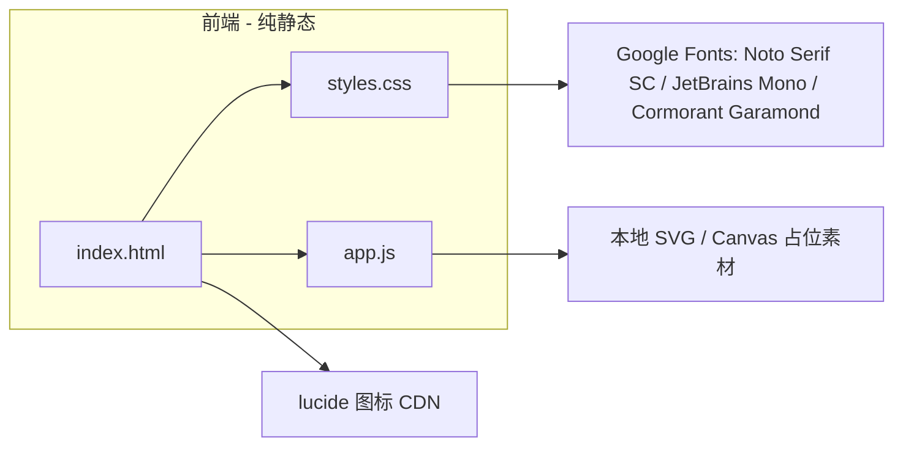

# 技术架构文档 —《对决》影视 PV 分镜展示页

## 1. 架构设计

单页静态站点，无后端，无数据库。



## 2. 技术说明
- **前端**：纯 HTML5 + CSS3 + 原生 JavaScript（ES2020）
- **构建工具**：无（直接打开 `index.html` 或 `python -m http.server` 预览）
- **后端**：无
- **数据库**：无
- **图标库**：[lucide](https://unpkg.com/lucide@latest) CDN
- **字体**：[Google Fonts](https://fonts.google.com) CDN
- **素材**：分镜占位由 CSS 渐变 + 内联 SVG 噪点 + 文字排版生成；不依赖任何位图

## 3. 路由定义

无路由（单页站点，仅锚点滚动）。

| 锚点 | 用途 |
| --- | --- |
| `#hero` | Hero 开场区 |
| `#rhythm` | 六幕节奏概览 |
| `#shots` | 16 镜分镜表 |
| `#constraints` | 全局技术约束 |
| `#assets` | 关键特效资产 |

## 4. API 定义
无后端 API。

## 5. 服务端架构图
无后端。

## 6. 数据模型
无数据库。16 镜数据以 JSON 形式硬编码在 `app.js` 中：

```javascript
const shots = [
  {
    act: "第一幕：觉醒",
    range: "0″ – 15″",
    number: "01",
    framing: "大全景",
    camera: "地面仰拍 → 急速拉升",
    content: "巨像（圣像）从地面拔地而起…",
    fx: "IMAX 渲染 · IMS 粒子模糊 · 大景深",
    audio: "低频嗡鸣 + 大地结构性震颤"
  },
  // ... 共 16 项
]
```

## 7. 部署与运行
- 直接静态托管（GitHub Pages / Vercel / Netlify / Nginx）
- 本地预览：`python3 -m http.server 8000` → `http://localhost:8000`
- 无构建步骤
