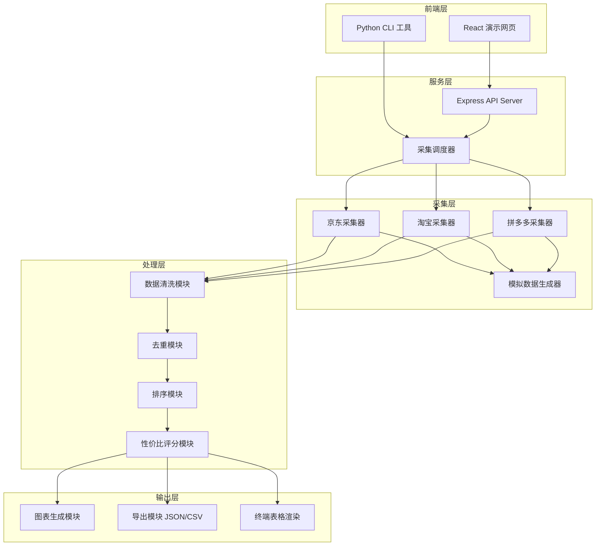
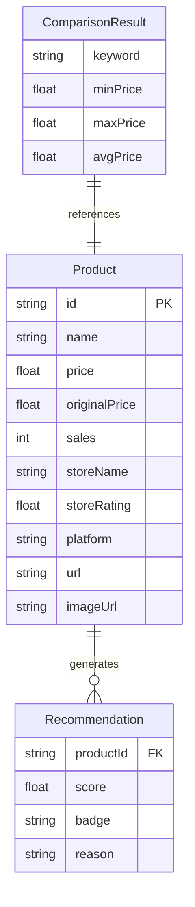

## 1. 架构设计



## 2. 技术说明

- **前端**：React@18 + TypeScript + Tailwind CSS + Vite + Recharts（图表库）
- **后端**：Express@4 + TypeScript（提供API代理采集脚本）
- **CLI工具**：Python 3.10+（独立命令行工具，使用 rich 库渲染终端表格）
- **采集方式**：模拟数据生成器（可扩展为真实API/Selenium采集器）
- **数据格式**：JSON 统一中间格式，支持导出 CSV

## 3. 路由定义

| 路由 | 用途 |
|------|------|
| `/` | 主页，含搜索栏和示例数据展示 |
| `/compare/:keyword` | 商品对比详情页 |

## 4. API 定义

### 4.1 搜索采集

```
POST /api/search
Request:  { keyword: string, platforms: string[] }
Response: { taskId: string, status: "running" }
```

### 4.2 获取结果

```
GET /api/result/:taskId
Response: {
  keyword: string,
  timestamp: string,
  products: Product[],
  comparison: ComparisonResult,
  recommendations: Recommendation[]
}
```

### 4.3 获取示例数据

```
GET /api/demo
Response: 同 /api/result 响应结构，使用预设"iPhone 16"数据
```

### 4.4 数据类型定义

```typescript
interface Product {
  id: string
  name: string
  price: number
  originalPrice: number
  sales: number
  storeName: string
  storeRating: number
  platform: "jd" | "tb" | "pdd"
  url: string
  imageUrl: string
}

interface ComparisonResult {
  cheapest: Product
  highestRated: Product
  bestSeller: Product
  priceRange: { min: number; max: number; avg: number }
  platformAvgPrices: Record<string, number>
}

interface Recommendation {
  product: Product
  score: number
  badge: "best_value" | "best_quality" | "best_seller" | "good_deal"
  reason: string
}
```

## 5. 数据模型

### 5.1 数据模型定义



## 6. 项目目录结构

```
/workspace/
├── price_hunter/           # Python CLI 工具
│   ├── __init__.py
│   ├── cli.py              # CLI 入口
│   ├── scrapers/           # 各平台采集器
│   │   ├── base.py         # 采集器基类
│   │   ├── jd.py           # 京东采集器
│   │   ├── taobao.py       # 淘宝采集器
│   │   └── pinduoduo.py    # 拼多多采集器
│   ├── processors/         # 数据处理模块
│   │   ├── cleaner.py      # 数据清洗
│   │   ├── dedup.py        # 去重
│   │   └── scorer.py       # 性价比评分
│   ├── exporters/          # 导出模块
│   │   ├── json_exporter.py
│   │   ├── csv_exporter.py
│   │   └── table_renderer.py
│   └── demo_data.py        # 演示数据生成
├── src/                    # React 前端
│   ├── components/
│   ├── pages/
│   ├── hooks/
│   ├── utils/
│   └── types/
├── api/                    # Express 后端
│   ├── routes/
│   └── services/
└── package.json
```
