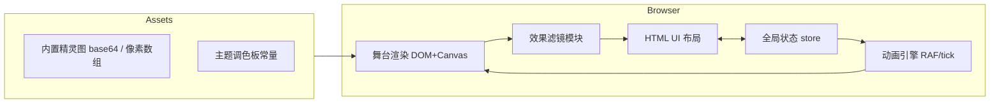

# 像素风角色动画实验场 - 技术架构文档

## 1. 架构设计
采用纯前端单页架构，无后端。所有资源（精灵、调色板、音效）通过静态文件或代码内置方式提供。



## 2. 技术选型
- **前端**：原生 HTML + CSS + JavaScript（ES2020+），零打包，零依赖，开箱即用。
- **理由**：项目体量小、效果需直接操作像素，单文件 + Canvas 后处理最直接；用户可以双击 `index.html` 即玩。
- **字体**：Google Fonts `Press Start 2P` + `VT323`，通过 `<link>` 加载，离线时降级为 `monospace`。
- **音频**：使用 `AudioContext` 程序化合成 8-bit 音效（按下、攻击、切换主题），无需音频文件。
- **持久化**：`localStorage` 保存玩家上次的效果开关和 FPS 偏好。

## 3. 路由定义
无路由（单页应用，仅一个 `index.html`）。通过 URL query 可选 `?theme=cyber` 预选主题。

## 4. API 定义
无后端 API。所有"数据"由前端常量提供。

## 5. 渲染与动画时序
```
主循环 (requestAnimationFrame):
  dt = now - last
  if dt >= 1000 / fps * slowmo:
    advance frame index
    last = now
  render stage (background + character)
  apply FX canvas pass
  update FPS counter
```

## 6. 数据模型

### 6.1 角色动画
```ts
type Action = 'idle' | 'walk' | 'attack' | 'victory';
interface CharacterFrame {
  pixels: Uint8Array;   // 调色板索引, 长度 = w*h
  w: number;            // 16
  h: number;            // 16
  durationMs?: number;  // 单帧持续时间(可覆盖 fps)
}
interface CharacterAction {
  frames: CharacterFrame[];
  loop: boolean;
}
interface Character {
  name: string;
  actions: Record<Action, CharacterAction>;
  palette: string[];    // 0 = 透明
}
```

### 6.2 状态
```ts
interface State {
  action: Action;
  facing: 1 | -1;            // 1=右 -1=左
  frameIndex: number;
  fps: number;               // 1..60
  playing: boolean;
  slowMo: number;            // 0.25..1
  theme: 'day' | 'night' | 'cyber';
  fx: {
    pixel:   { on: boolean; size: number };        // size 2..16
    wave:    { on: boolean; amp: number; freq: number; dir: 'x'|'y' };
    dither:  { on: boolean; level: number; strength: number }; // 贝叶抖动
    scan:    { on: boolean; strength: number };
  };
  bgOffset: number;
}
```

## 7. 效果算法

### 7.1 像素化 (Pixelation)
- 将舞台 `CanvasRenderingContext2D` 通过 `drawImage` 缩小 `size` 倍 → `drawImage` 放大回原尺寸，`imageSmoothingEnabled = false`。

### 7.2 波形扰动 (Wave)
- 在 `getImageData` 得到的 `ImageData` 上做逐像素重映射：
  - 横向：`srcX = x + sin(y * freq) * amp`
  - 纵向：`srcY = y + sin(x * freq) * amp`
- 越界用最近邻填充。

### 7.3 贝叶抖动 (Bayer Dither)
- 使用 8×8 Bayer 矩阵 `M`（即 `伯利兹/Bayer` 数学效果）：
  `threshold = (M[x%8][y%8] + 0.5) / 64`
- 对每个通道：`value = floor(c/level) * level + (value < threshold ? -strength : +strength) * level`
- 限制到 [0,255] 后写回。

### 7.4 扫描线 (Scanline)
- 每隔 2 行把 RGB 各乘 (1 - strength * 0.6)。

## 8. 性能预算
- 舞台固定 320×240 内部分辨率，CSS 缩放显示。
- 帧率 60 时单帧后处理 < 4ms（中端笔记本）。
- DPR 处理：取 `min(devicePixelRatio, 2)`，避免 4K 屏下数据爆炸。

## 9. 文件结构
```
/workspace
├── index.html        # 单页应用入口（HTML + 内嵌 CSS + 内嵌 JS）
├── README.md         # 简要说明
└── .trae/documents/
    ├── PRD.md
    └── tech-architecture.md
```

## 10. 启动与本地预览
- 静态文件，无需构建。
- 在 `/workspace` 启动 `python3 -m http.server 8000` 即可预览。
- 或直接双击 `index.html` 在浏览器中打开（部分浏览器对本地 file:// 限制可通过本地 server 绕过）。
