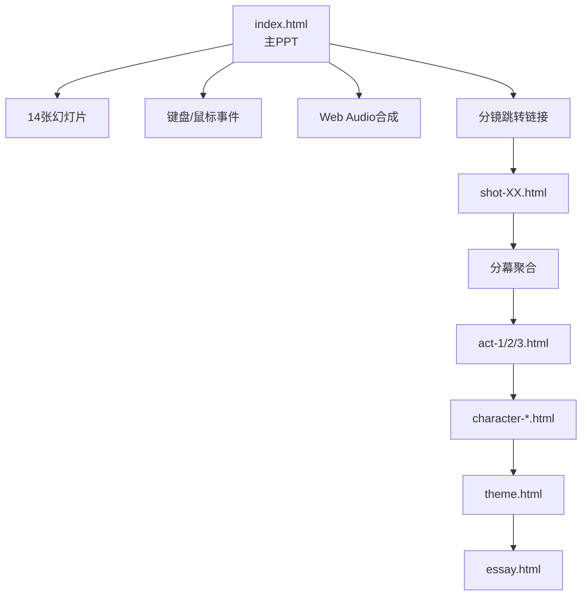

# 哥窑·主旨解读 PPT 技术架构文档

## 1. 技术栈

| 类别 | 选型 | 说明 |
|------|------|------|
| 标记 | HTML5 | 语义化标签 |
| 样式 | 原生 CSS3（CSS 变量 + Grid + Flexbox） | 无构建依赖 |
| 脚本 | 原生 ES6 JavaScript | 无框架 |
| 字体 | Google Fonts + 系统字体回退 | 离线优先 |
| 音频 | Web Audio API（程序化合成） | 无需外部资源 |
| 图像 | 内联 SVG | 可缩放、可着色 |
| 部署 | 纯静态文件 | 任意 HTTP 服务 |

## 2. 目录结构

```
/workspace
├── index.html                       # 主 PPT 入口（14 张幻灯片）
├── theme.html                       # 主旨专题页
├── essay.html                       # 主旨深度解读
├── gallery.html                     # 资源索引
├── character-zhangji.html           # 哥哥档案
├── character-zhangzhiyuan.html      # 弟弟档案
├── act-1.html                       # 第一幕
├── act-2.html                       # 第二幕
├── act-3.html                       # 第三幕
├── shot-01.html … shot-66.html      # 66 个分镜单页
├── README.md                        # 项目说明
├── .trae/documents/
│   ├── prd.md
│   └── tech-architecture.md
└── assets/
    ├── css/
    │   ├── base.css                 # 字体、变量、重置
    │   ├── deck.css                 # PPT 翻页样式
    │   ├── character.css            # 角色/分幕页样式
    │   └── shot.css                 # 分镜卡样式
    ├── js/
    │   ├── deck.js                  # 翻页逻辑
    │   ├── audio.js                 # 古琴/窑火/鼓点合成
    │   └── crackle.js               # 开片动画
    └── img/
        └── （内联 SVG，无外部位图）
```

## 3. 架构图



## 4. 关键设计模式

### 4.1 幻灯片翻页
- 每张 `.slide` 绝对定位，`translateX` 切换
- 当前页 `active`，使用 `opacity` + `transform` 过渡 800ms
- 全局快捷键：← / → / Space / Home / End / 1-9

### 4.2 主题色变量
```css
:root {
  --ink: #0c0a09;
  --celadon: #7ea89a;
  --celadon-deep: #2f5b51;
  --kiln-gold: #d99a52;
  --kiln-flame: #f4a35c;
  --paper: #f1ebe0;
  --gold-line: #b58a4a;
  --iron-line: #2a1a0e;
}
```

### 4.3 瓷器开片效果
多重 `box-shadow` + `clip-path` 模拟金丝铁线：
```css
.celadon {
  background: linear-gradient(135deg, #7ea89a, #2f5b51);
  box-shadow:
    inset 0 0 0 1px rgba(181, 138, 74, .3),
    inset 8px 0 12px rgba(42, 26, 14, .25),
    0 0 40px rgba(126, 168, 154, .25);
}
```

### 4.4 音频合成
Web Audio API 合成：
- 古琴单音：低频正弦 + 衰减包络，泛音叠加
- 窑火：粉红噪声 + 低通滤波 + 缓慢调制
- 战鼓：白噪声 + 短促包络
- 马蹄：木鱼音色冲击 + 节奏控制
- 鸟鸣：高频正弦扫频

## 5. 性能与兼容性

- 单页资源 < 200KB
- 使用 `prefers-reduced-motion` 关闭动画
- 字体降级链：思源宋体 → 系统中文字体 → serif
- 兼容 Chrome 90+ / Firefox 88+ / Safari 14+ / Edge 90+

## 6. 部署

```bash
# 启动任意静态服务
cd /workspace
python3 -m http.server 8000
# 访问 http://localhost:8000/
```

无构建步骤、无 npm 依赖，任意静态环境直接打开 `index.html` 即可。
