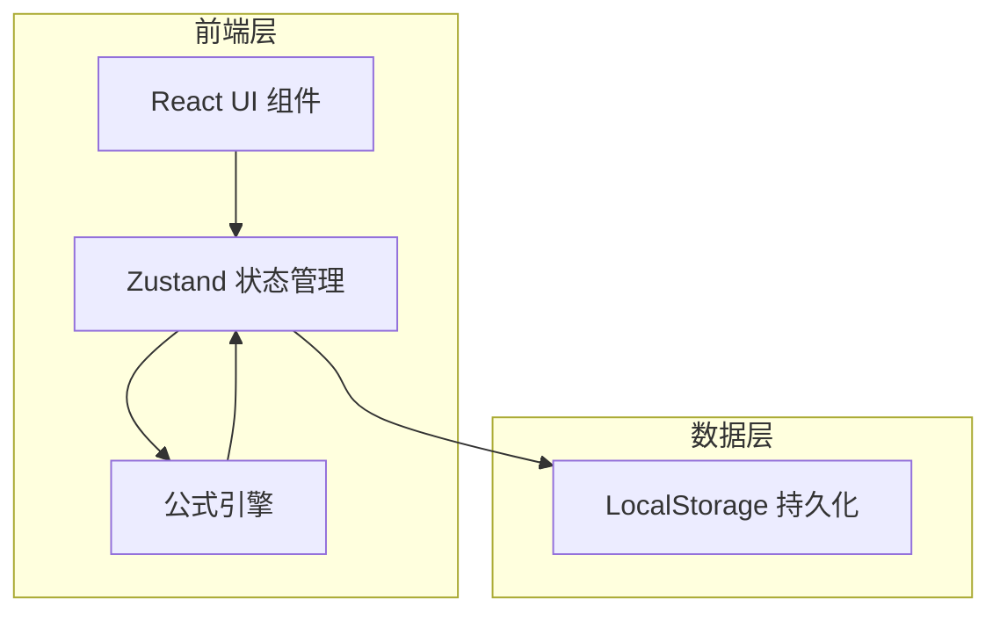
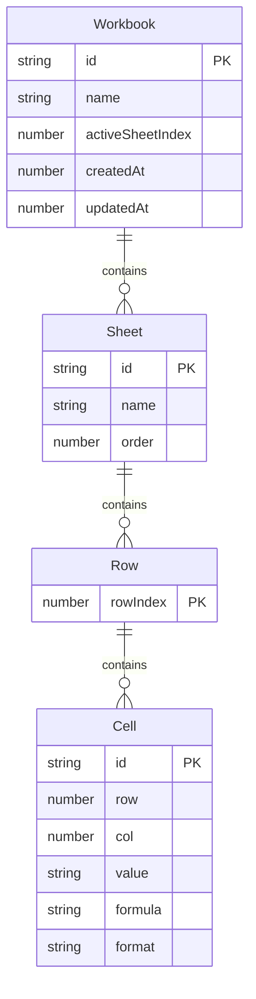

## 1. 架构设计



## 2. 技术说明

- 前端：React@18 + TailwindCSS@3 + Vite + TypeScript
- 初始化工具：vite-init
- 后端：无
- 数据库：无（使用浏览器 LocalStorage 持久化数据）
- 状态管理：Zustand
- 公式引擎：自实现轻量公式解析器（支持 SUM/AVERAGE/MIN/MAX/COUNT）

## 3. 路由定义

| 路由 | 用途 |
|------|------|
| / | 工作台主页面，包含标签页管理和表格编辑 |

## 4. API 定义

无后端 API，纯前端应用。

## 5. 服务端架构图

不适用

## 6. 数据模型

### 6.1 数据模型定义



### 6.2 数据定义语言

```typescript
interface CellFormat {
  bold: boolean
  italic: boolean
  align: 'left' | 'center' | 'right'
  bgColor: string | null
  textColor: string | null
}

interface CellData {
  id: string
  row: number
  col: number
  value: string
  formula: string | null
  format: CellFormat
}

interface SheetData {
  id: string
  name: string
  order: number
  cells: Record<string, CellData>
  rowCount: number
  colCount: number
}

interface WorkbookData {
  id: string
  name: string
  sheets: SheetData[]
  activeSheetIndex: number
  createdAt: number
  updatedAt: number
}
```
