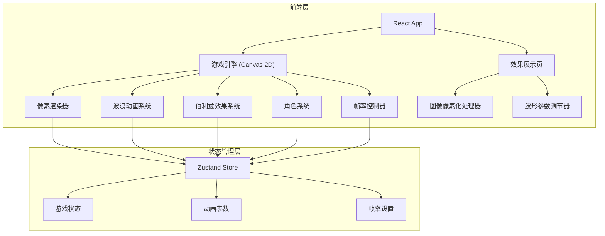

## 1. 架构设计



## 2. 技术说明

- 前端：React@18 + TypeScript + Tailwind CSS + Vite
- 初始化工具：vite-init
- 后端：无（纯前端项目）
- 数据库：无（所有状态在内存中管理）
- 渲染引擎：Canvas 2D API（像素化渲染）
- 动画系统：requestAnimationFrame + 自定义帧率控制

## 3. 路由定义

| 路由 | 用途 |
|------|------|
| / | 主游戏页面 - 像素角色在波浪/伯利兹动画场景中互动 |
| /effects | 效果展示页面 - 图像像素化转换与数学波形调节 |

## 4. 核心模块设计

### 4.1 像素渲染器 (PixelRenderer)

- 低分辨率离屏Canvas绘制 → 放大至主Canvas
- `imageSmoothingEnabled = false` 保持像素锐利
- 支持可调像素块大小（2x2, 4x4, 8x8, 16x16）

### 4.2 波浪动画系统 (WaveSystem)

- 基于正弦函数组合：`y = A1*sin(f1*x + p1) + A2*sin(f2*x + p2)`
- 支持多波叠加
- 实时参数调节：振幅、频率、相位、波数
- 波浪颜色渐变（伯利兹蓝→热带黄）

### 4.3 伯利兹效果系统 (BelizeEffect)

- 伯利兹旗色彩方案：蓝底+红条纹+白圆
- 数学函数驱动的动态色彩变化
- 波浪扭曲效果
- 像素化后的色彩量化

### 4.4 角色系统 (CharacterSystem)

- 16x16像素精灵图
- 状态机：待机、行走、跳跃
- 帧动画切换
- 物理模拟：重力、碰撞检测（与波浪地形）

### 4.5 帧率控制器 (FrameRateController)

- 基于 `requestAnimationFrame` 的帧率限制
- 可调范围：1-60 fps
- 帧时间统计与显示
- 帧率变化时的视觉对比

### 4.6 图像像素化处理器 (ImagePixelator)

- Canvas 2D 缩放算法实现像素化
- 支持上传图片 → 缩小 → 放大
- 可调像素粒度
- 颜色量化（减少色板）

## 5. 数据模型

### 5.1 游戏状态 (Zustand Store)

```typescript
interface GameState {
  character: {
    x: number;
    y: number;
    vx: number;
    vy: number;
    state: 'idle' | 'walk' | 'jump';
    direction: 'left' | 'right';
    frameIndex: number;
  };
  wave: {
    amplitude: number;
    frequency: number;
    phase: number;
    layers: number;
    speed: number;
  };
  belize: {
    intensity: number;
    colorShift: number;
    distortion: number;
  };
  renderer: {
    pixelSize: number;
    targetFps: number;
    showFps: boolean;
  };
  keys: Set<string>;
}
```
