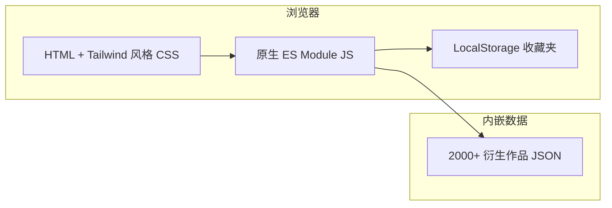

# 游戏IP衍生作品数据库浏览器 技术架构

## 1. 架构设计

单页应用，所有数据与逻辑均嵌入到一个 HTML 文件（data.js 内联为 JSON），可双击直接打开使用；亦可挂在任何静态 Web 服务器上。



## 2. 技术描述

- **前端**：原生 HTML5 + CSS3 (自定义变量、Grid、动画) + Vanilla JavaScript (ES2020)
- **样式**：CSS 变量 + 自定义 utility 类，模拟 Tailwind 体验但保持单文件
- **字体**：Google Fonts: Space Grotesk + Geist Mono + Inter Tight
- **图标**：Lucide Icons (CDN)
- **图表**：纯 SVG / Canvas 自绘（避免外部依赖）
- **数据存储**：所有数据以 `const DATA = [...]` 内联在 `<script>` 中
- **持久化**：`localStorage` 存储收藏与主题
- **后端**：无
- **构建**：无（单文件直出）

## 3. 路由定义
单页应用，无路由，所有视图通过 URL hash (`#browse`、`#stats`、`#favorites`) 切换状态。

| Hash | 视图 |
|------|------|
| #home | 仪表盘首页 |
| #browse | 浏览主界面（默认） |
| #stats | 统计可视化 |
| #favorites | 收藏夹 |

## 4. 数据模型

```ts
interface DerivativeWork {
  id: string;                 // 唯一 ID
  ip: string;                 // 所属游戏 IP，例如 "Mario"
  title: string;              // 衍生作品名称
  type: DerivativeType;       // 类型枚举
  releaseYear: number;        // 发布年份
  region: string;             // 主要发布地区
  platform?: string;          // 适用平台（动画/影视可空）
  publisher: string;          // 制作/出品方
  description: string;        // 简介
  tags: string[];             // 标签
  coverColor: string;         // 卡片渐变色（用于占位）
  rating?: number;            // 1-10 评分（可选）
}

type DerivativeType =
  | 'anime'        // 动画剧集
  | 'film-anime'   // 动画电影
  | 'film-live'    // 真人电影
  | 'tv'           // 电视剧 / 真人剧集
  | 'manga'        // 漫画
  | 'novel'        // 小说 / 轻小说
  | 'audio'        // 广播剧 / 有声
  | 'theater'      // 舞台剧 / 音乐剧
  | 'concert'      // 演唱会 / 音乐演出
  | 'merch-toy'    // 玩具 / 周边
  | 'merch-figure' // 手办 / 雕像
  | 'merch-cloth'  // 服饰 / 联动服装
  | 'merch-card'   // 卡牌 / 集换
  | 'game-board'   // 桌游 / 棋盘
  | 'game-mobile'  // 衍生手游
  | 'game-spinoff' // 衍生端游 / 主机
  | 'theme-park'   // 主题乐园 / 园区
  | 'cafe'         // 主题咖啡
  | 'exhibition'   // 官方展会 / 展览
  | 'web-series'   // 网络短剧 / Web 动画
  | 'ost'          // 原声碟 / 音乐专辑
  | 'artbook'      // 设定集 / 画集
  | 'event'        // 线下活动
  | 'collab'       // 跨界联动
  | 'pachinko'     // 柏青哥 / 老虎机
```

## 5. 数据规模与性能

- 数据条目：≥ 2000
- 列表渲染：分页（每页 24 条）+ 虚拟化懒加载
- 搜索：前缀索引 + 简单 fuzzy 匹配
- 筛选：纯前端 in-memory filter
- 性能预算：首屏 < 1.5s，搜索响应 < 50ms

## 6. 文件结构

```
/workspace
├── index.html              # 单文件应用（HTML + CSS + JS + DATA）
├── data.js                 # 独立数据文件（2000+ 条目，备用）
├── .trae/documents/        # PRD + 技术架构
└── README.md
```

由于数据量大，主 HTML 通过 `<script src="data.js">` 引用外部数据，保持 HTML 模板清晰可维护。
