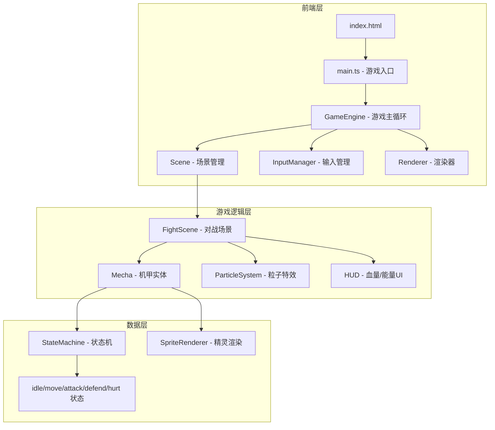

## 1. 架构设计



## 2. 技术说明

- **前端**：纯 HTML5 Canvas + TypeScript，无框架依赖
- **构建工具**：Vite + vanilla-ts 模板
- **后端**：无（纯前端本地双人游戏）
- **数据库**：无

## 3. 文件结构

```
src/
├── main.ts              # 游戏入口，初始化Canvas和游戏引擎
├── engine/
│   ├── GameEngine.ts    # 游戏主循环（requestAnimationFrame）
│   ├── InputManager.ts  # 键盘输入管理
│   └── Renderer.ts      # Canvas渲染封装
├── scenes/
│   ├── Scene.ts         # 场景基类
│   ├── TitleScene.ts    # 开始画面
│   ├── FightScene.ts    # 对战场景
│   └── ResultScene.ts   # 结算画面
├── entities/
│   ├── Mecha.ts         # 机甲实体（状态机+属性+逻辑）
│   └── Particle.ts      # 粒子特效
├── ui/
│   └── HUD.ts           # 血量条、能量条、提示文字
└── utils/
    ├── sprite.ts        # 像素精灵绘制工具（程序化生成像素图）
    └── constants.ts     # 游戏常量（伤害、速度、帧数等）
```

## 4. 核心类设计

### 4.1 GameEngine

```
class GameEngine {
  canvas: HTMLCanvasElement
  ctx: CanvasRenderingContext2D
  currentScene: Scene
  inputManager: InputManager
  lastTime: number

  gameLoop(timestamp): void    // 60fps主循环
  switchScene(scene): void     // 场景切换
}
```

### 4.2 Mecha（机甲）

```
class Mecha {
  x, y: number                // 位置
  velocityX, velocityY: number
  hp: number                  // 血量（0-100）
  energy: number              // 能量（0-100）
  state: MechaState           // 当前状态
  facingRight: boolean        // 朝向
  frameIndex: number          // 动画帧索引
  stateTimer: number          // 状态计时器

  update(): void              // 更新逻辑
  handleInput(keys): void     // 处理输入
  takeDamage(amount): void    // 受伤
  attack(): void              // 攻击
  defend(isDefending): void   // 防御
  draw(ctx): void             // 绘制
}
```

### 4.3 MechaState 状态机

```
enum MechaState {
  IDLE,       // 待机
  MOVE,       // 移动
  JUMP,       // 跳跃
  ATTACK,     // 攻击
  DEFEND,     // 防御
  HURT        // 受伤硬直
}
```

状态转换规则：
- IDLE → MOVE（按下移动键）
- IDLE → JUMP（按下跳跃键）
- IDLE → ATTACK（按下攻击键且能量足够）
- IDLE → DEFEND（按下防御键且能量足够）
- MOVE → IDLE（松开移动键）
- ATTACK → IDLE（攻击动画结束）
- DEFEND → IDLE（松开防御键或能量耗尽）
- 任意状态 → HURT（被攻击命中）
- HURT → IDLE（硬直结束）

### 4.4 碰撞检测

- 使用AABB矩形碰撞检测
- 攻击判定：攻击方在判定帧期间，攻击范围矩形与对方碰撞体重叠则命中
- 推挤检测：两机甲碰撞体重叠时互相推开

## 5. 像素精灵方案

所有角色和场景素材通过代码程序化绘制，无需外部图片资源：

- **机甲精灵**：使用二维数组定义像素颜色矩阵，逐像素绘制到Canvas
- **每帧32x48像素**，放大3倍显示（96x144屏幕像素）
- **动画帧**：每个状态4-6帧，8fps播放
- **场景背景**：程序化绘制星空、建筑剪影、地面

### 机甲像素矩阵示例

```
赤焰机甲（红色系）：
- 头部：深红方块 + 黄色眼睛
- 躯干：红色装甲 + 深灰细节
- 手臂：红色 + 灰色关节
- 腿部：深红 + 灰色靴子
- 武器：拳头（攻击时伸出）

苍雷机甲（蓝色系）：
- 头部：深蓝方块 + 青色眼睛
- 躯干：蓝色装甲 + 深灰细节
- 手臂：蓝色 + 灰色关节
- 腿部：深蓝 + 灰色靴子
- 武器：拳头（攻击时伸出）
```

## 6. 游戏常量

| 常量 | 值 | 说明 |
|------|-----|------|
| CANVAS_WIDTH | 960 | 画布宽度 |
| CANVAS_HEIGHT | 540 | 画布高度（16:9） |
| PIXEL_SCALE | 3 | 像素放大倍数 |
| MECHA_WIDTH | 32 | 机甲碰撞体宽 |
| MECHA_HEIGHT | 48 | 机甲碰撞体高 |
| MOVE_SPEED | 3 | 移动速度 |
| JUMP_FORCE | -10 | 跳跃力 |
| GRAVITY | 0.5 | 重力加速度 |
| MAX_HP | 100 | 最大血量 |
| MAX_ENERGY | 100 | 最大能量 |
| ENERGY_REGEN | 0.5 | 能量恢复速率 |
| ATTACK_DAMAGE | 10 | 攻击伤害 |
| ATTACK_ENERGY_COST | 15 | 攻击能量消耗 |
| DEFEND_ENERGY_COST | 5 | 防御每帧能量消耗 |
| DEFEND_REDUCTION | 0.7 | 防御减伤比例 |
| ATTACK_DURATION | 12 | 攻击持续帧数 |
| ATTACK_HIT_START | 4 | 攻击判定开始帧 |
| ATTACK_HIT_END | 8 | 攻击判定结束帧 |
| HURT_DURATION | 10 | 受伤硬直帧数 |
| GROUND_Y | 420 | 地面Y坐标 |
