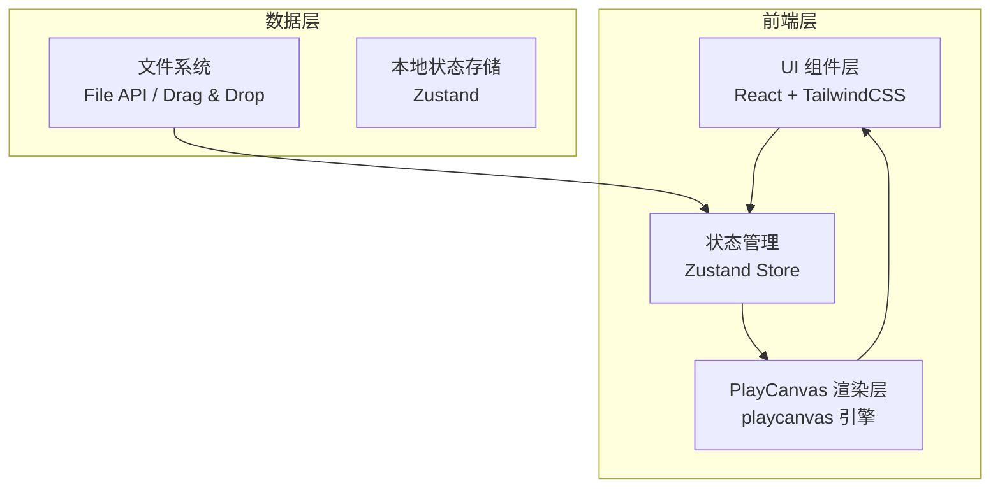
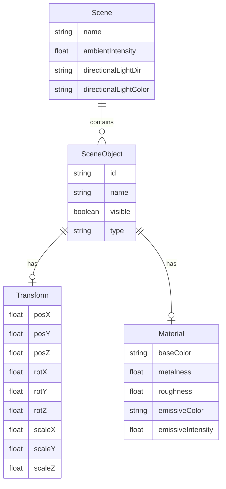

## 1. 架构设计



## 2. 技术说明

- 前端框架：React@18 + TailwindCSS@3 + Vite
- 初始化工具：Vite (npm create vite@latest)
- 3D 渲染引擎：PlayCanvas Engine（playcanvas）— 用户明确指定
- 状态管理：Zustand（轻量级，适合编辑器状态）
- 后端：无（纯前端应用）
- 数据库：无（所有数据在浏览器本地处理）

### 核心依赖

| 依赖 | 版本 | 用途 |
|------|------|------|
| react | ^18 | UI 框架 |
| react-dom | ^18 | DOM 渲染 |
| playcanvas | ^2.4 | 3D 渲染引擎 |
| zustand | ^4 | 状态管理 |
| tailwindcss | ^3 | 样式系统 |

## 3. 路由定义

| 路由 | 用途 |
|------|------|
| / | 编辑器主页面，包含 3D 视口、工具栏、面板 |

## 4. API 定义

无后端 API。所有功能通过浏览器本地 API 实现：

- **File API**：读取用户导入的 glTF/GLB 文件
- **Canvas API**：截图导出为 PNG
- **Drag & Drop API**：拖拽导入模型

## 5. 服务器架构图

无后端服务，纯前端应用。

## 6. 数据模型

### 6.1 数据模型定义



### 6.2 数据定义

```typescript
interface SceneState {
  name: string;
  ambientIntensity: number;
  directionalLightDir: [number, number, number];
  directionalLightColor: string;
  objects: SceneObject[];
  selectedObjectId: string | null;
  activeTool: 'select' | 'translate' | 'rotate' | 'scale';
  history: HistoryEntry[];
  historyIndex: number;
}

interface SceneObject {
  id: string;
  name: string;
  visible: boolean;
  type: 'model' | 'light' | 'camera' | 'primitive';
  transform: Transform;
  material: Material;
  children: string[];
  parent: string | null;
}

interface Transform {
  position: [number, number, number];
  rotation: [number, number, number];
  scale: [number, number, number];
}

interface Material {
  baseColor: string;
  metalness: number;
  roughness: number;
  emissiveColor: string;
  emissiveIntensity: number;
}

interface HistoryEntry {
  type: string;
  objectId: string;
  previousState: Partial<SceneObject>;
  newState: Partial<SceneObject>;
}
```
